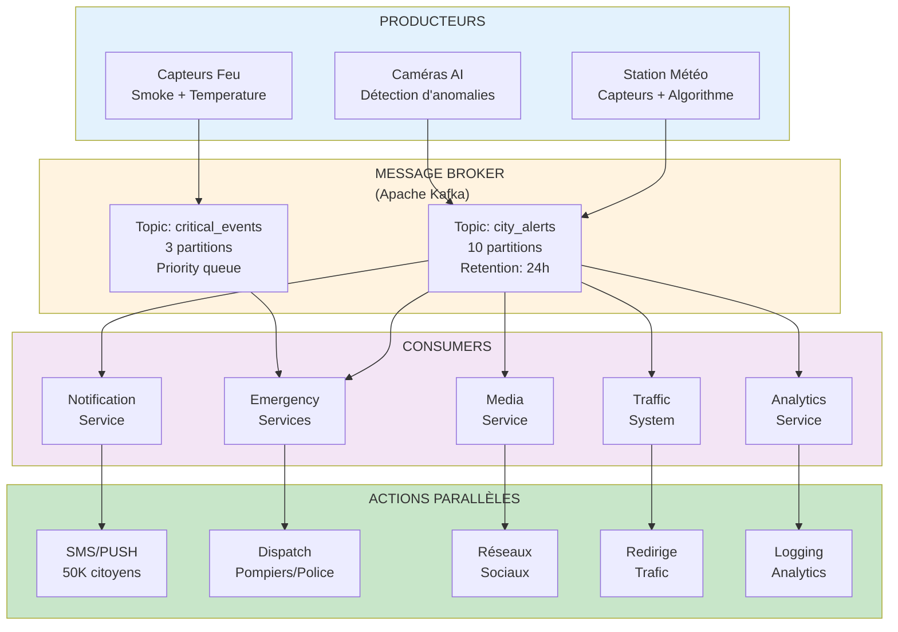
```mermaid
%%{init: {'flowchart': {'subGraphTitleMargin': {'top': 6, 'bottom': 22}}}}%%
graph TD
    subgraph Producers["PRODUCTEURS"]
        WS["Station Météo<br/>Capteurs + Algorithme"]
        CA["Caméras AI<br/>Détection d'anomalies"]
        FS["Capteurs Feu<br/>Smoke + Temperature"]
    end
    
    subgraph Broker["MESSAGE BROKER<br/>(Apache Kafka)"]
        T1["Topic: city_alerts<br/>10 partitions<br/>Retention: 24h"]
        T2["Topic: critical_events<br/>3 partitions<br/>Priority queue"]
    end
    
    subgraph Consumers["CONSUMERS"]
        NS["Notification<br/>Service"]
        ES["Emergency<br/>Services"]
        MS["Media<br/>Service"]
        TS["Traffic<br/>System"]
        AS["Analytics<br/>Service"]
    end
    
    subgraph Actions["ACTIONS PARALLÈLES"]
        A1["SMS/PUSH<br/>50K citoyens"]
        A2["Dispatch<br/>Pompiers/Police"]
        A3["Réseaux<br/>Sociaux"]
        A4["Redirige<br/>Trafic"]
        A5["Logging<br/>Analytics"]
    end
    
    WS --> T1
    CA --> T1
    FS --> T2
    
    T1 --> NS
    T1 --> ES
    T1 --> MS
    T1 --> TS
    T1 --> AS
    
    T2 --> ES
    
    NS --> A1
    ES --> A2
    MS --> A3
    TS --> A4
    AS --> A5
    
    style Producers fill:#e3f2fd
    style Broker fill:#fff3e0
    style Consumers fill:#f3e5f5
    style Actions fill:#c8e6c9
```

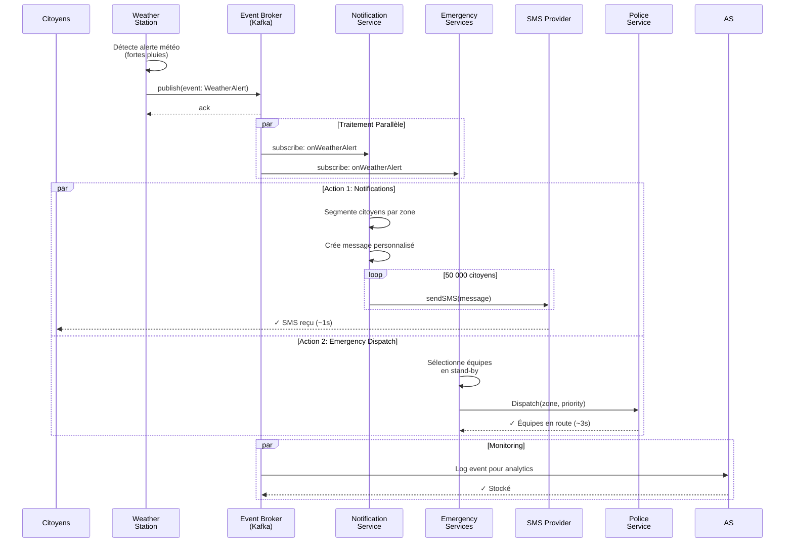
```mermaid
sequenceDiagram
    participant User as Citoyens
    participant WS as Weather<br/>Station
    participant Kafka as Event Broker<br/>(Kafka)
    participant NS as Notification<br/>Service
    participant ES as Emergency<br/>Services
    participant SMS as SMS Provider
    participant Police as Police<br/>Service
    
    WS->>WS: Détecte alerte météo<br/>(fortes pluies)
    WS->>Kafka: publish(event: WeatherAlert)
    Kafka-->>WS: ack
    
    par Traitement Parallèle
        Kafka->>NS: subscribe: onWeatherAlert
        Kafka->>ES: subscribe: onWeatherAlert
    end
    
    par Action 1: Notifications
        NS->>NS: Segmente citoyens par zone
        NS->>NS: Crée message personnalisé
        loop 50 000 citoyens
            NS->>SMS: sendSMS(message)
        end
        SMS-->>User: ✓ SMS reçu (~1s)
    and Action 2: Emergency Dispatch
        ES->>ES: Sélectionne équipes<br/>en stand-by
        ES->>Police: Dispatch(zone, priority)
        Police-->>ES: ✓ Équipes en route (~3s)
    end
    
    par Monitoring
        Kafka->>AS: Log event pour analytics
        AS-->>Kafka: ✓ Stocké
    end
```

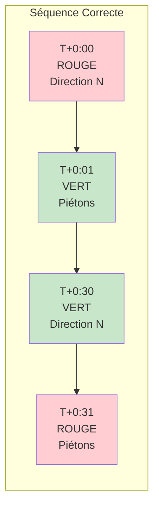
```mermaid
graph LR
    subgraph Timeline["Séquence Correcte"]
        T1["T+0:00<br/>ROUGE<br/>Direction N"]
        T2["T+0:01<br/>VERT<br/>Piétons"]
        T3["T+0:30<br/>VERT<br/>Direction N"]
        T4["T+0:31<br/>ROUGE<br/>Piétons"]
    end
    
    T1 --> T2
    T2 --> T3
    T3 --> T4
    
    style T1 fill:#ffcdd2
    style T2 fill:#c8e6c9
    style T3 fill:#c8e6c9
    style T4 fill:#ffcdd2
```

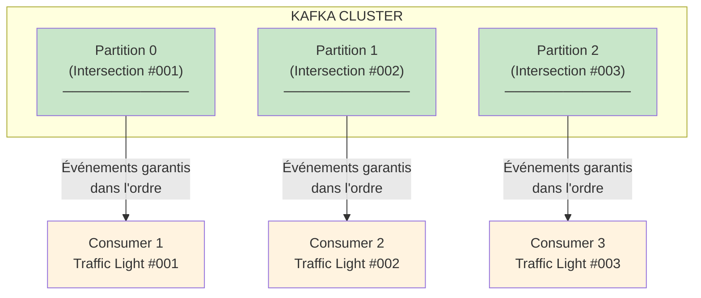
```mermaid
graph TB
    subgraph Kafka["KAFKA CLUSTER"]
        P0["Partition 0<br/>(Intersection #001)<br/>─────────────"]
        P1["Partition 1<br/>(Intersection #002)<br/>─────────────"]
        P2["Partition 2<br/>(Intersection #003)<br/>─────────────"]
    end
    
    P0 -->|Événements garantis<br/>dans l'ordre| C1["Consumer 1<br/>Traffic Light #001"]
    P1 -->|Événements garantis<br/>dans l'ordre| C2["Consumer 2<br/>Traffic Light #002"]
    P2 -->|Événements garantis<br/>dans l'ordre| C3["Consumer 3<br/>Traffic Light #003"]
    
    style P0 fill:#c8e6c9
    style P1 fill:#c8e6c9
    style P2 fill:#c8e6c9
    style C1 fill:#fff3e0
    style C2 fill:#fff3e0
    style C3 fill:#fff3e0
```

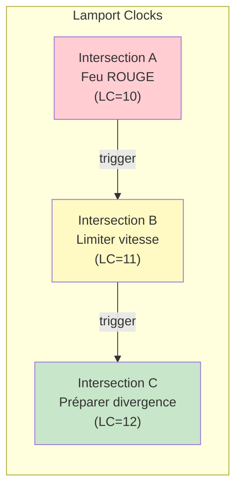
```mermaid
graph LR
    subgraph LC["Lamport Clocks"]
        A["Intersection A<br/>Feu ROUGE<br/>(LC=10)"]
        B["Intersection B<br/>Limiter vitesse<br/>(LC=11)"]
        C["Intersection C<br/>Préparer divergence<br/>(LC=12)"]
    end
    
    A -->|trigger| B
    B -->|trigger| C
    
    style A fill:#ffcdd2
    style B fill:#fff9c4
    style C fill:#c8e6c9
```

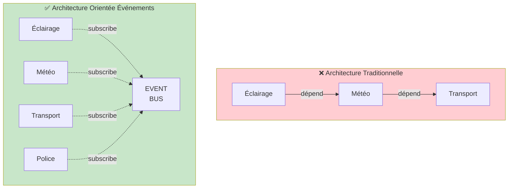
```mermaid
graph TB
    subgraph Traditional["❌ Architecture Traditionnelle"]
        E["Éclairage"]
        W["Météo"]
        T["Transport"]
        E -->|dépend| W
        W -->|dépend| T
    end
    
    subgraph EventDriven["✅ Architecture Orientée Événements"]
        E2["Éclairage"]
        W2["Météo"]
        T2["Transport"]
        P["Police"]
        EB["EVENT<br/>BUS"]
        E2 -.->|subscribe| EB
        W2 -.->|subscribe| EB
        T2 -.->|subscribe| EB
        P -.->|subscribe| EB
    end
    
    style Traditional fill:#ffcdd2
    style EventDriven fill:#c8e6c9
```

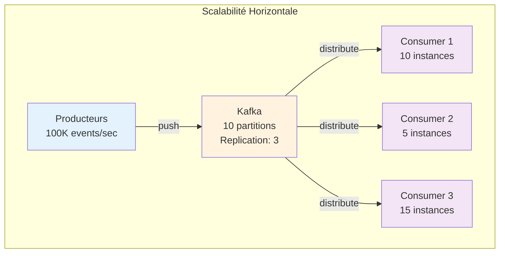
```mermaid
graph TB
    subgraph ScaleOut["Scalabilité Horizontale"]
        Producer["Producteurs<br/>100K events/sec"]
        Kafka["Kafka<br/>10 partitions<br/>Replication: 3"]
        
        C1["Consumer 1<br/>10 instances"]
        C2["Consumer 2<br/>5 instances"]
        C3["Consumer 3<br/>15 instances"]
    end
    
    Producer -->|push| Kafka
    Kafka -->|distribute| C1
    Kafka -->|distribute| C2
    Kafka -->|distribute| C3
    
    style Producer fill:#e3f2fd
    style Kafka fill:#fff3e0
    style C1 fill:#f3e5f5
    style C2 fill:#f3e5f5
    style C3 fill:#f3e5f5
```

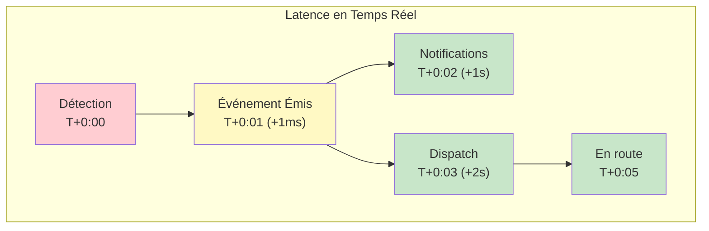
```mermaid
graph TB
    subgraph RTLatency["Latence en Temps Réel"]
        D["Détection<br/>T+0:00"]
        E["Événement Émis<br/>T+0:01 (+1ms)"]
        N["Notifications<br/>T+0:02 (+1s)"]
        D2["Dispatch<br/>T+0:03 (+2s)"]
        T["En route<br/>T+0:05"]
    end
    
    D --> E --> N
    E --> D2
    D2 --> T
    
    style D fill:#ffcdd2
    style E fill:#fff9c4
    style N fill:#c8e6c9
    style D2 fill:#c8e6c9
    style T fill:#c8e6c9
```

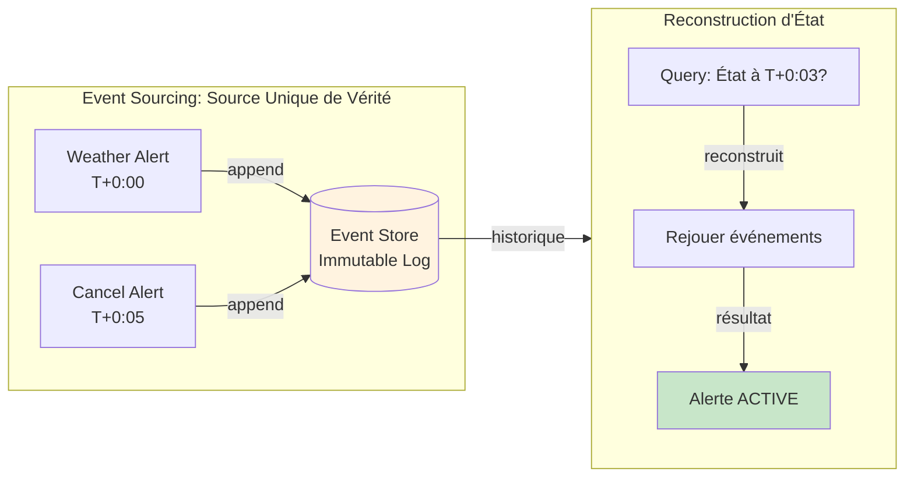
```mermaid
graph LR
    subgraph ES["Event Sourcing: Source Unique de Vérité"]
        DB[(Event Store<br/>Immutable Log)]
        WA["Weather Alert<br/>T+0:00"]
        CA["Cancel Alert<br/>T+0:05"]
        
        WA -->|append| DB
        CA -->|append| DB
    end
    
    subgraph Rebuild["Reconstruction d'État"]
        Query["Query: État à T+0:03?"]
        Replay["Rejouer événements"]
        State["Alerte ACTIVE"]
        
        Query -->|reconstruit| Replay
        Replay -->|résultat| State
    end
    
    DB -->|historique| Rebuild
    
    style DB fill:#fff3e0
    style State fill:#c8e6c9
```

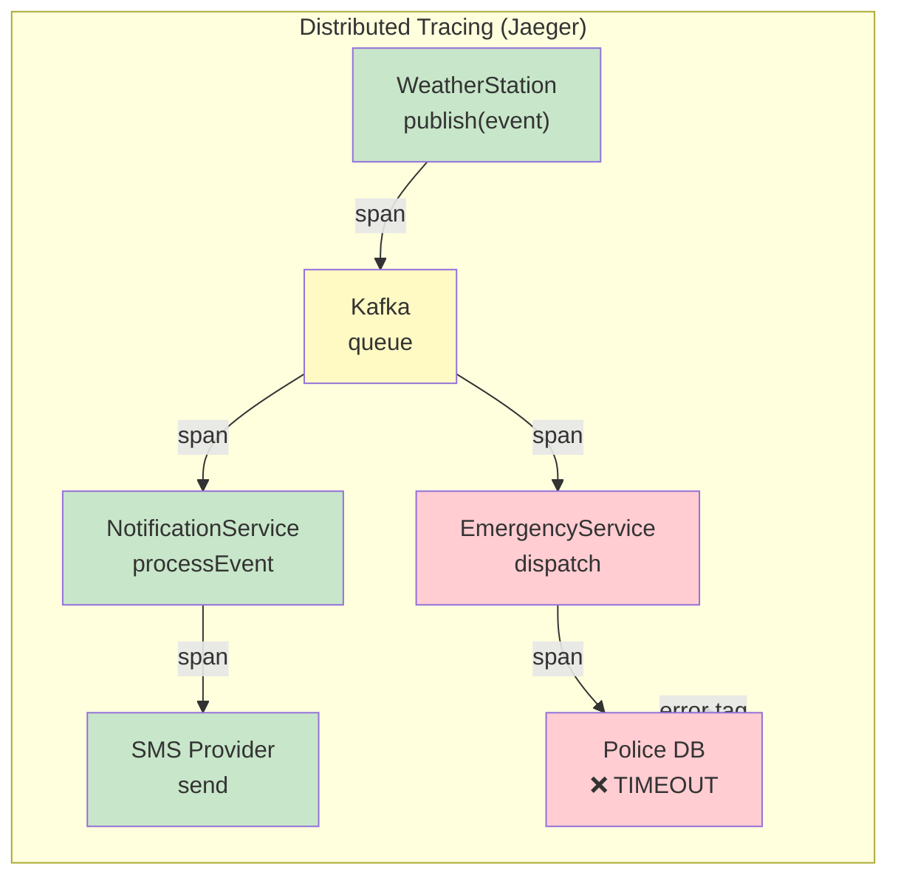
```mermaid
graph TB
    subgraph DT["Distributed Tracing (Jaeger)"]
        P["WeatherStation<br/>publish(event)"]
        K["Kafka<br/>queue"]
        N["NotificationService<br/>processEvent"]
        SMS["SMS Provider<br/>send"]
        E["EmergencyService<br/>dispatch"]
        FAIL["Police DB<br/>❌ TIMEOUT"]
    end
    
    P -->|span| K
    K -->|span| N
    N -->|span| SMS
    K -->|span| E
    E -->|span| FAIL
    
    FAIL -->|error tag| DT
    
    style P fill:#c8e6c9
    style K fill:#fff9c4
    style N fill:#c8e6c9
    style SMS fill:#c8e6c9
    style E fill:#ffcdd2
    style FAIL fill:#ffcdd2
```

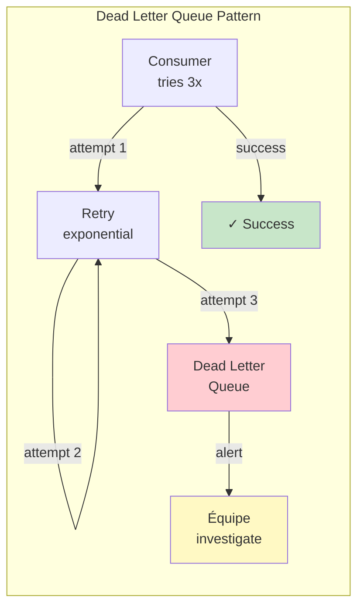
```mermaid
graph LR
    subgraph DLQ["Dead Letter Queue Pattern"]
        Consumer["Consumer<br/>tries 3x"]
        Success["✓ Success"]
        Retry["Retry<br/>exponential"]
        DLQ_Q["Dead Letter<br/>Queue"]
        Investigate["Équipe<br/>investigate"]
    end
    
    Consumer -->|attempt 1| Retry
    Retry -->|attempt 2| Retry
    Retry -->|attempt 3| DLQ_Q
    DLQ_Q -->|alert| Investigate
    Consumer -->|success| Success
    
    style DLQ_Q fill:#ffcdd2
    style Success fill:#c8e6c9
    style Investigate fill:#fff9c4
```

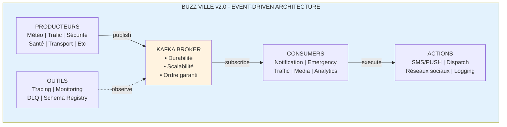
```mermaid
graph TB
    subgraph BuzzVille["BUZZ VILLE v2.0 - EVENT-DRIVEN ARCHITECTURE"]
        Prod["PRODUCTEURS<br/>Météo | Trafic | Sécurité<br/>Santé | Transport | Etc"]
        Kafka["KAFKA BROKER<br/>• Durabilité<br/>• Scalabilité<br/>• Ordre garanti"]
        Cons["CONSUMERS<br/>Notification | Emergency<br/>Traffic | Media | Analytics"]
        Action["ACTIONS<br/>SMS/PUSH | Dispatch<br/>Réseaux sociaux | Logging"]
        Tools["OUTILS<br/>Tracing | Monitoring<br/>DLQ | Schema Registry"]
    end
    
    Prod -->|publish| Kafka
    Kafka -->|subscribe| Cons
    Cons -->|execute| Action
    Tools -.->|observe| Kafka
    
    style BuzzVille fill:#e3f2fd
    style Kafka fill:#fff3e0
```

