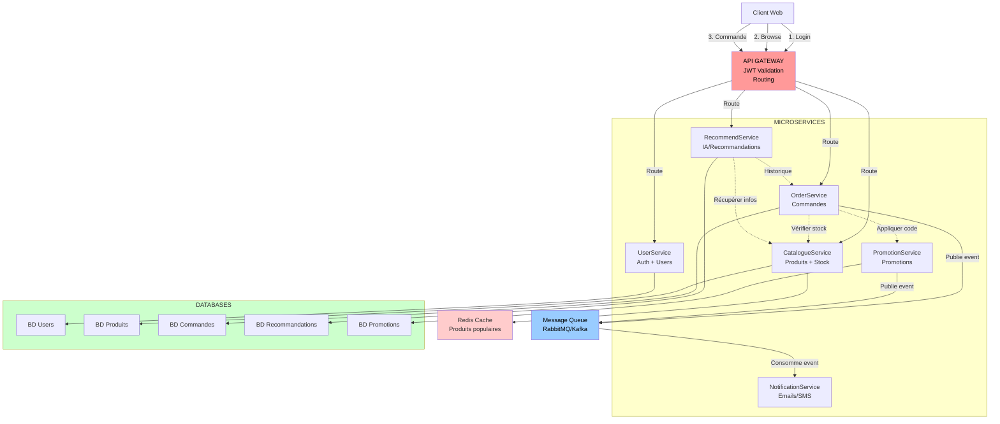
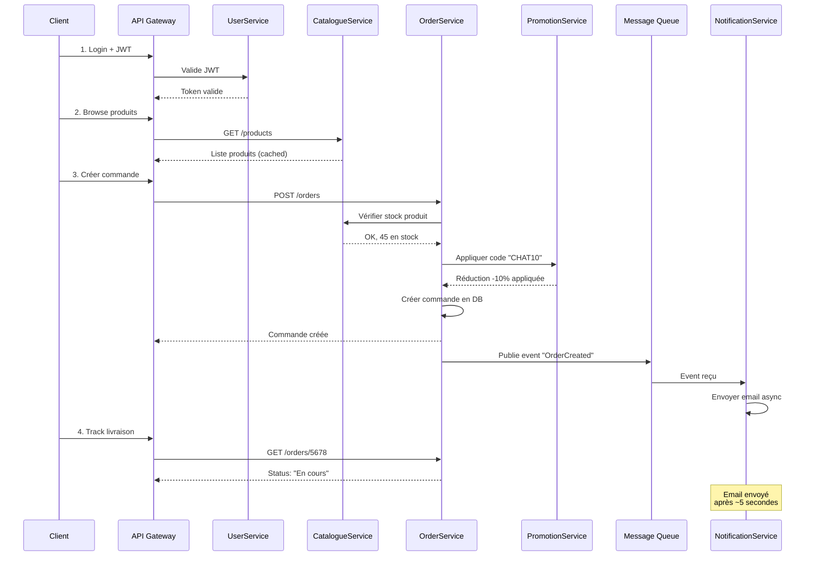

```mermaid
graph TB
    Client["Client Web"]
    Gateway["API GATEWAY<br/>JWT Validation<br/>Routing"]
    
    subgraph Services["MICROSERVICES"]
        UserService["UserService<br/>Auth + Users"]
        CatalogueService["CatalogueService<br/>Produits + Stock"]
        OrderService["OrderService<br/>Commandes"]
        RecommendService["RecommendService<br/>IA/Recommandations"]
        PromoService["PromotionService<br/>Promotions"]
        NotifService["NotificationService<br/>Emails/SMS"]
    end
    
    subgraph Databases["DATABASES"]
        UserDB["BD Users"]
        ProdDB["BD Produits"]
        OrderDB["BD Commandes"]
        RecomsDB["BD Recommandations"]
        PromoDB["BD Promotions"]
    end
    
    Queue["Message Queue<br/>RabbitMQ/Kafka"]
    Cache["Redis Cache<br/>Produits populaires"]
    
    Client -->|1. Login| Gateway
    Client -->|2. Browse| Gateway
    Client -->|3. Commande| Gateway
    
    Gateway -->|Route| UserService
    Gateway -->|Route| CatalogueService
    Gateway -->|Route| OrderService
    Gateway -->|Route| RecommendService
    
    UserService --> UserDB
    CatalogueService --> ProdDB
    CatalogueService --> Cache
    OrderService --> OrderDB
    RecommendService --> RecomsDB
    PromoService --> PromoDB
    
    OrderService -->|Publie event| Queue
    PromoService -->|Publie event| Queue
    Queue -->|Consomme event| NotifService
    
    OrderService -.->|Vérifier stock| CatalogueService
    OrderService -.->|Appliquer code| PromoService
    RecommendService -.->|Récupérer infos| CatalogueService
    RecommendService -.->|Historique| OrderService
    
    style Gateway fill:#ff9999,color:#000
    style Queue fill:#99ccff,color:#000
    style Services fill:#ffffcc
    style Databases fill:#ccffcc
    style Cache fill:#ffcccc
```

```mermaid
sequenceDiagram
    participant Client as Client
    participant Gateway as API Gateway
    participant UserSvc as UserService
    participant CatSvc as CatalogueService
    participant OrderSvc as OrderService
    participant PromoSvc as PromotionService
    participant Queue as Message Queue
    participant NotifSvc as NotificationService
    
    Client->>Gateway: 1. Login + JWT
    Gateway->>UserSvc: Valide JWT
    UserSvc-->>Gateway: Token valide
    
    Client->>Gateway: 2. Browse produits
    Gateway->>CatSvc: GET /products
    CatSvc-->>Gateway: Liste produits (cached)
    
    Client->>Gateway: 3. Créer commande
    Gateway->>OrderSvc: POST /orders
    OrderSvc->>CatSvc: Vérifier stock produit #123
    CatSvc-->>OrderSvc: OK, 45 en stock
    
    OrderSvc->>PromoSvc: Appliquer code "CHAT10"
    PromoSvc-->>OrderSvc: Réduction -10% appliquée
    
    OrderSvc->>OrderSvc: Créer commande en DB
    OrderSvc-->>Gateway: Commande créée #5678
    
    OrderSvc->>Queue: Publie event "OrderCreated"
    Queue->>NotifSvc: Event reçu
    NotifSvc->>NotifSvc: Envoyer email async
    
    Client->>Gateway: 4. Track livraison
    Gateway->>OrderSvc: GET /orders/5678
    OrderSvc-->>Gateway: Status: "En cours"
    
    Note over NotifSvc: Email envoyé<br/>après ~5 secondes
```