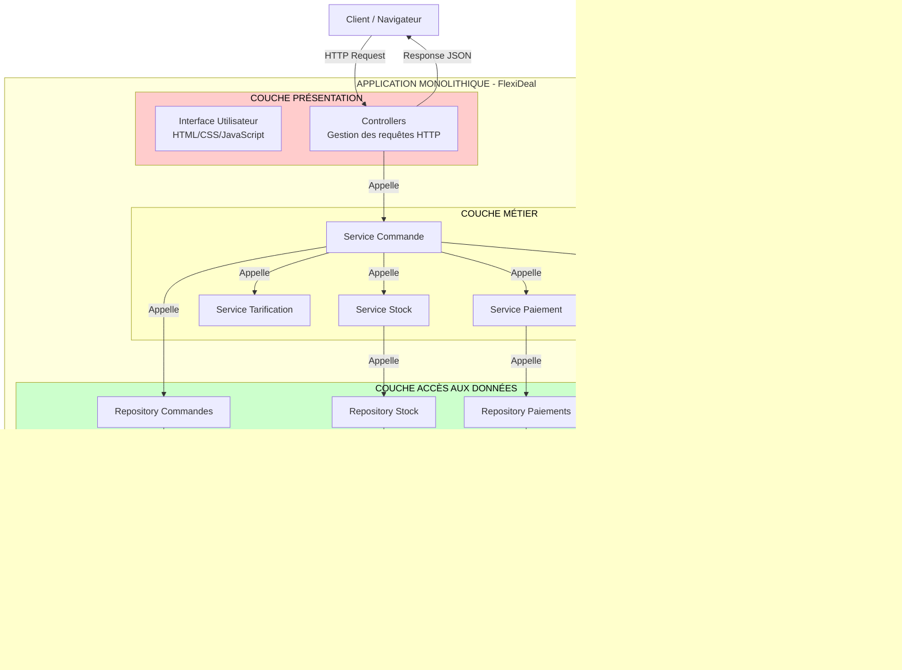
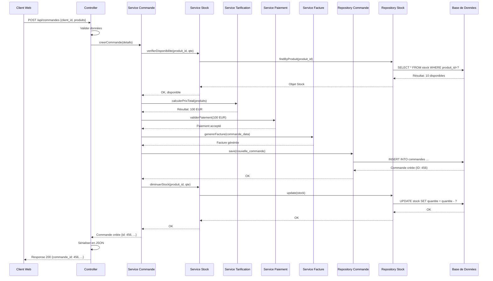
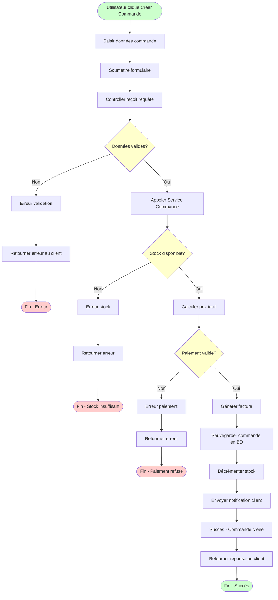

```mermaid
graph TB
    Client["Client / Navigateur"]
    
    subgraph Monolithe["APPLICATION MONOLITHIQUE - FlexiDeal"]
        subgraph Presentation["COUCHE PRÉSENTATION"]
            UI["Interface Utilisateur<br/>HTML/CSS/JavaScript"]
            Controllers["Controllers<br/>Gestion des requêtes HTTP"]
        end
        
        subgraph Business["COUCHE MÉTIER"]
            CommandService["Service Commande"]
            StockService["Service Stock"]
            PricingService["Service Tarification"]
            PaymentService["Service Paiement"]
            InvoiceService["Service Facture"]
            NotificationService["Service Notification"]
        end
        
        subgraph Data["COUCHE ACCÈS AUX DONNÉES"]
            CommandRepository["Repository Commandes"]
            StockRepository["Repository Stock"]
            ClientRepository["Repository Clients"]
            PaymentRepository["Repository Paiements"]
            InvoiceRepository["Repository Factures"]
            ORM["ORM Framework"]
        end
        
        subgraph Database["BASE DE DONNÉES"]
            DB["PostgreSQL/MySQL<br/>Schéma Centralisé<br/>Transactions ACID"]
        end
    end
    
    Client -->|HTTP Request| Controllers
    Controllers -->|Appelle| CommandService
    CommandService -->|Appelle| StockService
    CommandService -->|Appelle| PricingService
    CommandService -->|Appelle| PaymentService
    CommandService -->|Appelle| InvoiceService
    
    CommandService -->|Appelle| CommandRepository
    StockService -->|Appelle| StockRepository
    PaymentService -->|Appelle| PaymentRepository
    InvoiceService -->|Appelle| InvoiceRepository
    
    CommandRepository -->|ORM| ORM
    StockRepository -->|ORM| ORM
    PaymentRepository -->|ORM| ORM
    InvoiceRepository -->|ORM| ORM
    
    ORM -->|SQL| DB
    
    Controllers -->|Response JSON| Client
    
    style Presentation fill:#ffcccc,color:#000
    style Business fill:#ffffcc,color:#000
    style Data fill:#ccffcc,color:#000
    style Database fill:#ccccff,color:#000
```

```mermaid
sequenceDiagram
    participant Client as Client Web
    participant Ctrl as Controller
    participant CmdSvc as Service Commande
    participant StockSvc as Service Stock
    participant PricingSvc as Service Tarification
    participant PaySvc as Service Paiement
    participant InvSvc as Service Facture
    participant CmdRepo as Repository Commande
    participant StockRepo as Repository Stock
    participant DB as Base de Données
    
    Client->>Ctrl: POST /api/commandes {client_id, produits}
    
    Ctrl->>Ctrl: Valider données
    
    Ctrl->>CmdSvc: creerCommande(details)
    
    CmdSvc->>StockSvc: verifierDisponibilite(produit_id, qte)
    StockSvc->>StockRepo: findByProduit(produit_id)
    StockRepo->>DB: SELECT * FROM stock WHERE produit_id=?
    DB-->>StockRepo: Résultat: 10 disponibles
    StockRepo-->>StockSvc: Objet Stock
    StockSvc-->>CmdSvc: OK, disponible
    
    CmdSvc->>PricingSvc: calculerPrixTotal(produits)
    PricingSvc-->>CmdSvc: Résultat: 100 EUR
    
    CmdSvc->>PaySvc: validerPaiement(100 EUR)
    PaySvc-->>CmdSvc: Paiement accepté
    
    CmdSvc->>InvSvc: genererFacture(commande_data)
    InvSvc-->>CmdSvc: Facture générée
    
    CmdSvc->>CmdRepo: save(nouvelle_commande)
    CmdRepo->>DB: INSERT INTO commandes ...
    DB-->>CmdRepo: Commande créée (ID: 456)
    CmdRepo-->>CmdSvc: OK
    
    CmdSvc->>StockSvc: diminuerStock(produit_id, qte)
    StockSvc->>StockRepo: update(stock)
    StockRepo->>DB: UPDATE stock SET quantite = quantite - ?
    DB-->>StockRepo: OK
    StockRepo-->>StockSvc: OK
    StockSvc-->>CmdSvc: OK
    
    CmdSvc-->>Ctrl: Commande créée {id: 456, ...}
    
    Ctrl->>Ctrl: Sérialiser en JSON
    
    Ctrl-->>Client: Response 200 {commande_id: 456, ...}
```

```mermaid
graph TD
    Start([Utilisateur clique Créer Commande]) --> Saisir[Saisir données commande]
    Saisir --> Soumettre[Soumettre formulaire]
    Soumettre --> RecCtrl[Controller reçoit requête]
    RecCtrl --> ValCtrl{Données valides?}
    
    ValCtrl -->|Non| ErrVal[Erreur validation]
    ErrVal --> RetErr[Retourner erreur au client]
    RetErr --> End1([Fin - Erreur])
    
    ValCtrl -->|Oui| AppSvc[Appeler Service Commande]
    AppSvc --> VerifStock{Stock disponible?}
    
    VerifStock -->|Non| ErrStock[Erreur stock]
    ErrStock --> RetErrStock[Retourner erreur]
    RetErrStock --> End2([Fin - Stock insuffisant])
    
    VerifStock -->|Oui| CalcPrix[Calculer prix total]
    CalcPrix --> ValPay{Paiement valide?}
    
    ValPay -->|Non| ErrPay[Erreur paiement]
    ErrPay --> RetErrPay[Retourner erreur]
    RetErrPay --> End3([Fin - Paiement refusé])
    
    ValPay -->|Oui| GenFact[Générer facture]
    GenFact --> SaveCmd[Sauvegarder commande en BD]
    SaveCmd --> DecStock[Décrémenter stock]
    DecStock --> SendNotif[Envoyer notification client]
    SendNotif --> Success[Succès - Commande créée]
    Success --> RetSuccess[Retourner réponse au client]
    RetSuccess --> End4([Fin - Succès])
    
    style Start fill:#ccffcc
    style End1 fill:#ffcccc
    style End2 fill:#ffcccc
    style End3 fill:#ffcccc
    style End4 fill:#ccffcc
    style ValCtrl fill:#ffffcc
    style VerifStock fill:#ffffcc
    style ValPay fill:#ffffcc
```