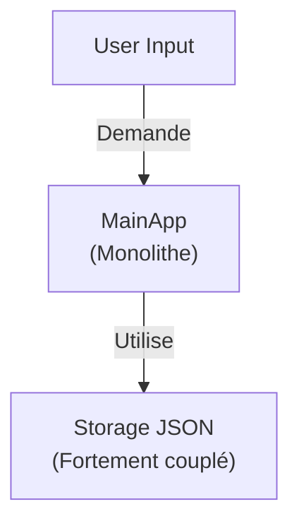

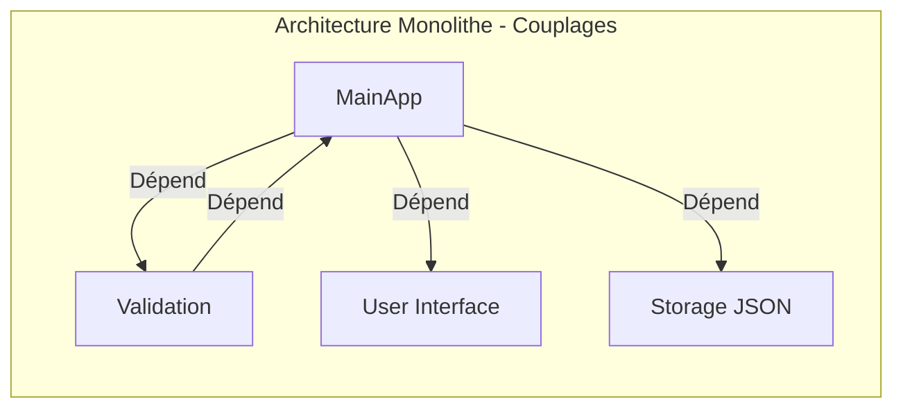

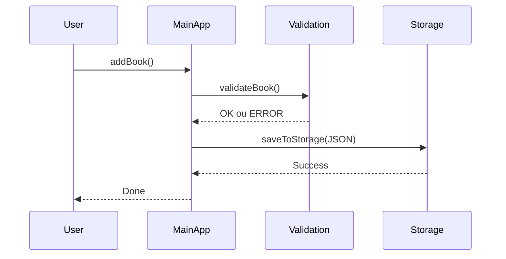

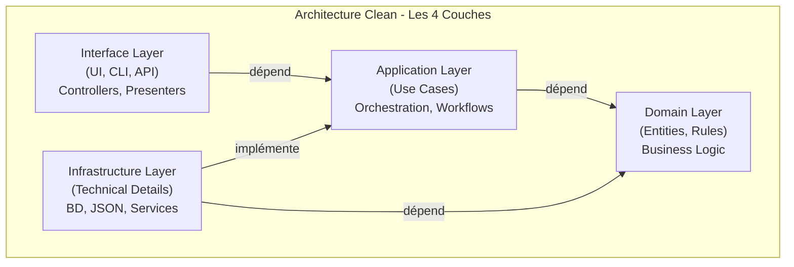

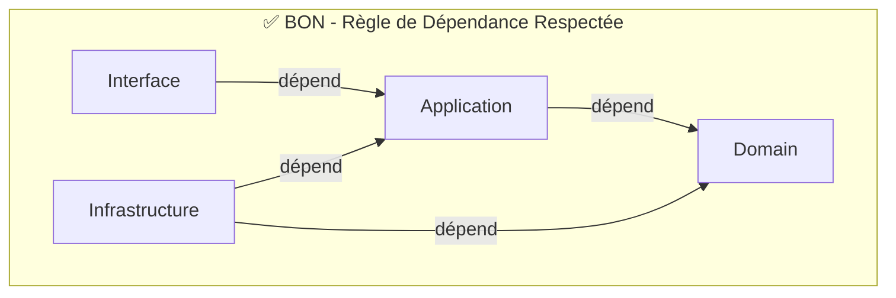

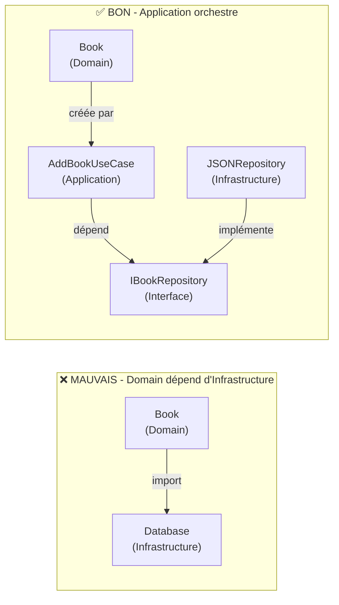

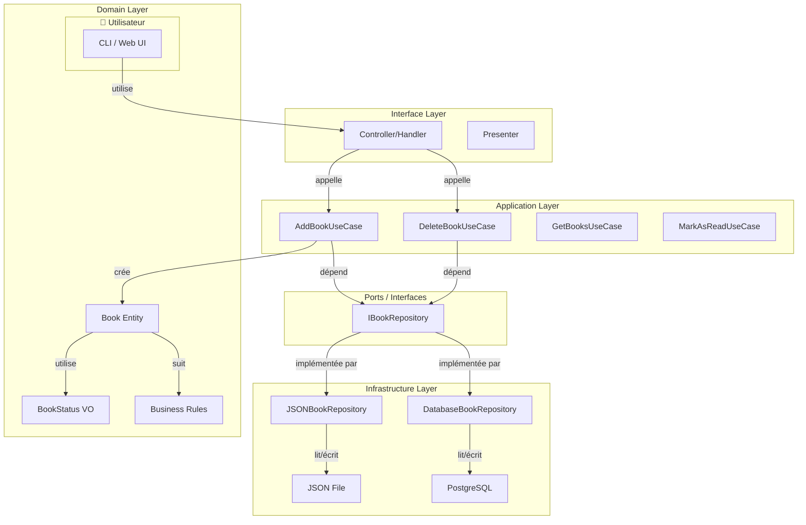

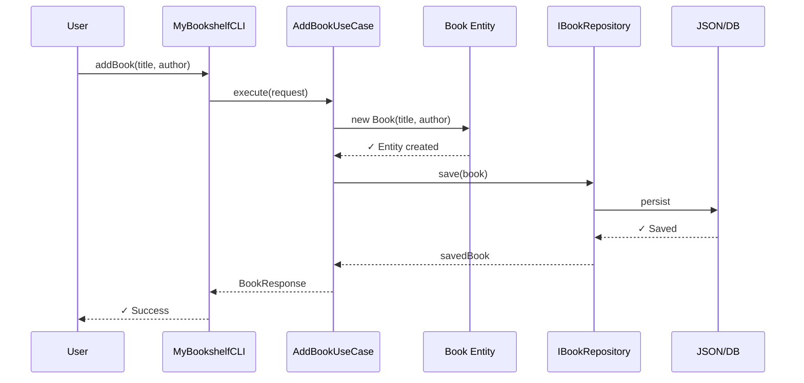

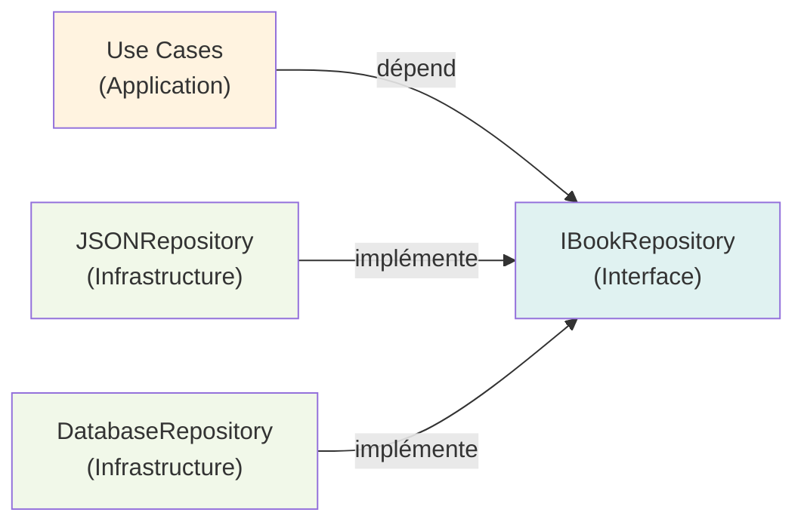

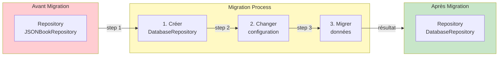

```mermaid
graph LR
    D["Domain<br/>Book Entity"]
    A["Application<br/>RateBookUseCase"]
    I["Infrastructure<br/>Repository"]
    
    D -->|add| Rating["rating: 0-5"]
    A -->|new| "RateBookUseCase"
    I -->|persist| "rating field"
    
    style D fill:#fff3e0
    style A fill:#f3e5f5
    style I fill:#f1f8e9
```

```mermaid
xychart-beta
    title Score de Qualité: Avant vs Après
    x-axis [Maintenabilité, Testabilité, Flexibilité, Évolutivité]
    y-axis "Score" 0 --> 100
    line [20, 10, 15, 25]
    line [90, 95, 85, 90]
    
    legend
        item Avant (MainApp)
        item Après (Clean)
```


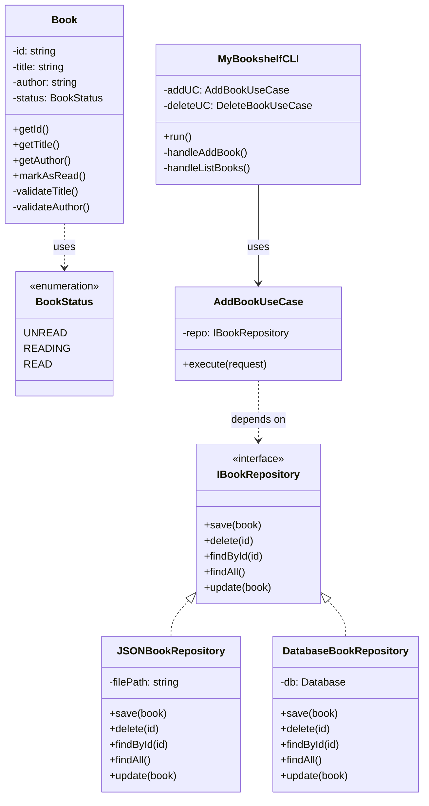
