```mermaid
graph TD
    UI["User Input"]
    MA["MainApp<br/>(Monolithe)"]
    JSON["Storage JSON<br/>(Fortement couplé)"]
    
    UI -->|Demande| MA
    MA -->|Utilise| JSON
```

```mermaid
graph TB
    subgraph Clean["Architecture Clean - Les 4 Couches"]
        I["Interface Layer<br/>(UI, CLI, API)<br/>Controllers, Presenters"]
        A["Application Layer<br/>(Use Cases)<br/>Orchestration, Workflows"]
        D["Domain Layer<br/>(Entities, Rules)<br/>Business Logic"]
        INF["Infrastructure Layer<br/>(Technical Details)<br/>BD, JSON, Services"]
    end
    
    I -->|dépend| A
    A -->|dépend| D
    INF -->|implémente| A
    INF -->|dépend| D
```

```mermaid
graph TB
    subgraph Correct["✅ BON - Règle de Dépendance Respectée"]
        I1["Interface"]
        A1["Application"]
        D1["Domain"]
        INF1["Infrastructure"]
    end
    
    I1 -->|dépend| A1
    A1 -->|dépend| D1
    INF1 -->|dépend| A1
    INF1 -->|dépend| D1
```

```mermaid
graph LR
    subgraph Mauvais["❌ MAUVAIS - Domain dépend d'Infrastructure"]
        B1["Book<br/>(Domain)"]
        DB1["Database<br/>(Infrastructure)"]
    end
    B1 -->|import| DB1
    
    subgraph Bon["✅ BON - Application orchestre"]
        B2["Book<br/>(Domain)"]
        UC["AddBookUseCase<br/>(Application)"]
        R["IBookRepository<br/>(Interface)"]
        DB2["JSONRepository<br/>(Infrastructure)"]
    end
    B2 -->|créée par| UC
    UC -->|dépend| R
    DB2 -->|implémente| R
```

```mermaid
graph TB
    subgraph User["👤 Utilisateur"]
        CLI["CLI / Web UI"]
    end
    
    subgraph I["Interface Layer"]
        Controller["Controller/Handler"]
        Presenter["Presenter"]
    end
    
    subgraph A["Application Layer"]
        UC1["AddBookUseCase"]
        UC2["DeleteBookUseCase"]
        UC3["GetBooksUseCase"]
        UC4["MarkAsReadUseCase"]
    end
    
    subgraph D["Domain Layer"]
        Book["Book Entity"]
        User["User Entity"]
        BookStatus["BookStatus VO"]
        Rules["Business Rules"]
    end
    
    subgraph Ports["Ports / Interfaces"]
        IRepo["IBookRepository"]
    end
    
    subgraph INF["Infrastructure Layer"]
        JSONRepo["JSONBookRepository"]
        DBRepo["DatabaseBookRepository"]
        JSON["JSON File"]
        DB["PostgreSQL"]
    end
    
    CLI -->|utilise| Controller
    Controller -->|appelle| UC1
    Controller -->|appelle| UC2
    UC1 -->|crée| Book
    UC1 -->|dépend| IRepo
    UC2 -->|dépend| IRepo
    Book -->|utilise| BookStatus
    Book -->|suit| Rules
    IRepo -->|implémentée par| JSONRepo
    IRepo -->|implémentée par| DBRepo
    JSONRepo -->|lit/écrit| JSON
    DBRepo -->|lit/écrit| DB
```

```mermaid
graph LR
    UC["Use Cases<br/>(Application)"]
    IR["IBookRepository<br/>(Interface)"]
    JSON["JSONRepository<br/>(Infrastructure)"]
    DB["DatabaseRepository<br/>(Infrastructure)"]

    UC -->|dépend| IR
    JSON -->|implémente| IR
    DB -->|implémente| IR

    style UC fill:#fff3e0
    style IR fill:#e0f2f1
    style JSON fill:#f1f8e9
    style DB fill:#f1f8e9
```

```mermaid
graph LR
    subgraph Avant["Avant Migration"]
        RC1["Repository<br/>JSONBookRepository"]
    end
    
    subgraph Migration["Migration Process"]
        S1["1. Créer<br/>DatabaseRepository"]
        S2["2. Changer<br/>configuration"]
        S3["3. Migrer<br/>données"]
    end
    
    subgraph Apres["Après Migration"]
        RC2["Repository<br/>DatabaseRepository"]
    end
    
    Avant -->|step 1| S1
    S1 -->|step 2| S2
    S2 -->|step 3| S3
    S3 -->|résultat| Apres
    
    style Avant fill:#ffcdd2
    style Migration fill:#fff9c4
    style Apres fill:#c8e6c9
```

```mermaid
graph LR
    subgraph Problèmes["Architecture Monolithe - Couplages"]
        MA["MainApp"]
        VAL["Validation"]
        UI["User Interface"]
        JSON["Storage JSON"]
    end
    
    MA -->|Dépend| VAL
    MA -->|Dépend| UI
    MA -->|Dépend| JSON
    VAL -->|Dépend| MA
```















```mermaid
graph LR
    D["Domain<br/>Book Entity"]
    A["Application<br/>RateBookUseCase"]
    I["Infrastructure<br/>Repository"]
    
    D -->|add| Rating["rating: 0-5"]
    A -->|new| "RateBookUseCase"
    I -->|persist| "rating field"
    
    style D fill:#fff3e0
    style A fill:#f3e5f5
    style I fill:#f1f8e9
```

```mermaid
xychart-beta
    title Score de Qualité: Avant vs Après
    x-axis [Maintenabilité, Testabilité, Flexibilité, Évolutivité]
    y-axis "Score" 0 --> 100
    line [20, 10, 15, 25]
    line [90, 95, 85, 90]
    
    legend
        item Avant (MainApp)
        item Après (Clean)
```


