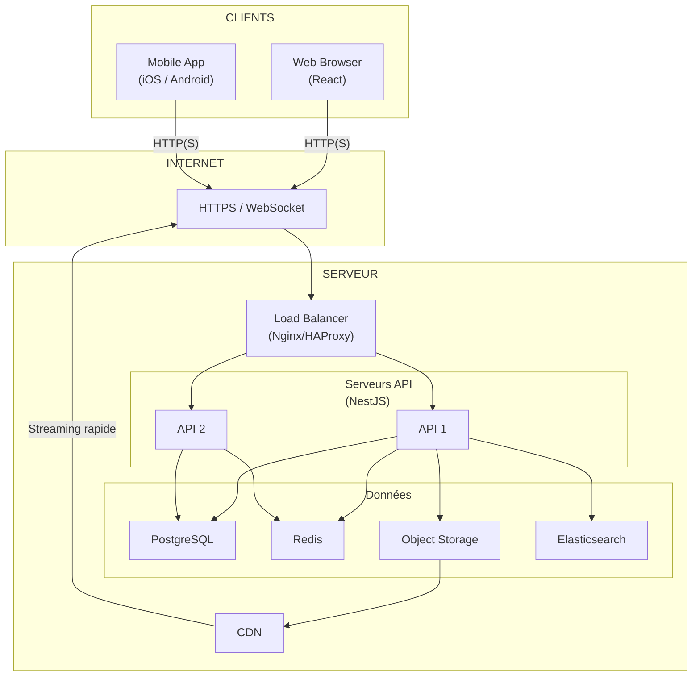

```mermaid
%%{init: {'flowchart': {'subGraphTitleMargin': {'top': 6, 'bottom': 22}}}}%%
graph TB
    subgraph Clients["CLIENTS"]
        WEB["Web Browser<br/>(React)"]
        MOBILE["Mobile App<br/>(iOS / Android)"]
    end
    
    subgraph Internet["INTERNET"]
        HTTPS["HTTPS / WebSocket"]
    end
    
    subgraph Server["SERVEUR"]
        LB["Load Balancer<br/>(Nginx/HAProxy)"]
        
        subgraph API["Serveurs API<br/>(NestJS)"]
            API1["API 1"]
            API2["API 2"]
        end
        
        subgraph Storage["Données"]
            PG["PostgreSQL"]
            REDIS["Redis"]
            S3["Object Storage"]
            ES["Elasticsearch"]
        end
        
        CDN["CDN"]
    end
    
    WEB -->|"HTTP(S)"| HTTPS
    MOBILE -->|"HTTP(S)"| HTTPS
    HTTPS --> LB
    
    LB --> API1
    LB --> API2
    
    API1 --> PG
    API1 --> REDIS
    API1 --> S3
    API1 --> ES
    
    API2 --> PG
    API2 --> REDIS
    
    S3 --> CDN
    CDN -->|Streaming rapide| HTTPS
```