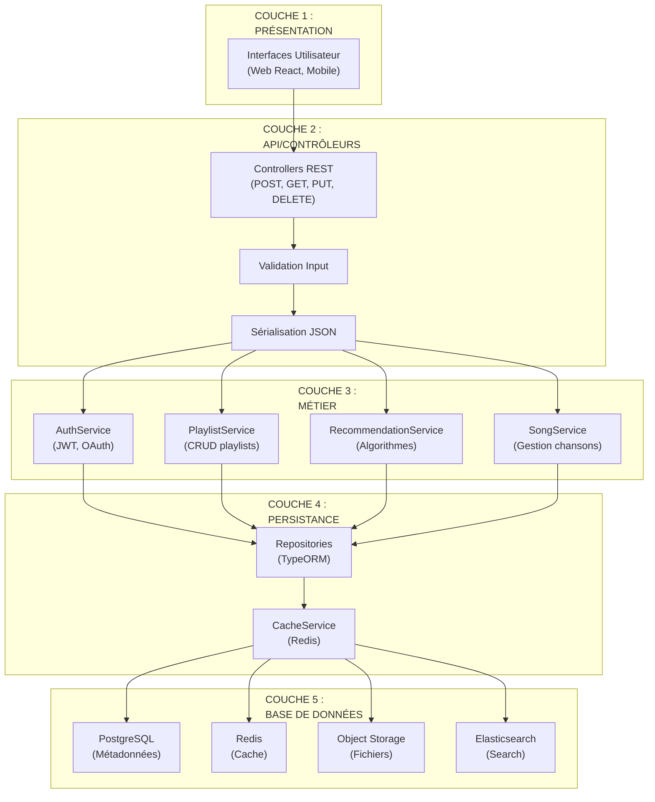

```mermaid
%%{init: {'flowchart': {'subGraphTitleMargin': {'top': 6, 'bottom': 22}}}}%%
graph TB
    subgraph Presentation["COUCHE 1 :<br/>PRÉSENTATION"]
        UI["Interfaces Utilisateur<br/>(Web React, Mobile)"]
    end
    
    subgraph API_Layer["COUCHE 2 :<br/>API/CONTRÔLEURS"]
        Controllers["Controllers REST<br/>(POST, GET, PUT, DELETE)"]
        Validation["Validation Input"]
        Serialization["Sérialisation JSON"]
    end
    
    subgraph Business_Layer["COUCHE 3 :<br/>MÉTIER"]
        Auth["AuthService<br/>(JWT, OAuth)"]
        PlaylistService["PlaylistService<br/>(CRUD playlists)"]
        RecommendService["RecommendationService<br/>(Algorithmes)"]
        SongService["SongService<br/>(Gestion chansons)"]
    end
    
    subgraph Data_Layer["COUCHE 4 :<br/>PERSISTANCE"]
        Repository["Repositories<br/>(TypeORM)"]
        CacheService["CacheService<br/>(Redis)"]
    end
    
    subgraph Database["COUCHE 5 :<br/>BASE DE DONNÉES"]
        PG["PostgreSQL<br/>(Métadonnées)"]
        REDIS["Redis<br/>(Cache)"]
        S3["Object Storage<br/>(Fichiers)"]
        ES["Elasticsearch<br/>(Search)"]
    end
    
    UI --> Controllers
    Controllers --> Validation
    Validation --> Serialization
    
    Serialization --> Auth
    Serialization --> PlaylistService
    Serialization --> RecommendService
    Serialization --> SongService
    
    Auth --> Repository
    PlaylistService --> Repository
    RecommendService --> Repository
    SongService --> Repository
    
    Repository --> CacheService
    
    CacheService --> PG
    CacheService --> REDIS
    CacheService --> S3
    CacheService --> ES

```