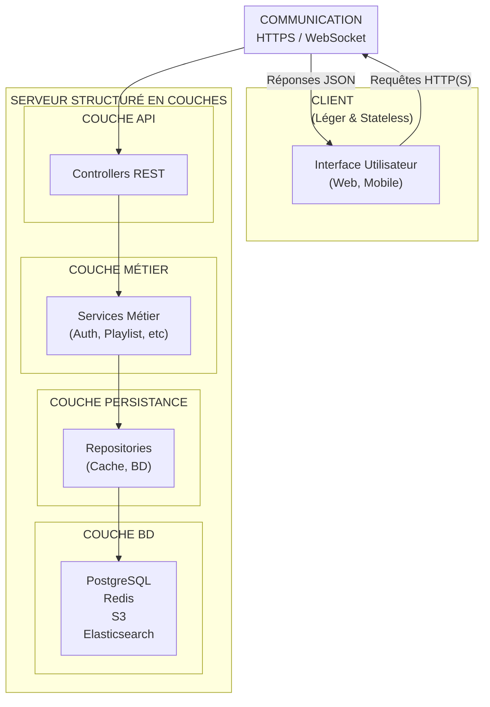

```mermaid
%%{init: {'flowchart': {'subGraphTitleMargin': {'top': 6, 'bottom': 22}}}}%%
graph TB
    subgraph Client["CLIENT<br/>(Léger & Stateless)"]
        UI["Interface Utilisateur<br/>(Web, Mobile)"]
    end
    
    subgraph Communication["COMMUNICATION<br/>HTTPS / WebSocket"]
    end
    
    subgraph Server["SERVEUR STRUCTURÉ EN COUCHES"]
        subgraph Layer2["COUCHE API"]
            API["Controllers REST"]
        end
        
        subgraph Layer3["COUCHE MÉTIER"]
            Business["Services Métier<br/>(Auth, Playlist, etc)"]
        end
        
        subgraph Layer4["COUCHE PERSISTANCE"]
            Data["Repositories<br/>(Cache, BD)"]
        end
        
        subgraph Layer5["COUCHE BD"]
            DB["PostgreSQL<br/>Redis<br/>S3<br/>Elasticsearch"]
        end
    end
    
    UI -->|"Requêtes HTTP(S)"| Communication
    Communication -->|Réponses JSON| UI
    
    Communication --> API
    API --> Business
    Business --> Data
    Data --> DB

```