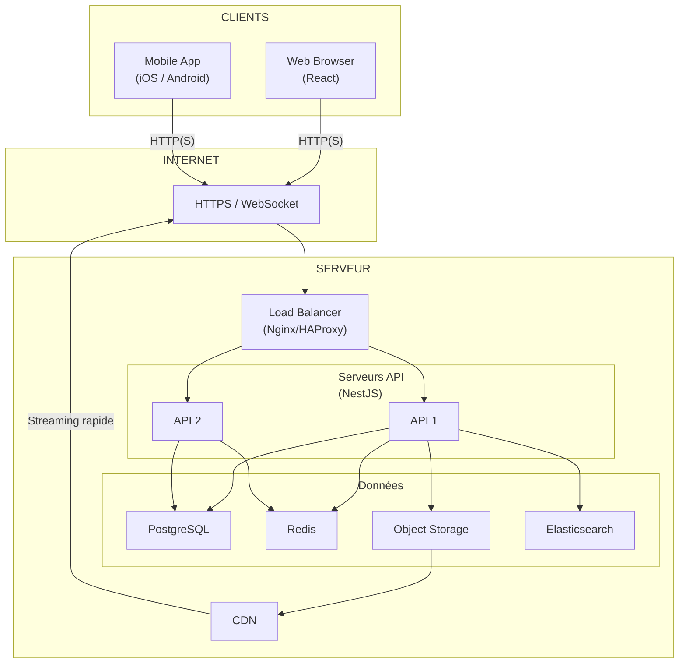
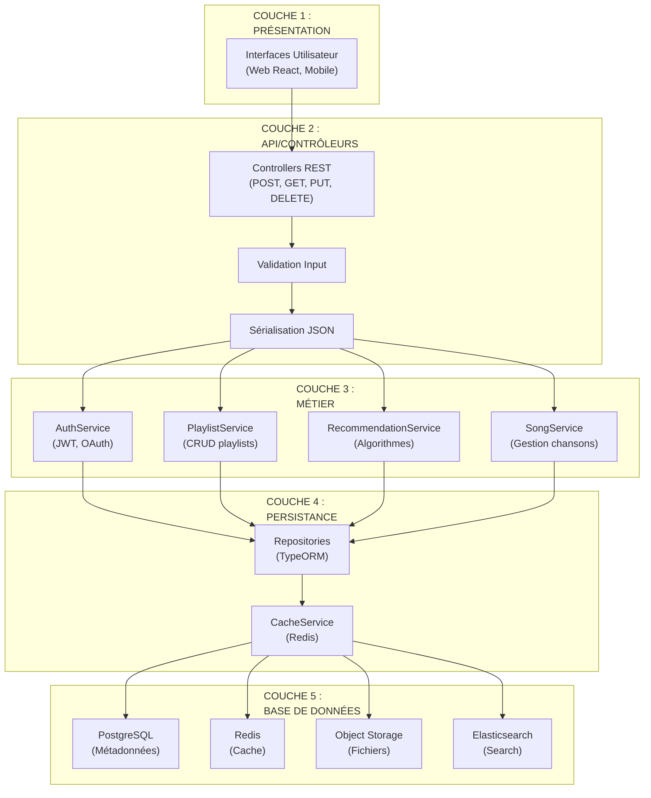
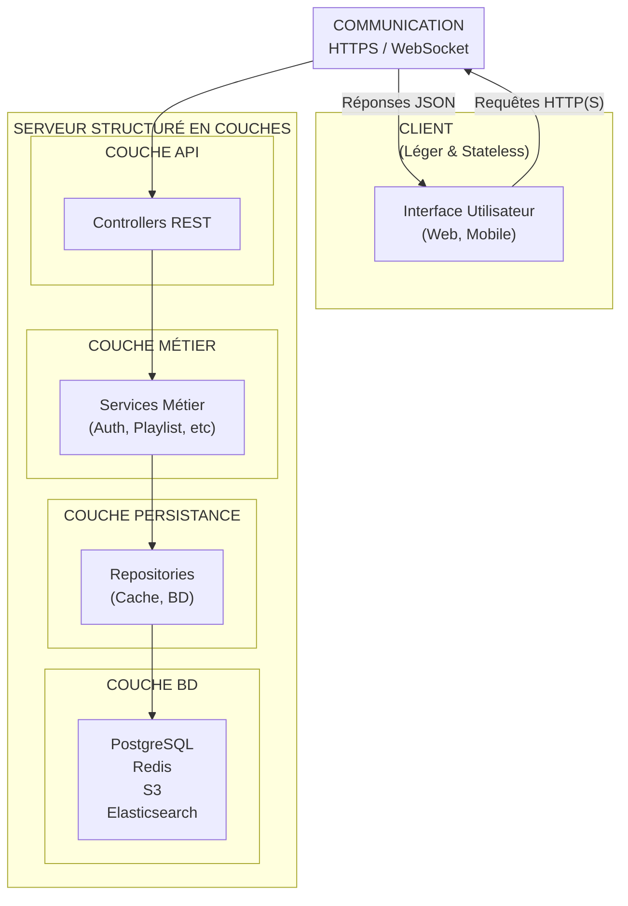

# StreamTune - Rapport d'Architecture Logicielle <!-- omit in toc -->

- [Introduction](#introduction)
- [1. Analyse des Besoins](#1-analyse-des-besoins)
  - [Exigences Fonctionnelles](#exigences-fonctionnelles)
  - [Exigences Non-Fonctionnelles](#exigences-non-fonctionnelles)
- [2. Choix Architecturaux Globaux](#2-choix-architecturaux-globaux)
  - [Justification de l'Architecture Client-Serveur](#justification-de-larchitecture-client-serveur)
  - [Justification de l'Architecture en Couches](#justification-de-larchitecture-en-couches)
  - [Combinaison des Deux Styles](#combinaison-des-deux-styles)
- [3. Architecture Client-Serveur](#3-architecture-client-serveur)
  - [Composants Clients](#composants-clients)
  - [Composants Serveurs](#composants-serveurs)
  - [Communication Client-Serveur](#communication-client-serveur)
  - [Diagramme Architecture Client-Serveur](#diagramme-architecture-client-serveur)
  - [Avantages pour StreamTune](#avantages-pour-streamtune)
- [4. Architecture en Couches](#4-architecture-en-couches)
  - [Les 5 Couches](#les-5-couches)
  - [Responsabilités de Chaque Couche](#responsabilités-de-chaque-couche)
  - [Communication Inter-Couches](#communication-inter-couches)
  - [Diagramme Architecture en Couches](#diagramme-architecture-en-couches)
  - [Avantages pour StreamTune](#avantages-pour-streamtune-1)
- [5. Cohabitation des Deux Styles Architecturaux](#5-cohabitation-des-deux-styles-architecturaux)
  - [Deux Dimensions Complémentaires](#deux-dimensions-complémentaires)
  - [Comment Elles S'Intègrent](#comment-elles-sintègrent)
  - [Bénéfices de Cette Combinaison](#bénéfices-de-cette-combinaison)
  - [Diagramme Cohabitation Client-Serveur + En Couches](#diagramme-cohabitation-client-serveur--en-couches)
- [6. Gestion de la Montée en Charge](#6-gestion-de-la-montée-en-charge)
- [7. Sécurité \& Maintenabilité](#7-sécurité--maintenabilité)
- [Conclusion](#conclusion)
- [Glossaire Technique](#glossaire-technique)

## Introduction

StreamTune aspire à devenir une plateforme de streaming musical mondiale, capable de servir des milliers d'utilisateurs simultanés tout en gérant une collection de millions de chansons.

Ce défi implique des exigences fortes en termes de scalabilité, de performance et de sécurité des données.

Pour répondre à ces besoins, nous proposons une architecture combinant deux styles fondamentaux :

- une architecture client-serveur pour la distribution des responsabilités,
- une architecture en couches pour l'organisation interne du serveur.

Cette approche garantit une flexibilité maximale, une maintenabilité optimale et une capacité d'évolution future.

---

## 1. Analyse des Besoins

### Exigences Fonctionnelles

StreamTune doit permettre aux utilisateurs de s'inscrire, rechercher des chansons par titre/artiste/genre, créer et gérer des playlists, et streamer de la musique en temps réel.

Les artistes doivent pouvoir uploader leurs compositions avec métadonnées associées.

La plateforme doit supporter des recommandations personnalisées basées sur l'historique d'écoute.

### Exigences Non-Fonctionnelles

**Scalabilité** : Gérer des milliers d'utilisateurs simultanés et des millions de chansons sans dégradation de performance.

**Performance** : Temps de réponse rapide pour recherches, streaming fluide sans interruptions.

**Disponibilité** : Plateforme 24/7 avec tolérance aux défaillances matérielles. Pics de charge imprévisibles (sorties albums, promotions).

**Sécurité** : Protection données utilisateurs, gestion des droits d'auteur, authentification robuste.

**Maintenabilité** : Architecture flexible pour ajouter nouvelles fonctionnalités (podcasts, recommandations IA, features sociales) sans perturbation.

---

## 2. Choix Architecturaux Globaux

### Justification de l'Architecture Client-Serveur

L'architecture client-serveur est **incontournable** pour StreamTune car elle offre trois avantages critiques :

- (1) **Centralisation des droits d'auteur** : les règles de gestion des droits et des accès sont appliquées côté serveur, impossible à contourner par un client malveillant.
- (2) **Source unique de vérité** : toutes les données (chansons, utilisateurs, playlists) sont centralisées, garantissant cohérence et synchronisation.
- (3) **Scalabilité horizontale** : on peut multiplier les serveurs API sans modification du client, permettant une croissance flexible.

### Justification de l'Architecture en Couches

Structurer le serveur en couches répond à des enjeux de **maintenabilité** et **testabilité**.

Chaque couche (présentation, métier, données) a une responsabilité unique et bien définie.

Cela permet de tester chaque couche indépendamment (tests unitaires), de modifier l'une sans casser les autres, et de réutiliser le code métier dans d'autres contextes (ex : future API GraphQL, webhook, job asynchrone).

### Combinaison des Deux Styles

Client-serveur répond à la **division horizontale** (client vs serveur), tandis que les couches répondent à la **division verticale** (présentation vs métier vs données).

Ensemble, elles offrent une **séparation complète des préoccupations**, garantissant scalabilité, maintenabilité et sécurité.

C'est un pattern classique dans les grandes applications web modernes.

---

## 3. Architecture Client-Serveur

### Composants Clients

StreamTune propose deux types de clients :

- application web (navigateur React),
- applications mobiles (iOS/Android).

Les clients sont légers et stateless :

- ils gèrent l'interface utilisateur,
- capturent les interactions,
- envoient requêtes HTTPS au serveur,
- affichent les réponses.

Aucune logique métier critique côté client.

### Composants Serveurs

Le serveur comprend :

- (1) **Load Balancer** : répartit requêtes HTTP(S) sur serveurs API.
- (2) **Serveurs API** : instances multiples (NestJS/Node.js) exécutant logique métier.
- (3) **PostgreSQL** : données relationnelles (utilisateurs, chansons, playlists).
- (4) **Redis** : cache sessions et résultats recherche.
- (5) **Object Storage** : fichiers audio immuables et répliqués.
- (6) **Elasticsearch** : recherche full-text sur millions chansons.
- (7) **CDN** : distribution audio mondiale via edge servers.

### Communication Client-Serveur

Modèle requête-réponse :

**client → load balancer → serveur API sélectionné → consultation cache/BD/Elasticsearch → réponse JSON.**

WebSocket possible pour streaming audio temps réel.

### Diagramme Architecture Client-Serveur

### Avantages pour StreamTune

**Centralisation** : Source unique de vérité  
**Sécurité** : Droits d'auteur gérés serveur  
**Scalabilité** : Scale horizontal facile  
**Flexibilité** : Clients multiples, serveur unique

---

## 4. Architecture en Couches

### Les 5 Couches

StreamTune est structuré en **5 couches verticales** :

- (1) **Présentation** : interfaces utilisateur (web React, mobile).
- (2) **API/Contrôleurs** : endpoints REST pour communiquer avec clients.
- (3) **Métier** : logique métier (authentification, gestion playlists, recommandations).
- (4) **Persistance** : accès données via repositories et cache.
- (5) **Base de Données** : PostgreSQL, Redis, Object Storage, Elasticsearch.

### Responsabilités de Chaque Couche

**Présentation** : affiche l'interface, capture interactions utilisateur.  
**API** : valide requêtes, orchestre appels métier, sérialise réponses JSON.  
**Métier** : implémente règles métier, gère droits d'accès, logique applicative.  
**Persistance** : requêtes BD, gestion cache, mapping objet-relationnel.  
**BD** : stockage données, recherche, fichiers.

### Communication Inter-Couches

Les couches communiquent de **haut en bas** :

**présentation → API → métier → persistance → BD.**

Chaque couche expose une interface et n'expose pas ses détails internes.

Flux inverse :

**BD retourne données → persistance mappe → métier traite → API sérialise → présentation affiche.**

### Diagramme Architecture en Couches

### Avantages pour StreamTune

**Séparation des préoccupations** : Chaque couche a responsabilité unique  
**Testabilité** : Tester chaque couche indépendamment (mocks)  
**Maintenabilité** : Modifier une couche sans affecter autres  
**Réutilisabilité** : Services métier utilisables par multiple contextes  
**Évolutivité** : Ajouter features sans restructurer existant

---

## 5. Cohabitation des Deux Styles Architecturaux

### Deux Dimensions Complémentaires

**Client-serveur** répond à une division **horizontale** : client (léger, présentation) vs serveur (lourd, logique métier et données).

**Architecture en couches** répond à une division **verticale** : chaque couche du serveur a responsabilité spécifique (API → métier → données → BD). Ces deux styles ne s'opposent pas ; ils se **complètent parfaitement**.

### Comment Elles S'Intègrent

Le client reste simple : interface + gestion interactions.

Le serveur, lui, est organisé en couches pour interne : **requête client → API → métier → persistance → BD.**

Client ne voit que l'API du serveur (abstraction). Le serveur interne peut évoluer (refactoring couches) sans impacter client.

Cette séparation **horizontale + verticale** crée une architecture **modulaire et scalable**.

### Bénéfices de Cette Combinaison

**Clients légers** : faciles à déployer et maintenir  
**Serveur bien organisé** : logique métier isolée et testable  
**Scalabilité** : ajouter serveurs API sans impact client  
**Sécurité** : logique sensible côté serveur uniquement  
**Maintenabilité** : évolution indépendante client/serveur

### Diagramme Cohabitation Client-Serveur + En Couches

---

## 6. Gestion de la Montée en Charge

StreamTune doit gérer deux scénarios :

- (1) **Croissance régulière** : ajouter des serveurs API quand la charge augmente (scaling horizontal).

- (2) **Pics imprévisibles** : sortie album très attendu → des milliers d'utilisateurs simultanés.

**Solutions :**

- le load balancer répartit les requêtes entre serveurs API, permettant de ajouter rapidement des serveurs supplémentaires.
- Redis cache les résultats de recherche populaires.
- CDN distribue les fichiers audio depuis serveurs proches des utilisateurs (réduisant latence).
- Rate limiting limite requêtes par utilisateur (prévient abuse).

**Principes clés** :

- Ajouter des serveurs API (horizontal scaling) résout les problèmes de charge graduels.
- Pour pics soudains, une bonne stratégie de caching (Redis) + CDN + load balancing suffisent.

Les requêtes complexes sont optimisées via indexation base de données.

**Monitoring et alertes** :

Surveiller l'état du système (CPU, erreurs, latence). Si CPU serveurs > 80%, déclencher ajout serveurs automatiquement.

Si les erreurs augmentent, alerter l'équipe pour investigation.

Si latence devient trop importante, optimizer les requêtes.

---

## 7. Sécurité & Maintenabilité

**Sécurité** :

Authentification via tokens sécurisés (sessions ou JWT).

Autorisation role-based :

- USER peut écouter,
- ARTIST peut uploader,
- ADMIN gère tout.

Communication HTTPS obligatoire (chiffrement en transit).

Passwords jamais stockés en clair : hashées avec algo sécurisé.

Streaming audio toujours via serveur (jamais downloader fichier complet en clair).

Logging : tracer qui a fait quoi et quand.

**Maintenabilité** :

- Code source versionné en Git.
- Tests unitaires pour chaque fonctionnalité (détection bugs précoce).
- Documentation du code et APIs.
- Déploiement via CI/CD pipeline (build auto, tests auto, deploy auto).
- Versioning API : /api/v1, /api/v2 si breaking changes (clients vieux peuvent continuer /v1).
- Database migrations : chaque changement schema versionné et réversible.

**Évolution** :

Architecture modulaire (couches) permet d'ajouter de nouvelles features (podcasts, recommandations IA, social) sans refactorer tout le système.

Chaque couche peut évoluer indépendamment.

Les clients ne sont pas affectés par les changements internes du serveur.

---

## Conclusion

StreamTune, plateforme ambitieuse de streaming musical, demande une architecture robuste et scalable.

Notre proposition combine **architecture client-serveur** (clients légers, serveur centralisé) et **architecture en couches** (organisation interne du serveur).

Cette approche garantit **séparation des préoccupations**, **scalabilité**, **sécurité centralisée**, et **maintenabilité** optimale.

Avec auto-scaling, caching, CDN, et monitoring, StreamTune peut servir des **millions d'utilisateurs** et des **millions de chansons** sans perturbation.

Les droits d'auteur sont gérés côté serveur, données sécurisées, et évolution future facilitée.

Cette architecture est **pertinente pour une startup** qui doit croître rapidement.

---

## Glossaire Technique

### **A** <!-- omit in toc -->

**Authentification**  
Vérification de l'identité d'un utilisateur (qui es-tu ?). StreamTune utilise des tokens sécurisés : l'utilisateur se connecte avec email/password, le serveur génère un token unique, et chaque requête l'envoie pour prouver identité.

**Autorisation**  
Une fois identifié, vérifier ce qu'on a le droit de faire (qu'est-ce que tu peux faire ?). StreamTune utilise role-based : USER écoute, ARTIST upload, ADMIN gère tout.

**Auto-scaling**  
Augmenter automatiquement le nombre de serveurs quand la charge augmente. Exemple : si CPU > 80%, déployer 2 serveurs API de plus. Quand charge baisse, les supprimer.

### **C** <!-- omit in toc -->

**Cache**  
Stocker temporairement données populaires en mémoire rapide pour éviter les relancer à la BD chaque fois. Redis = cache. Exemple : résultats recherche "Taylor Swift" cachés 5 minutes.

**CDN (Content Delivery Network)**  
Réseau de serveurs distribués mondialement pour servir fichiers proches de l'utilisateur. StreamTune utilise CDN pour audio : utilisateur à Tokyo obtient fichier depuis serveur Tokyo (5ms) au lieu de server Paris (200ms).

**Client**  
Application utilisateur (navigateur web, app mobile). Envoie requêtes serveur et affiche réponses.

**Client-Serveur**  
Architecture où clients légers (présentation) dépendent serveur puissant (logique métier + données). Opposé : P2P où chacun est client ET serveur.

### **D** <!-- omit in toc -->

**Database (BD / BDD)**  
Système de stockage données permanent. PostgreSQL = BD relationnelle (tables, colonnes, lignes). Redis = BD mémoire (clés-valeurs). Object Storage = fichiers (audio).

**Deploy / Déploiement**  
Mettre en production code changé. Exemple : développeur change code, tests passent, code automatiquement envoyé serveurs production.

### **E** <!-- omit in toc -->

**Elasticsearch**  
Moteur de recherche ultra-rapide. Pour StreamTune : utilisateur tape "taylor" → Elasticsearch retourne toutes chansons contenant "taylor" en quelques ms (au lieu de lire chaque chanson).

**Endpoint (API Endpoint)**  
URL d'une fonctionnalité serveur. Exemple : `POST /api/v1/users/login` (endpoint pour se connecter), `GET /api/v1/songs/search?q=taylor` (endpoint pour rechercher).

### **H** <!-- omit in toc -->

**HTTPS**  
HTTP sécurisé = communication chiffrée entre client/serveur. Si quelqu'un écoute réseau, voit que du charabia (chiffré), pas mots de passe en clair.

### **J** <!-- omit in toc -->

**JSON**  
Format pour envoyer données texte. Exemple : serveur retourne `{ "username": "alice", "email": "alice@example.com" }` au client.

**JWT (JSON Web Token)**  
Token sécurisé pour authentification. Utilisateur login → reçoit JWT → envoie JWT chaque requête → serveur vérifie JWT valide et expédié.

### **L** <!-- omit in toc -->

**Load Balancer**  
Répartisseur de charge. Reçoit 1000 requêtes/seconde, les distribue entre 5 serveurs API (200 req chacun au lieu de 1000 à un seul). Utilise algo : round-robin (alternant) ou least-connections (serveur moins chargé).

**Logging**  
Tracer qui a fait quoi et quand. Exemple : "User alice logged in at 2025-12-14 17:30:00". Aide debug et audit sécurité.

### **M** <!-- omit in toc -->

**Monitoring**  
Observer état du système en temps réel. Tracker : CPU (% utilisation processeur), RAM (% mémoire), latence (temps réponse), erreurs (400/500). Si valeurs bizarres, alerter l'équipe.

### **N** <!-- omit in toc -->

**NestJS / Node.js**  
Frameworks pour écrire serveurs API. Node.js = runtime JavaScript serveur. NestJS = framework avec structure, validation, BD, etc.

### **O** <!-- omit in toc -->

**Object Storage (S3 / Stockage Objet)**  
Système stockage fichiers dans cloud (Amazon S3, Google Cloud Storage). StreamTune stocke fichiers audio là. Avantage : scalable infiniment, géographiquement répliqué, très fiable.

### **P** <!-- omit in toc -->

**PostgreSQL**  
Base données relationnelle (tableslignes/colonnes). Stocke données importantes et persistantes : utilisateurs, chansons, playlists, etc. Contrairement Redis, données survivent crash serveur.

### **R** <!-- omit in toc -->

**Rate Limiting**  
Limiter nombre de requêtes par utilisateur/heure. Exemple : max 100 requêtes/minute par utilisateur. Prévient abuse (bot qui spam serveur).

**Redis**  
Base de données mémoire ultra-rapide. Stocke données temporaires populaires : sessions utilisateurs, résultats recherche fréquents, recommandations. Avantage : 100x plus rapide PostgreSQL. Inconvénient : données disparaissent si crash.

**Repository (Data Access Object)**  
Classe qui encapsule requêtes base de données. Au lieu d'écrire SQL partout, une classe Repository contient toutes requêtes pour une entité (User, Song, Playlist).

### **S** <!-- omit in toc -->

**Scalabilité**  
Capacité système à gérer plus de charge en ajoutant ressources. Horizontal scaling = ajouter serveurs. Vertical scaling = serveur plus puissant.

**Sécurité HTTPS**  
Communication chiffrée entre client/serveur. Données en transit protégées. Même si quelqu'un intercepte réseau, voit du charabia.

**Serialization (Sérialisation)**  
Convertir données objet en format envoyable (JSON). Exemple : classe User { name, email } → JSON `{ "name": "alice", "email": "alice@example.com" }`.

**Serveur**  
Machine puissante qui exécute logique métier, stocke données, répond requêtes clients.

### **T** <!-- omit in toc -->

**Token**  
Clé temporaire prouvant identité. Utilisateur reçoit token login. Envoie token chaque requête. Serveur : "Token valide ? Oui ? Requête acceptée."

**TTL (Time To Live)**  
Durée validité données cache. Exemple : cache "Top 10 chansons" avec TTL 5 minutes. Après 5 minutes, données périmées, recalculer.

### **V** <!-- omit in toc -->

**Validation**  
Vérifier données input sont correctes avant traiter. Exemple : email valide ? Password > 8 caractères ? Prévient bugs et injection SQL.

### **W** <!-- omit in toc -->

**WebSocket**  
Communication bidirectionnelle temps réel client-serveur. HTTP = client demande, serveur répond. WebSocket = connexion persistante, serveur peut envoyer data proactivement. Utile pour streaming audio (push player avec statut serveur).

---
