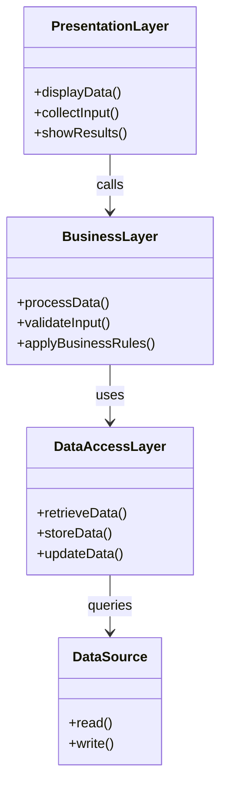
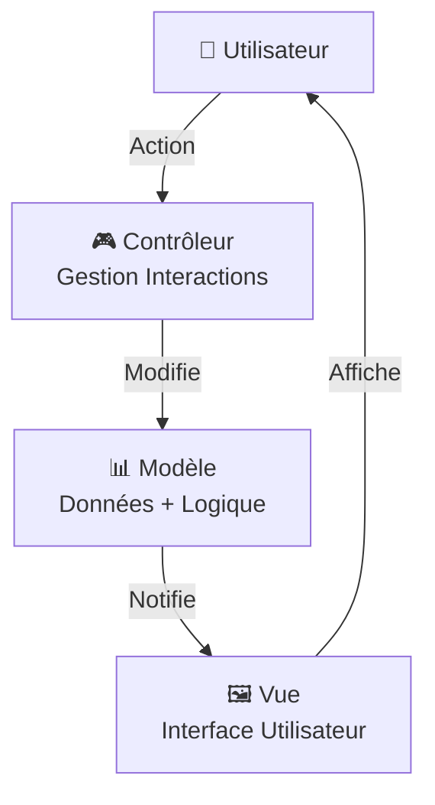
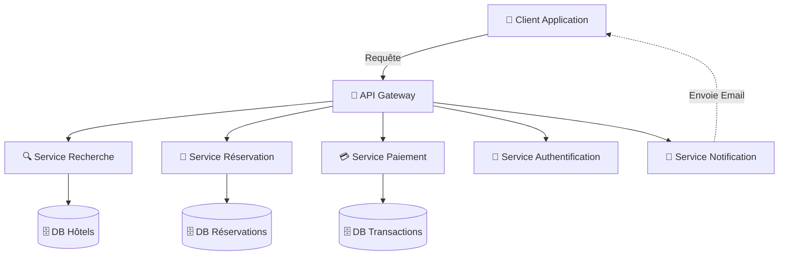
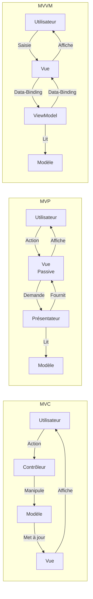
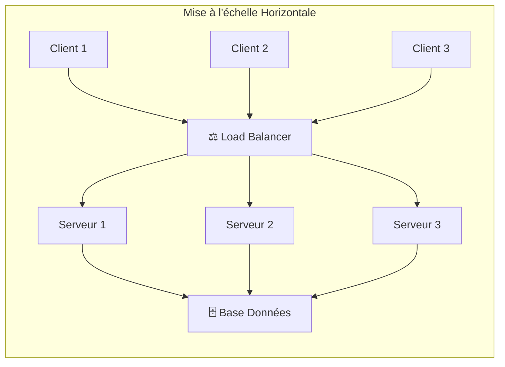
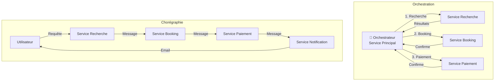
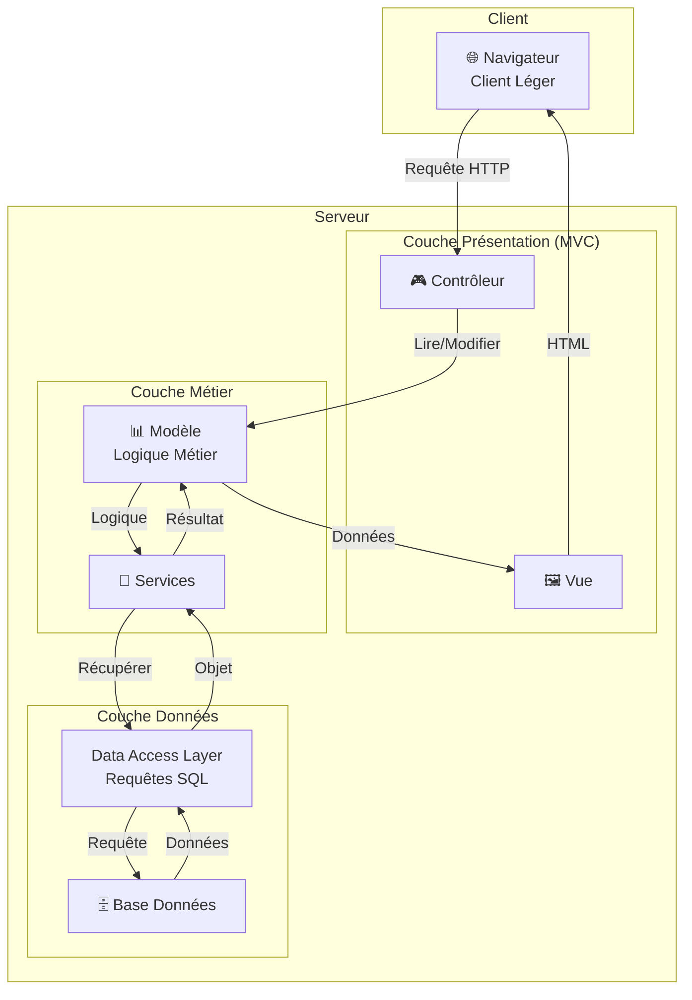

# FICHE DE PRÉPARATION QCM N°1 - VERSION AMÉLIORÉE AVEC DIAGRAMMES
## Architecture Logicielle - Styles d'Architecture

**Durée disponible :** 30 minutes  
**Tentatives :** 1 seule  
**Styles couverts :** Client-Serveur | Couches | MVC & Variantes | SOA

---

## TABLE DE MATIÈRE

1. [Architecture Client-Serveur](#1-architecture-client-serveur)
2. [Architecture en Couches](#2-architecture-en-couches)
3. [MVC et Ses Variantes](#3-mvc-et-ses-variantes)
4. [Architecture Orientée Services (SOA)](#4-architecture-orientée-services-soa)
5. [Comparaisons Clés](#5-comparaisons-clés)
6. [Questions Potentielles](#6-questions-potentielles-type)
7. [Diagrammes UML Mermaid](#7-diagrammes-uml-mermaid-complets)

---

## 1. ARCHITECTURE CLIENT-SERVEUR

### Définition & Concept Principal
L'**architecture client-serveur** est un modèle fondamental dans le monde du réseau. Un **serveur** fournit des services et des **clients** consomment ces services. C'est le modèle utilisé pour les interactions sur le web, le courrier électronique, les bases de données, et bien d'autres applications.

### Structure Fondamentale
- **Serveur** : ordinateur puissant qui héberge les données et exécute les tâches complexes
- **Clients** : peuvent être moins puissants, demandent des services au serveur
- **Requête-Réponse** : clients envoient des demandes, serveur répond

### Caractéristiques Clés
- **Répartition des tâches** : charge distribuée entre client et serveur
- **Protocoles** : TCP/IP (base), HTTP/HTTPS (surcouche)
- **Centralisation** : données et services centralisés sur le serveur

### Scalabilité
- **Mise à l'échelle horizontale** : ajouter plus de serveurs (avec Load Balancer)
- **Mise à l'échelle verticale** : augmenter la puissance d'un serveur
- **Load Balancer** : répartit le trafic entre plusieurs serveurs

### AVANTAGES
✅ **Centralisation** : données et services centralisés = gestion facile  
✅ **Contrôle d'accès** : gestion centralisée des droits d'accès  
✅ **Efficacité** : serveurs puissants traitent les requêtes rapidement  
✅ **Flexibilité** : clients divers supportés (différents OS)  
✅ **Scalabilité** : ajout de serveurs sans perturber le système

### INCONVÉNIENTS
❌ **Point de défaillance unique** : si serveur down → tous clients affectés  
❌ **Goulots d'étranglement** (bottleneck) : serveur surcharge = ralentissements  
❌ **Sécurité** : serveur centralisé = cible attrayante pour attaques  
❌ **Coûts de maintenance** : infrastructure et compétences techniques nécessaires  
❌ **Scalabilité limitée** : pics rares mais massifs peuvent surcharger (ex : PS5 2020)

### Exemples Réels
- Sites web : navigateur (client) ↔ serveur web
- Jeux en ligne : ordinateur (client) ↔ serveur de jeu
- Applications de messagerie : clients mail ↔ serveur SMTP/IMAP
- Bases de données : applications (client) ↔ serveur BD

---

## 2. ARCHITECTURE EN COUCHES

### Définition & Concept Principal
L'**architecture en couches** est un style d'architecture logicielle largement utilisé. Elle consiste à organiser les différents composants d'un système en **couches distinctes**, chaque couche ayant des **responsabilités spécifiques**. Cette approche permet de **séparer les préoccupations** et facilite la maintenance, réutilisabilité et test du système.

### Principes Fondamentaux
- **Séparation des responsabilités** : chaque couche = responsabilité spécifique
- **Hiérarchique et modulaire** : chaque couche indépendante des autres
- **Communication via interfaces** : couches adjacentes communiquent proprement
- **Réutilisabilité** : composants réutilisables dans chaque couche

### Structure Typique (3-4 couches)

**Couche de Présentation (Presentation Layer)**
- **Responsabilité :** Interface utilisateur
- Affichage des données (clair et convivial)
- Réception des entrées utilisateur (clics, clavier)
- Présentation des résultats
- **Code :** Fenêtres, formulaires, boutons, gestionnaires d'événements, GUI

**Couche Métier / Services (Business Layer)**
- **Responsabilité :** Logique métier de l'application
- Règles et algorithmes de traitement des données
- Prise de décisions
- **Code :** Classes de logique métier, modèles données, services, validation

**Couche d'Accès aux Données (Data Access Layer)**
- **Responsabilité :** Interaction avec systèmes de stockage
- Récupération/stockage de données
- Opérations CRUD (Create, Read, Update, Delete)
- **Code :** Connexions BD, requêtes SQL, mappers de données

**Couche Source de Données (optionnelle - Database Layer)**
- Base de données, fichiers, services web externes

### Avantages des Couches
✅ **Séparation des responsabilités** : chaque couche = une fonction claire  
✅ **Maintenabilité** : modifications isolées par couche  
✅ **Testabilité** : chaque couche testée indépendamment  
✅ **Réutilisabilité** : composants/services réutilisables  
✅ **Scalabilité verticale** : ajout de couches spécialisées si besoin

### Inconvénients des Couches
❌ **Complexité accrue** : surcharge pour petites applications  
❌ **Performance** : multiples appels entre couches = latence  
❌ **Difficulté d'ajout de couches** : modifications cascadées  
❌ **Monolithique** : structure en bloc difficile à découper

### Exemple Concret : Application de Banque en Ligne

| Couche | Responsabilité | Exemple |
|--------|----------------|---------|
| **Présentation** | Interface web | Page connexion, affichage soldes |
| **Métier** | Logique transactionnelle | Autoriser/refuser transactions, vérifier solde |
| **Accès Données** | Requêtes BD | Récupérer comptes, enregistrer transactions |
| **Données** | Base de données | Tables comptes, transactions, utilisateurs |

### Combinaison : Client-Serveur + Couches
- **Client** : interface légère
- **Serveur** : ensemble de couches (présentation, métier, données)
- **Avantage** : séparation claire client ↔ serveur, gestion logique complexe côté serveur

---

## 3. MVC ET SES VARIANTES

### 3.1 ARCHITECTURE MVC (Model-View-Controller)

#### Définition
L'**architecture MVC** est un modèle d'architecture logicielle couramment utilisé dans le développement de logiciels. Elle divise une application en **3 composants interagissant** : le **modèle** (logique de données), la **vue** (présentation des données) et le **contrôleur** (gestion des interactions).

#### Les 3 Composants

**📊 Modèle (Model)**
- **Responsabilité :** Logique de données
- Gère données + logique métier
- **Code :** Classes de données, logique métier
- **Exemple :** Classe `Produit` avec attributs et méthodes

**🖼️ Vue (View)**
- **Responsabilité :** Présentation des données
- Affiche les informations à l'utilisateur
- Forme indépendante du modèle
- **Code :** Templates HTML, interfaces graphiques
- **Exemple :** Page produit affichant prix et description

**🎮 Contrôleur (Controller)**
- **Responsabilité :** Gestion des interactions
- Reçoit les actions utilisateur
- Manipule le modèle et met à jour la vue
- **Code :** Classes gestionnaires d'événements
- **Exemple :** Fonction de panier qui ajoute produit

#### Flux MVC
```
Utilisateur ──Action──→ Contrôleur
                           ↓
                      Modifie Modèle
                           ↓
                      Demande Vue
                           ↓
Utilisateur ←─Affichage← Vue (lit Modèle)
```

#### AVANTAGES MVC
✅ **Séparation des préoccupations** : chaque composant = rôle clair  
✅ **Modularité** : composants indépendants  
✅ **Réutilisabilité du code** : plusieurs vues peuvent utiliser même modèle  
✅ **Facilité de maintenance** : localiser et corriger erreurs rapidement  
✅ **Développement parallèle** : équipes travaillent sur composants séparés

#### INCONVÉNIENTS MVC
❌ **Complexité accrue** : surcharge pour applications simples  
❌ **Courbe d'apprentissage** : architecture moins intuitive  
❌ **Pas optimal** : pour petites applications = overhead inutile

#### Frameworks MVC Populaires
- **Python :** Django, Flask
- **PHP :** Laravel, Symfony
- **Node.js :** Express
- **Ruby :** Ruby on Rails
- **Java :** Spring

#### Exemple Concret : E-commerce
- **Modèle :** `Produit`, `Panier`, `Commande` (données + logique)
- **Vue :** Pages produit, panier, checkout (HTML/CSS)
- **Contrôleur :** Traite clics, ajoute panier, process commande

---

### 3.2 VARIANTE MVP (Model-View-Presenter)

#### Définition
L'**architecture MVP** est une variante de MVC utilisée pour structurer le code en séparant les préoccupations logiques, notamment quand la **vue doit être testée indépendamment**.

#### Les 3 Composants

**📊 Modèle (Model)**
- Gère données + logique métier
- *Identique à MVC*

**🖼️ Vue (View)**
- Interface utilisateur
- **DIFFÉRENCE CLÉ : Vue est PASSIVE** (ne manipule pas données)
- Affiche seulement ce que Présentateur lui dit
- N'interagit pas directement avec Modèle

**🎯 Présentateur (Presenter)**
- Intermédiaire entre Modèle et Vue
- Récupère données du Modèle
- Les transforme pour affichage
- Vue appelle Présentateur pour données
- **DIFFÉRENCE CLÉ MVC :** Contrôleur reçoit actions, Présentateur les fournit à la Vue

#### Flux MVP
```
Utilisateur ──Action──→ Vue ──Appelle──→ Présentateur
                                              ↓
                                        Lit Modèle
                                              ↓
                                    Formate données
                                              ↓
                        Vue ←─Données formattées─ Présentateur
                        ↓
                     Affichage
```

#### AVANTAGES MVP
✅ **Testabilité accrue** : logique de présentation isolée et testable  
✅ **Vue passive** : simplifie vues, réduit couplage  
✅ **Séparation claire** : distinction nette affichage vs logique

#### CAS D'UTILISATION MVP
- Applications nécessitant **forte couverture de tests**
- **Applications d'entreprise** où testabilité = priorité
- Environnements **sans data-binding bidirectionnel**

---

### 3.3 VARIANTE MVVM (Model-View-ViewModel)

#### Définition
L'**architecture MVVM** est une architecture moderne pour applications avec interfaces riches. Elle utilise le **data-binding bidirectionnel** pour synchronisation automatique.

#### Les 3 Composants

**📊 Modèle (Model)**
- Données + logique métier
- *Identique à MVC/MVP*

**🖼️ Vue (View)**
- Interface utilisateur + interaction
- **Utilise data-binding bidirectionnel** avec ViewModel
- Liaison automatique données ↔ affichage

**🔄 ViewModel (View Model)**
- Intermédiaire entre Modèle et Vue
- **Transforme données du Modèle** en forme optimale pour Vue
- **Data-binding bidirectionnel :** changements UI ↔ changements données
- Gère état présentation
- **DIFFÉRENCE CLÉ :** Liaison temps réel View ↔ ViewModel

#### Flux MVVM
```
Vue ←─Data-Binding─→ ViewModel ←─Données─→ Modèle
 ↓                        ↓
Affichage          Logique présentation
```

#### AVANTAGES MVVM
✅ **Séparation UI vs logique** : nette distinction  
✅ **Data-binding bidirectionnel** : synchronisation automatique  
✅ **Testabilité** : ViewModel testable indépendamment  
✅ **Maintenabilité** : changements isolés  
✅ **Évolutivité** : structure scalable pour applications complexes

#### CAS D'UTILISATION MVVM
- Frameworks supportant **data-binding** : WPF, Angular, Vue.js
- **Applications riches** avec interfaces complexes
- **Applications mobiles** (Xamarin)
- **SPAs (Single Page Applications)** : Angular, React (style similaire)
- **Applications d'entreprise** complexes

#### Exemples Frameworks MVVM
- **WPF** (Windows)
- **Angular** (web frontend)
- **Vue.js** (web frontend)
- **Xamarin** (mobile)
- **ReactiveUI** (mobile)

---

### 3.4 COMPARAISON RAPIDE : MVC vs MVP vs MVVM

| Aspect | MVC | MVP | MVVM |
|--------|-----|-----|------|
| **Vue Interaction** | Active (manipule données) | Passive (affichage seulement) | Réactive (data-binding) |
| **Intermédiaire** | Contrôleur reçoit actions | Présentateur demandé par Vue | ViewModel lié aux données |
| **Data-binding** | Non | Non | Oui (bidirectionnel) |
| **Testabilité** | Moyenne | Excellente | Excellente |
| **Complexité** | Faible | Moyenne | Moyenne-Haute |
| **Cas d'usage** | Web traditionnel | Tests importants | Applications riches/SPAs |
| **Frameworks** | Django, Laravel, Rails | Applications testées | Angular, Vue, WPF |

---

## 4. ARCHITECTURE ORIENTÉE SERVICES (SOA)

### Définition & Concept Principal
L'**architecture orientée services (SOA)** est un style d'architecture logicielle favorisant systèmes **modulaires et flexibles** basés sur des **services indépendants**. Émergée années 1990, elle gagne en popularité. SOA repose sur des principes : **modularité, découplage, réutilisabilité, interopérabilité**.

### Services & Caractéristiques Clés

#### Découplage
- Chaque service fonctionne **indépendamment**
- Modifications isolées sans affecter autres services
- Déploiement indépendant

#### Modularité
- **Fonctionnalités divisées en services autonomes**
- Développement et test simplifiés
- **Exemple :** Service Paiement, Service Authentification, Service Avis

#### Réutilisabilité
- Services utilisables par **différentes applications**
- Réduction effort de développement
- **Exemple :** Service Paiement réutilisé par e-commerce et plateforme réservation

#### Interopérabilité
- **Communication indépendante de langages/plateformes**
- Protocoles standardisés (REST, SOAP, etc.)
- Intégration facile entre systèmes hétérogènes

### Services Web & Protocoles

#### SOAP (Simple Object Access Protocol)
- Protocole XML **strict et formalisé**
- Overhead important
- Sécurité robuste
- Moins populaire actuellement

#### REST (REpresentational State Transfer)
- **Basé sur principes du web**
- Utilise méthodes HTTP : GET, POST, PUT, DELETE
- **Léger et simple**
- Largement adopté (standard actuel)
- Exemple URI : `/clients`, `/clients/{id}`

### Composition de Services

#### 🎼 Orchestration
- **Un service principal (orchestrateur) contrôle l'exécution**
- Orchestrateur appelle séquentiellement les services
- Gère le flux complet
- **Exemple :** Orchestrateur de réservation appelle Service Recherche Vols → Service Réservation Hôtel → Service Paiement

#### 💃 Chorégraphie
- **Chaque service connaît ses responsabilités**
- Services communiquent **directement** entre eux
- Pas de point de contrôle central
- Communication par **messages échangés**
- **Exemple :** Service Réservation déclenche Service Paiement qui déclenche Service Notification

#### Comparaison
| Aspect | Orchestration | Chorégraphie |
|--------|---------------|-------------|
| **Contrôle** | Centralisé | Distribué |
| **Couplage** | Orchestrateur = point unique | Chaque service autonome |
| **Complexité** | Plus simple initialement | Plus complexe |
| **Scalabilité** | Limitée (goulot orchestrateur) | Meilleure |

### Gestion des Services

#### 🔍 Découverte de Services (Service Discovery)
- **Trouver services nécessaires rapidement**
- Sans connaître détails de chaque service
- **Outils :** Registres, moteurs recherche, annuaires services

#### 📢 Publication de Services (Service Publication)
- **Exposer services et fonctionnalités**
- Rendre interfaces accessibles
- Annuaire centralisé où services s'enregistrent

#### 📊 Annuaire de Services (Service Registry)
- **Base de données centralisée**
- Services enregistrés + recherchables
- Contient : descriptions, interfaces, emplacements
- Facilite découverte et intégration

#### 👁️ Surveillance de Services (Service Monitoring)
- **Suivre disponibilité et performances**
- Détecter erreurs
- Alertes si service down

### Sécurité dans SOA

#### 🔐 Authentification
- **Vérifier identité** des utilisateurs et services
- Garantir seules entités légitimes accèdent aux services

#### 🚪 Autorisation
- **Contrôler actions autorisées** après authentification
- Gestion granulaire des droits d'accès

#### 🔒 Confidentialité
- **Protéger données échangées** entre services
- Chiffrement SSL/TLS (HTTPS)
- Données non visibles en transit

#### ✓ Intégrité
- **Garantir messages non modifiés** en transmission
- Vérification d'intégrité (fonctions de hachage)
- Certificats pour authentifier services

### AVANTAGES SOA
✅ **Réutilisabilité** : services utilisés par plusieurs applications  
✅ **Flexibilité** : services modifiés/remplacés indépendamment  
✅ **Interopérabilité** : intégration facile applications hétérogènes  
✅ **Scalabilité** : déploiement indépendant des services  
✅ **Maintenabilité** : modification isolée par service  
✅ **Modularité** : structure logique claire  
✅ **Intégration d'entreprise** : connecter systèmes dispersés

### INCONVÉNIENTS SOA
❌ **Complexité accrue** : orchestration/chorégraphie complexe  
❌ **Gestion des services** : coordination flux données, gestion erreurs  
❌ **Performance** : communication inter-services = latence réseau  
❌ **Consistance des données** : données distribuées difficiles à synchroniser  
❌ **Surcharge initiale** : mise en place infrastructure importante

### Exemple Concret : Plateforme de Réservation

**Services nécessaires :**
- Service Recherche Hôtels
- Service Réservation
- Service Paiement
- Service Authentification
- Service Avis
- Service Notification
- Service Disponibilité
- Service Images

**Flux de réservation (orchestration) :**
```
1. Utilisateur recherche (Service Recherche)
2. Sélectionne hôtel
3. Orchestrateur appelle :
   - Service Disponibilité (vérifier stock)
   - Service Authentification (vérifier user)
   - Service Paiement (traiter paiement)
   - Service Réservation (créer réservation)
   - Service Notification (email confirmation)
4. Confirmation affichée à utilisateur
```

---

## 5. COMPARAISONS CLÉS

### Client-Serveur vs Couches
| Aspect | Client-Serveur | Couches |
|--------|----------------|---------|
| **Niveau** | Distribution physique | Organisation logique |
| **Où appliqué** | Déploiement réseau | Structure application |
| **Combinaison** | Souvent combinées | Sur serveur |
| **Exemple** | Client web ↔ Serveur | Serveur = Présentation + Métier + Données |

### MVC vs Couches
| Aspect | MVC | Couches |
|--------|-----|---------|
| **Composants** | 3 (M-V-C) | 3-4+ (Présentation, Métier, Données) |
| **Orientation** | Interaction utilisateur | Organisation logique |
| **Relation** | Complément | Peut contenir MVC |
| **Exemple** | View (présentation), Model (données) | Couche Présentation = MVC |

### SOA vs Couches
| Aspect | SOA | Couches |
|--------|-----|---------|
| **Niveau** | Services indépendants | Structures internes |
| **Couplage** | Découplé | Couplé verticalement |
| **Réutilisabilité** | Forte (services partagés) | Moyenne (couches liées) |
| **Complexité** | Haute | Moyenne |
| **Déploiement** | Indépendant par service | Monolithique |
| **Scalabilité** | Horizontale (services) | Verticale (couches) |

### Quand Utiliser Quelle Architecture ?

| Architecture | Cas d'Utilisation |
|--------------|-------------------|
| **Client-Serveur** | Applications web, email, BD, jeux en ligne |
| **Couches** | Applications web standards, gestion d'entreprise |
| **MVC** | Web traditionnel, rapidité développement |
| **MVP** | Applications nécessitant tests rigoureux |
| **MVVM** | SPA (Angular, Vue.js), applications riches |
| **SOA** | Systèmes complexes, intégration multi-applications |

---

## 6. QUESTIONS POTENTIELLES & RÉPONSES

### Questions Type Client-Serveur

**Q1 : Quel est le principal avantage d'une architecture client-serveur ?**
A : Centralisation des données et services = facilite gestion, contrôle et mise à jour

**Q2 : Qu'est-ce qu'une mise à l'échelle horizontale ?**
A : Ajouter plus de serveurs (vs verticale = augmenter puissance d'un serveur)

**Q3 : Nommez 2 inconvénients de client-serveur**
A : Point défaillance unique (serveur down = tous clients down), goulots étranglement (surcharge serveur)

**Q4 : Quel protocole utilise généralement client-serveur ?**
A : TCP/IP, HTTP/HTTPS

**Q5 : Que fait un Load Balancer ?**
A : Répartit le trafic entre plusieurs serveurs

---

### Questions Type Couches

**Q6 : Quel est l'objectif principal de l'architecture en couches ?**
A : Séparer les responsabilités en couches distinctes pour faciliter maintenance, test et réutilisabilité

**Q7 : Nommez les 3 couches principales d'une architecture en couches**
A : Présentation, Métier, Accès Données (+ Base Données)

**Q8 : Quel est le rôle de la couche de présentation ?**
A : Gérer interface utilisateur : affichage et entrées utilisateur

**Q9 : Que fait la couche métier ?**
A : Contient logique métier et algorithmes de traitement des données

**Q10 : Quel problème peut causer l'ajout d'une couche dans une architecture existante ?**
A : Modifications cascadées et complexité accrue

---

### Questions Type MVC

**Q11 : Quels sont les 3 composants de MVC ?**
A : Modèle (données), Vue (présentation), Contrôleur (gestion interactions)

**Q12 : Quel framework web utilise MVC ?**
A : Django (Python), Laravel (PHP), Rails (Ruby), Spring (Java), Express (Node.js)

**Q13 : Quel est l'avantage principal de MVC ?**
A : Séparation des préoccupations = modularité, réutilisabilité, maintenance

**Q14 : Quelle variante MVP ou MVVM est mieux testable ?**
A : Les deux sont très testables, MVP pour logique présentation, MVVM pour applications riches

**Q15 : Quand utiliser MVVM plutôt que MVC ?**
A : Pour applications riches, SPAs (Angular, Vue.js), ou environnements avec data-binding

---

### Questions Type MVP vs MVVM

**Q16 : Quelle est la différence clé entre MVP et MVC ?**
A : Dans MVP, la Vue est passive (ne manipule pas données), Présentateur lui fournit

**Q17 : Qu'est-ce que le data-binding bidirectionnel (MVVM) ?**
A : Liaison automatique entre Vue et ViewModel : changement UI ↔ changement données (temps réel)

**Q18 : Pour quel type d'application MVVM est-il préconisé ?**
A : Applications riches, SPAs (Angular, Vue.js), applications mobiles (Xamarin)

**Q19 : Quel framework mobile supporte MVVM ?**
A : Xamarin, ReactiveUI

**Q20 : Dans MVP, qui appelle qui ?**
A : La Vue appelle le Présentateur pour récupérer les données

---

### Questions Type SOA

**Q21 : Qu'est-ce qu'une architecture SOA ?**
A : Style basé sur services indépendants et modulaires, réutilisables, découplés

**Q22 : Nommez 4 principes clés de SOA**
A : Modularité, Découplage, Réutilisabilité, Interopérabilité

**Q23 : Quelle est la différence entre orchestration et chorégraphie ?**
A : Orchestration = orchestrateur central contrôle, Chorégraphie = services communiquent directement

**Q24 : Quel protocole REST utilise-t-il pour communiquer ?**
A : HTTP avec méthodes GET, POST, PUT, DELETE (format léger, populaire)

**Q25 : Nommez 3 services d'une plateforme de réservation d'hôtels**
A : Service Recherche, Service Réservation, Service Paiement, Service Avis, Service Authentification (au choix)

**Q26 : Qu'est-ce qu'un Service Registry ?**
A : Base de données centralisée où services s'enregistrent avec descriptions, interfaces, emplacements

**Q27 : Nommez les 4 aspects de sécurité dans SOA**
A : Authentification, Autorisation, Confidentialité, Intégrité

**Q28 : Quel est l'inconvénient majeur de SOA ?**
A : Complexité accrue (orchestration), latence réseau (communication inter-services)

---

## 7. DIAGRAMMES UML MERMAID COMPLETS

### 7.1 Diagramme de Classe - Architecture Couches



### 7.2 Diagramme de Composants - Architecture MVC



### 7.3 Diagramme de Composants - SOA



### 7.4 Flux MVC vs MVP vs MVVM



### 7.5 Comparaison Client-Serveur



### 7.6 Orchestration vs Chorégraphie



### 7.7 Architecture Complète : Client-Serveur + Couches + MVC



---

## 8. CONSEILS POUR LE QCM

### ⏱️ Gestion du Temps (30 minutes)
- Lire **attentivement chaque question** (temps clé)
- **Ne pas stagner** sur questions difficiles = revenir après
- Environ **1.5-2 minutes par question** en moyenne
- Relire avant de soumettre (1 tentative !)

### 🎯 Stratégie de Réponse
1. **Lire l'énoncé 2 fois** : comprendre ce qui est demandé
2. **Éliminer réponses évidemment fausses** : augmente chances
3. **Soyez sûr avant cocher** : 1 tentative seulement !
4. **Ne devinez pas** : réfléchissez logiquement

### 🚩 Points à Retenir Absolument
- **Client-Serveur :** Client léger, serveur puissant, requête-réponse
- **Couches :** Présentation, Métier, Données (séparation responsabilités)
- **MVC :** Modèle + Vue + Contrôleur (très courant)
- **MVP :** Vue PASSIVE (différence clé avec MVC)
- **MVVM :** Data-binding BIDIRECTIONNEL (lien temps réel)
- **SOA :** Services INDÉPENDANTS et DÉCOUPLÉS (orchestration/chorégraphie)

### ❌ Erreurs à Éviter
- Confondre **Client-Serveur** (réseau) avec **Couches** (organisation logique)
- Oublier que **MVP = Vue passive** (ne manipule pas données)
- Confondre **Orchestration** (contrôleur central) et **Chorégraphie** (communication directe)
- Répondre au hasard : réfléchissez d'abord !
- Confondre **Data-binding** (MVVM) avec **communication** ordinaire

---

## 9. CHECKLIST DE RÉVISION

### Avez-vous compris ?
- [ ] Architecture client-serveur : structure, avantages, inconvénients
- [ ] Architecture en couches : 3 couches, responsabilités, cas d'usage
- [ ] MVC : 3 composants, flux, frameworks populaires
- [ ] MVP : différences avec MVC, Vue passive, testabilité
- [ ] MVVM : data-binding bidirectionnel, frameworks (Angular, Vue.js)
- [ ] SOA : services indépendants, orchestration vs chorégraphie
- [ ] Orchestration vs chorégraphie : différences majeures
- [ ] Sécurité SOA : 4 aspects (Authentification, Autorisation, Confidentialité, Intégrité)
- [ ] Comparaisons : quand utiliser quelle architecture
- [ ] Diagrammes UML : lecture et compréhension

### Pouvez-vous expliquer ?
- [ ] Pourquoi client-serveur peut avoir un point de défaillance unique ?
- [ ] Comment les couches favorisent la séparation des responsabilités ?
- [ ] La différence entre MVP et MVC en 1 phrase ?
- [ ] Ce qu'est le data-binding bidirectionnel ?
- [ ] Pourquoi orchestration centralisée vs chorégraphie distribuée ?
- [ ] Un exemple concret d'une plateforme de réservation en SOA ?

---

## RÉSUMÉ FINAL EN 1 PAGE

### Client-Serveur
Clients envoient requêtes → Serveur répond | Avantages : Centralisation, Contrôle | Inconvénients : Point défaillance unique

### Couches
Présentation | Métier | Données | Avantages : Séparation responsabilités | Inconvénients : Performance

### MVC
Modèle (données) + Vue (interface) + Contrôleur (logique) | Frameworks : Django, Laravel, Rails

### MVP
Model + Vue (PASSIVE) + Présentateur | Meilleure testabilité logique présentation

### MVVM
Model + Vue + ViewModel (DATA-BINDING) | Frameworks : Angular, Vue.js, WPF

### SOA
Services indépendants (découplés) + orchestration/chorégraphie | Avantages : Réutilisabilité, Scalabilité

---

**BON COURAGE POUR LE QCM ! 💪**

Vous êtes bien préparé(e) ! Lisez attentivement chaque question, éliminez réponses évidentes, et soyez sûr avant de répondre (1 tentative seulement).

*Fiche créée d'après supports cours "Styles d'Architecture Logicielle" - Ynov © 2024*  
*Version améliorée avec diagrammes Mermaid UML et vérification complète du cours*
