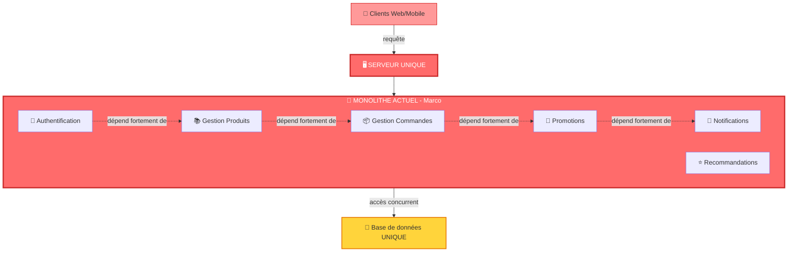
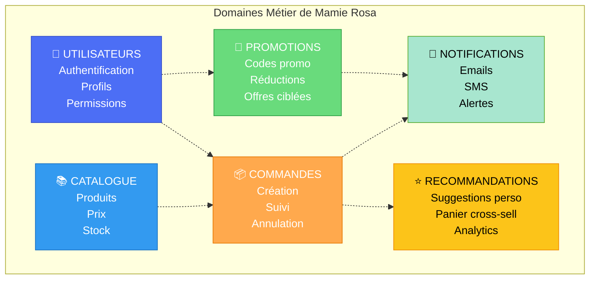
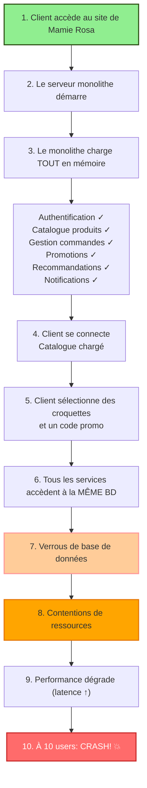
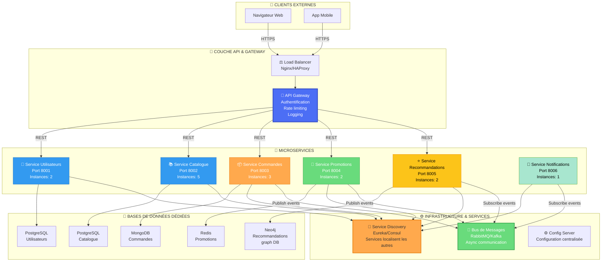
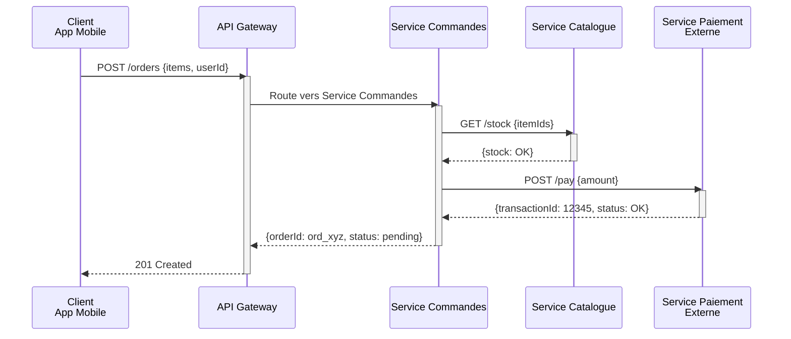
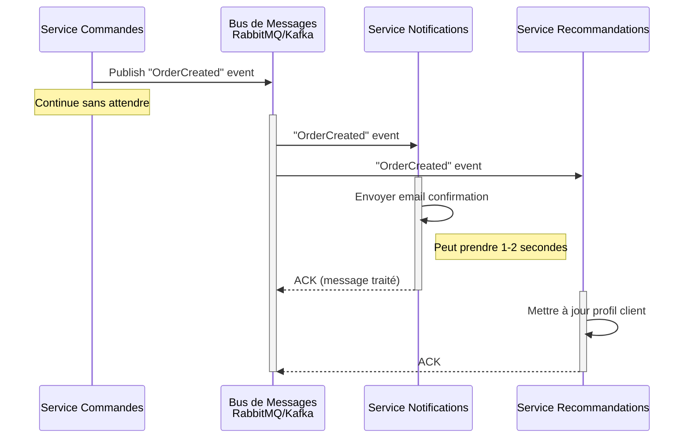
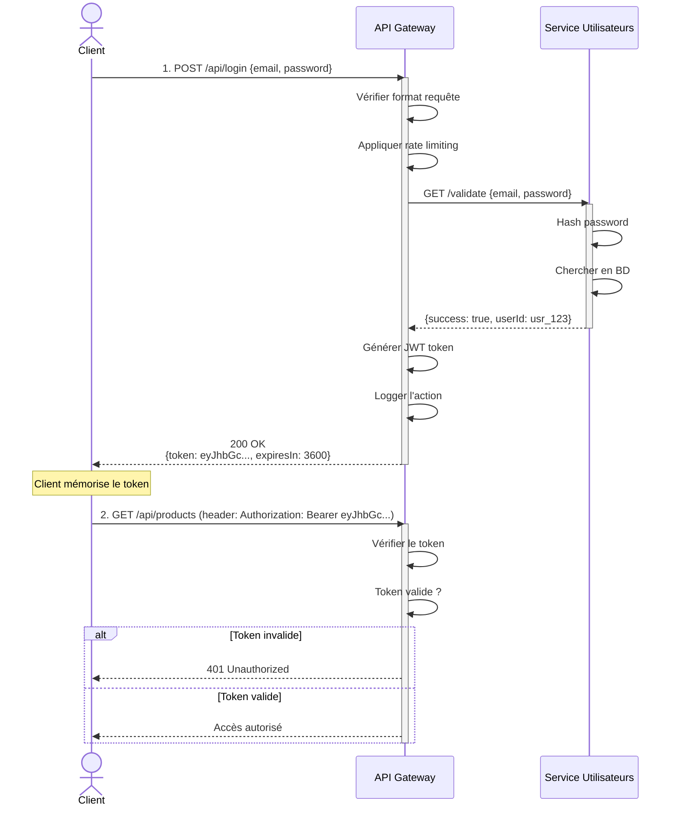
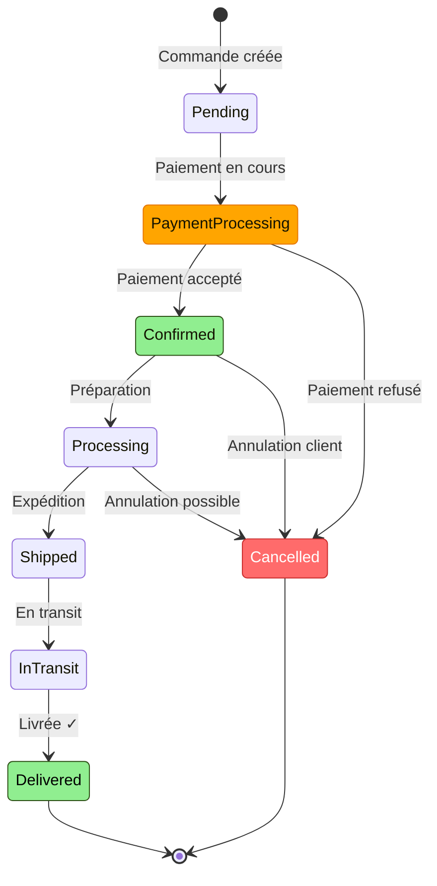
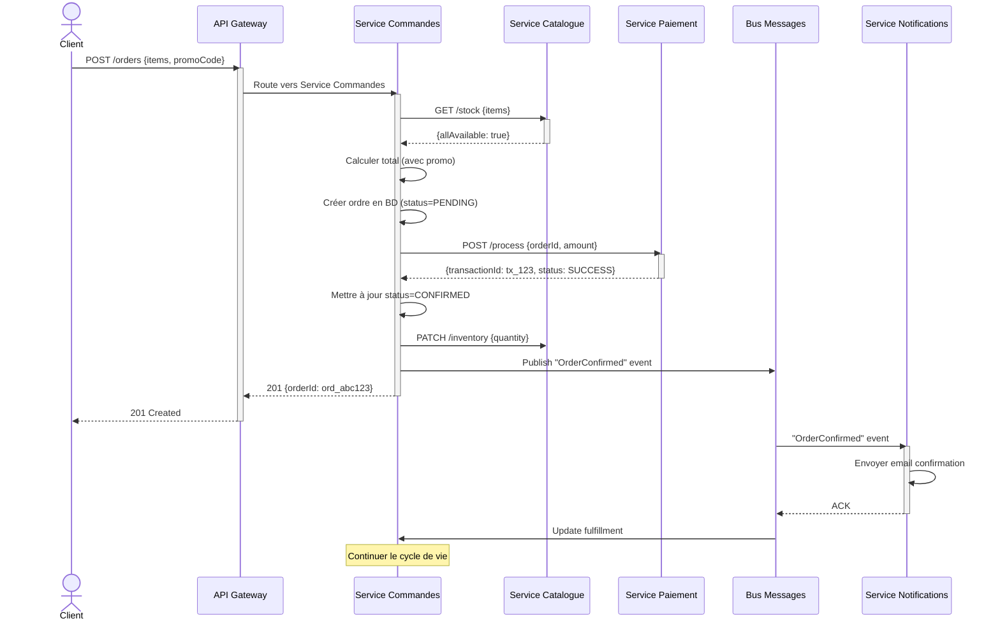

# TP n°3 - La Grande Aventure des Croquettes Numériques de Mamie Rosa
## Document Complet de Rédaction avec Diagrammes Mermaid

---

## 📄 INTRODUCTION

**Auteur** : [Votre Nom]  
**Date** : [Date]  
**Plateforme** : Notion  
**Diagrammes** : Mermaid  

### Contexte du TP

Mamie Rosa a lancé une boutique en ligne dédiée aux accessoires pour animaux. Cependant, l'architecture monolithique de son application créée par son petit-fils Marco présente des limitations critiques qui menacent la survie de son business.

**Problèmes rencontrés :**
- Le système s'effondre au-delà de 10 utilisateurs simultanés
- Impossible de modifier une fonctionnalité sans risquer de tout casser
- Maintenance cauchemardesque et coûteuse
- Chaque déploiement arrête l'application (perte de ventes)

**Objectif de ce TP :** Refondre l'application en architecture microservices pour résoudre ces problèmes et permettre à Mamie Rosa de scaler son business.

---

# 📋 PHASE 1 : ANALYSE APPROFONDIE

## 1.1 - Limitations du monolithe de Marco

### Tableau des problèmes identifiés

| # | Problème | Cause racine | Impact métier | Evidence technique |
|---|----------|-------------|---------------|--------------------|
| **1** | Performance s'effondre à 10 utilisateurs | Monolithe = 1 instance. Pas de scalabilité horizontale. Toutes les requêtes vont à la même machine | Mamie Rosa perd des clients → perte de ventes | Seul serveur = bottleneck CPU/mémoire/IO |
| **2** | Couplage fort entre fonctionnalités | Toutes les fonctionnalités dans le même codebase/processus | Impossible de modifier une fonction sans risquer de casser les autres | Modification → recompilation → retests globaux |
| **3** | Maintenance cauchemardesque | Pas d'isolation des services. Tests unitaires impossibles. Marco répare des bugs chaque weekend | Qualité baisse, bugs prolifèrent, dette technique | Une modification affecte potentiellement 6 domaines |
| **4** | Gestion des données centralisée | Une seule BD avec tous les types de données (utilisateurs, produits, commandes, promotions, etc.) | Verrous BD, transactions longues → ralentissements exponentiels | Contentions sur les ressources partagées |
| **5** | Arrêt complet pour déploiement | Chaque modification = redémarrage total de l'app, nécessité de recompilation | Mamie Rosa perd 100% des ventes pendant le déploiement | Zéro downtime deployment impossible |

### Analyse approfondie

**Problème 1 - Performance et scalabilité :**

Le monolithe de Marco fonctionne comme un restaurant avec une seule serveuse. Tant qu'il y a 2-3 clients, tout fonctionne. Mais à 10 clients ?
- Elle devient le goulot d'étranglement
- Les clients attendent en queue
- À 20 clients : chaos total

Techniquement, tous les utilisateurs qui accèdent à l'application vont frapper le même serveur, qui doit exécuter :
- Le code d'authentification
- La logique du catalogue
- Le traitement des commandes
- Les calculs de promotions
- Les recommandations
- Les envois de notifications

**Problème 2 - Couplage fort :**

Supposons que Marco veut corriger un bug dans le système de promotions. Il doit :
1. Modifier le code source (situé dans le même projet monolithe)
2. Recompiler l'application ENTIÈRE
3. Relancer les tests d'intégration complets
4. Redéployer le tout

Pendant ce temps, l'application est DOWN. Les ventes s'arrêtent.

**Problème 3 - Maintenance :**

Dans un monolithe, il est impossible d'isoler les tests. Si on teste la fonctionnalité "recommandations", on doit charger aussi :
- Toute la couche d'authentification
- Tout le catalogue
- Toute la gestion des commandes
- Etc.

Résultat : les tests sont lents, compliqués, et peu fiables.

**Problème 4 - Données centralisées :**

Une seule base de données pour TOUS les domaines crée des problèmes :
- Un client qui consulte le catalogue (SELECT simple) se retrouve bloqué par une transaction longue de paiement
- Les indexes deviennent compliqués
- La performance se dégrade progressivement

**Problème 5 - Zéro downtime impossible :**

Pour déployer une correction, il faut arrêter l'application. Dans un contexte e-commerce, c'est catastrophique.

### Diagramme : Monolithe actuel - Problèmes

Copiez ce diagramme Mermaid dans Notion :



---

## 1.2 - Domaines métier identifiés

À partir de l'énoncé du TP, nous avons identifié **6 domaines métier distincts** que Mamie Rosa veut gérer :

### Tableau des domaines métier

| # | Domaine | Description métier | Raison d'indépendance | Données gérées |
|---|---------|------------------|----------------------|-----------------|
| **1** | Gestion des utilisateurs | Authentification, création de comptes, gestion des profils | Utilisé par tous les autres services pour vérifier les permissions | ID utilisateurs, emails, mots de passe, préférences |
| **2** | Catalogue produits | Liste des articles (croquettes, jouets, accessoires), prix, stock | Change indépendamment, consulté très fréquemment | Descriptions produits, prix, images, quantités en stock |
| **3** | Gestion des commandes | Création de commandes, suivi, annulation | Cœur du métier e-commerce de Mamie Rosa | Détails commandes, statut, articles, quantités |
| **4** | Promotions | Codes promo, réductions spéciales, offres personnalisées | Logique métier complexe et indépendante | Codes promo, % réduction, dates de validité, conditions |
| **5** | Recommandations | Suggestions personnalisées ("clients qui ont acheté X achètent aussi Y") | Peut être down sans casser les ventes, logique algébrée complexe | Historique d'achat, profils de préférence, patterns |
| **6** | Notifications | Emails, SMS, alertes clients | Peut être asynchrone, non-critique immédiatement | Templates de messages, logs d'envoi, emails clients |

### Analyse métier

**Pourquoi ces 6 domaines ?**

Chaque domaine a une **raison d'être indépendante** et répond à une responsabilité métier distincte :

1. **Utilisateurs** : C'est la base. Tous les autres services dépendent de l'authentification.

2. **Catalogue** : Le produit de Mamie Rosa. Ses clients consultent le catalogue constamment. Si c'est lent, ils partent.

3. **Commandes** : Le cœur du revenue. La gestion des commandes nécessite une complexité propre (validation, paiement, suivi).

4. **Promotions** : La stratégie commerciale de Mamie Rosa. Elle veut des réductions ciblées par animal, par saison, etc.

5. **Recommandations** : Un service à valeur ajoutée. Les recommandations augmentent le panier moyen. Mais ce n'est pas critique si c'est down momentanément.

6. **Notifications** : Un service de communication. Les clients doivent être informés des statuts de livraison, des nouvelles promo, etc.

### Diagramme : Domaines métier



---

## 1.3 - Flux d'une commande dans le monolithe

### Scénario : "Un client achète des croquettes"

Voici ce qui se passe ACTUELLEMENT dans le monolithe :



### Texte explicatif

**Étape 1-2 :** Client accède au site de Mamie Rosa. Le seul serveur démarre.

**Étape 3-4 :** Le serveur charge le **monolithe entier** en mémoire. Même si le client ne veut que consulter le catalogue, tous les 6 services sont chargés.

**Étape 5-6 :** Client passe une commande. Tous les services accèdent à la base de données unique.

**Étape 7-8 :** Les opérations SQL se bloquent les unes les autres. La transaction "vérifier le stock" est bloquée par la transaction "enregistrer la commande".

**Étape 9 :** La latence augmente. Une requête qui devrait prendre 100ms en prend 500ms.

**Étape 10 :** Lorsque 10 utilisateurs accèdent simultanément à l'application, les contentions deviennent insupportables. Le serveur s'effondre.

---

## 1.4 - État du problème

### Bilan de la Phase 1 d'analyse

✅ **Identifié :**
- 5+ problèmes majeurs du monolithe
- 6 domaines métier distincts
- Flux complet d'une commande avec goulots d'étranglement
- Raisons techniques de chaque limitation

❌ **Pas encore fait :**
- Proposer une architecture microservices
- Définir comment décomposer en services

**Prochaine étape :** Phase 2 - Concevoir l'architecture microservices pour Mamie Rosa.

---

# 🏗️ PHASE 2 : CONCEPTUALISATION DE L'ARCHITECTURE MICROSERVICES

## 2.1 - Principes fondamentaux des microservices

### Qu'est-ce qu'une architecture microservices ?

Une architecture microservices décompose une application monolithique en **services petits, autonomes et indépendants** qui :

1. **Chacun gère une responsabilité métier unique** (Single Responsibility)
2. **Possèdent leur propre base de données** (Database per Service pattern)
3. **Communiquent via des APIs ou des messages**
4. **Peuvent être développés, testés et déployés indépendamment**
5. **Peuvent être scalés individuellement**

### Avantage clé pour Mamie Rosa

Au lieu d'avoir **1 serveur unique** qui fait TOUT, vous avez **6 petits services** :
- Service 1 : 2 instances pour les utilisateurs
- Service 2 : 5 instances pour le catalogue (très consulté)
- Service 3 : 3 instances pour les commandes
- Service 4 : 1 instance pour les promotions
- Service 5 : 2 instances pour les recommandations
- Service 6 : 1 instance pour les notifications

**Résultat :** Au lieu de tomber à 10 utilisateurs, le système peut gérer **50+ utilisateurs simultanés** avec la même infrastructure !

---

## 2.2 - Architecture microservices pour Mamie Rosa

### Vue d'ensemble

Voici l'architecture complète que nous proposons pour remplacer le monolithe de Marco :



### Description des composants

**Clients externes :**
- Navigateur web (accès desktop)
- App mobile (accès smartphone)

**Load Balancer :**
- Distribue le trafic HTTPS entre plusieurs instances de l'API Gateway
- Géré par Nginx ou HAProxy
- Assure la redondance (si une instance tombe, une autre prend le relais)

**API Gateway :**
- **Point d'entrée unique** pour tous les clients
- Routes les requêtes vers les bons services
- Gère l'authentification centralisée
- Applique le rate limiting (protection contre les attaques)
- Centralise le logging pour debugging

**Les 6 Microservices :**
- Chacun sur un port différent
- Chacun possède N instances (scalabilité horizontale)
- Chacun avec sa propre base de données

**Bases de données :**
- PostgreSQL : BD relationnelle classique (Utilisateurs, Catalogue)
- MongoDB : BD document pour commandes (plus flexible)
- Redis : Cache haute performance pour promotions
- Neo4j : Base de données graphe pour recommandations (relations entre clients/produits)

**Bus de messages :**
- Communication asynchrone
- Découplage des services
- Permet aux événements de circuler sans blocage

**Service Discovery :**
- Chaque service s'enregistre automatiquement
- Les services peuvent se trouver les uns les autres
- Pas besoin de hardcoder les adresses IP/ports

---

## 2.3 - Communication entre services

### Modèle de communication

**SYNCHRONE (API REST) :**

Quand la réponse immédiate est cruciale.



**Raison :** Il faut IMMÉDIATEMENT vérifier le stock et traiter le paiement.

**ASYNCHRONE (Bus de messages) :**

Quand la réponse peut attendre quelques secondes.



**Raison :** Les notifications et recommandations ne sont pas critiques immédiatement.

### Tableau des interactions

| Interaction | Type | Pourquoi ? |
|-------------|------|-----------|
| Client → API Gateway | Sync (HTTP) | Communication directe cliente |
| API Gateway → Services | Sync (REST) | Coordination et contrôle |
| Service Commandes → Service Catalogue | Sync (REST) | Vérifier le stock IMMÉDIATEMENT |
| Service Commandes → Service Paiement | Sync (REST) | Transaction financière = critique |
| Service Commandes → Bus Messages | Async | Publier l'événement "CommandeCreée" |
| Service Notifications ← Bus Messages | Async | Recevoir les événements commande |
| Service Recommandations ← Bus Messages | Async | Mettre à jour les profils |

---

## 2.4 - Le pattern API Gateway

### Rôle critique

L'API Gateway est le **point d'entrée unique** pour toute communication externe. C'est elle qui :

1. **Authentifie** les utilisateurs (génère des tokens JWT)
2. **Route** les requêtes vers les bons services
3. **Protège** contre les attaques (rate limiting)
4. **Centralise** le logging (qui a appelé quoi ?)
5. **Gère** les erreurs

### Diagramme : Flux à travers l'API Gateway



### Exemple concret : Requête pour acheter des croquettes

1. **Client envoie :** POST /api/orders {items, userId, promoCode}
2. **API Gateway reçoit** et applique rate limiting (max 100 req/minute par IP)
3. **API Gateway vérifie** le token JWT
4. **API Gateway route** vers Service Commandes
5. **Service Commandes** appelle Service Catalogue pour vérifier stock
6. **Service Commandes** appelle Service Paiement pour transaction
7. **Service Commandes** publie "OrderCreated" dans le bus
8. **API Gateway retourne** {orderId: 12345} au client
9. **Service Notifications** reçoit l'événement et envoie un email
10. **Service Recommandations** reçoit l'événement et met à jour le profil

---

## Bilan Phase 2

✅ **Accompli :**
- Architecture microservices complète pour Mamie Rosa
- Diagramme de composants avec tous les services
- Pattern API Gateway détaillé
- Communication sync vs async définie
- Choix des technologies motivés

❌ **À faire :**
- Spécifier chaque service en détail (endpoints, données)
- Créer les diagrammes de séquence métier
- Documenter les formats JSON

**Prochaine étape :** Phase 3 - Spécification détaillée de chaque microservice

---

# 📝 PHASE 3 : SPÉCIFICATION DÉTAILLÉE DES MICROSERVICES

## 3.1 - Service de Gestion des Utilisateurs

### Vue d'ensemble

Le Service Utilisateurs est la **fondation** de tout le système. C'est lui qui gère :
- Création de comptes
- Authentification (login/logout)
- Gestion des profils
- Génération de tokens de session

### Responsabilités principales

| Fonction | Description | Critique |
|----------|-------------|----------|
| Authentification | Vérifier email + mot de passe, générer JWT | ⭐⭐⭐ |
| Inscription | Créer un nouveau compte utilisateur | ⭐⭐⭐ |
| Récupération profil | Obtenir les infos de l'utilisateur | ⭐⭐⭐ |
| Modification profil | Mettre à jour les préférences | ⭐⭐ |
| Validation de session | Vérifier si token JWT est valide | ⭐⭐⭐ |

### Base de données

**Technologie :** PostgreSQL (base de données relationnelle)

**Justification :** Les données utilisateurs sont très structurées (ID, email, mot de passe, préférences). PostgreSQL excelle avec les transactions ACID et les relations.

**Schéma :**

```sql
-- Table des utilisateurs
CREATE TABLE users (
    userId UUID PRIMARY KEY,
    email VARCHAR(255) UNIQUE NOT NULL,
    passwordHash VARCHAR(255) NOT NULL,
    firstName VARCHAR(100),
    lastName VARCHAR(100),
    phoneNumber VARCHAR(20),
    createdAt TIMESTAMP DEFAULT NOW(),
    updatedAt TIMESTAMP DEFAULT NOW()
);

-- Table des préférences utilisateurs
CREATE TABLE user_preferences (
    preferenceId UUID PRIMARY KEY,
    userId UUID REFERENCES users(userId),
    animalType VARCHAR(50),  -- chat, chien, hamster, etc.
    animalAge INT,
    notificationsEnabled BOOLEAN DEFAULT TRUE,
    updatedAt TIMESTAMP DEFAULT NOW()
);

-- Table des sessions/tokens
CREATE TABLE authentication_tokens (
    tokenId UUID PRIMARY KEY,
    userId UUID REFERENCES users(userId),
    token VARCHAR(500) NOT NULL,
    expiresAt TIMESTAMP NOT NULL,
    createdAt TIMESTAMP DEFAULT NOW()
);
```

### APIs REST

```
1. POST /api/users/register
   Créer un nouveau compte utilisateur
   
   Request Body:
   {
     "email": "marie@example.com",
     "password": "SecurePassword123",
     "firstName": "Marie",
     "lastName": "Dupont"
   }
   
   Response (201 Created):
   {
     "userId": "usr_12345",
     "email": "marie@example.com",
     "token": "eyJhbGciOiJIUzI1NiIsInR5cCI6IkpXVCJ9...",
     "expiresIn": 3600
   }
   
   Codes d'erreur:
   - 400: Email/mot de passe invalides
   - 409: Email déjà existant

---

2. POST /api/users/login
   S'authentifier
   
   Request Body:
   {
     "email": "marie@example.com",
     "password": "SecurePassword123"
   }
   
   Response (200 OK):
   {
     "userId": "usr_12345",
     "token": "eyJhbGciOiJIUzI1NiIsInR5cCI6IkpXVCJ9...",
     "expiresIn": 3600
   }
   
   Codes d'erreur:
   - 401: Email/mot de passe incorrect

---

3. GET /api/users/{userId}
   Récupérer le profil d'un utilisateur
   
   Header:
   Authorization: Bearer <token>
   
   Response (200 OK):
   {
     "userId": "usr_12345",
     "email": "marie@example.com",
     "firstName": "Marie",
     "lastName": "Dupont",
     "phoneNumber": "+33612345678",
     "preferences": {
       "animalType": "chat",
       "animalAge": 5,
       "notificationsEnabled": true
     }
   }
   
   Codes d'erreur:
   - 401: Token invalide
   - 404: Utilisateur non trouvé

---

4. PUT /api/users/{userId}
   Modifier le profil utilisateur
   
   Header:
   Authorization: Bearer <token>
   
   Request Body:
   {
     "firstName": "Marie-Anne",
     "preferences": {
       "animalType": "chien",
       "notificationsEnabled": true
     }
   }
   
   Response (200 OK):
   {
     "userId": "usr_12345",
     "firstName": "Marie-Anne",
     "preferences": { ... }
   }
   
   Codes d'erreur:
   - 401: Token invalide
   - 404: Utilisateur non trouvé

---

5. POST /api/users/logout
   Se déconnecter
   
   Header:
   Authorization: Bearer <token>
   
   Response (200 OK):
   {
     "message": "Déconnecté avec succès"
   }
```

### Dépendances et interactions

**Dépendances entrantes :**
- Tous les autres services l'appellent pour valider les tokens

**Dépendances sortantes :**
- Aucune (service indépendant)

**Exemples d'appels :**

Service Commandes appelle :
```
GET /api/users/{userId}/validate
Request: {token: "eyJhbGc..."}
Response: {isValid: true, userId: "usr_12345"}
```

### Gestion des erreurs

| Code HTTP | Signification | Exemple |
|-----------|---------------|---------|
| 400 | Bad Request | Email format invalide |
| 401 | Unauthorized | Mot de passe incorrect |
| 409 | Conflict | Email déjà enregistré |
| 500 | Server Error | Problème BD interne |

### Métriques de performance

| Métrique | Cible |
|----------|-------|
| Latence login | < 200ms |
| Availability | 99.9% |
| Throughput | 1000 req/sec |

---

## 3.2 - Service de Catalogue Produits

### Vue d'ensemble

Le Service Catalogue gère **tous les produits** que Mamie Rosa vend : croquettes, jouets, accessoires, etc.

### Responsabilités principales

| Fonction | Description | Critique |
|----------|-------------|----------|
| Lister produits | Récupérer tous les produits (pagination) | ⭐⭐⭐ |
| Détails produit | Récupérer les infos complètes d'un produit | ⭐⭐⭐ |
| Vérifier stock | Vérifier la disponibilité avant commande | ⭐⭐⭐ |
| Mettre à jour stock | Décrémenter quand une commande est passée | ⭐⭐⭐ |
| Recherche | Chercher des produits par titre/description | ⭐⭐ |
| Créer produit | Admin crée un nouveau produit | ⭐ |

### Base de données

**Technologie :** PostgreSQL

**Justification :** Données très structurées (ID, titre, prix, stock). Les relations entre catégories/produits sont importantées.

**Schéma :**

```sql
CREATE TABLE categories (
    categoryId UUID PRIMARY KEY,
    name VARCHAR(100),
    description TEXT
);

CREATE TABLE products (
    productId UUID PRIMARY KEY,
    categoryId UUID REFERENCES categories(categoryId),
    title VARCHAR(255) NOT NULL,
    description TEXT,
    price DECIMAL(10, 2) NOT NULL,
    imageUrl VARCHAR(500),
    createdAt TIMESTAMP DEFAULT NOW(),
    updatedAt TIMESTAMP DEFAULT NOW()
);

CREATE TABLE inventory (
    inventoryId UUID PRIMARY KEY,
    productId UUID UNIQUE REFERENCES products(productId),
    quantity INT NOT NULL DEFAULT 0,
    warehouseLocation VARCHAR(100),
    updatedAt TIMESTAMP DEFAULT NOW()
);
```

### APIs REST

```
1. GET /api/products
   Lister tous les produits avec pagination
   
   Query Parameters:
   - page: 1 (par défaut)
   - limit: 20 (par défaut)
   - category: chat (optionnel)
   
   Response (200 OK):
   {
     "products": [
       {
         "productId": "prod_001",
         "title": "Croquettes Délice Chat",
         "price": 15.99,
         "stock": 150,
         "imageUrl": "https://..."
       },
       { ... }
     ],
     "total": 245,
     "page": 1,
     "pages": 13
   }

---

2. GET /api/products/{productId}
   Récupérer les détails complets d'un produit
   
   Response (200 OK):
   {
     "productId": "prod_001",
     "title": "Croquettes Délice Chat",
     "description": "Croquettes premium pour chats adultes...",
     "price": 15.99,
     "stock": 150,
     "category": "Croquettes",
     "imageUrl": "https://...",
     "ratings": {
       "average": 4.7,
       "count": 234
     }
   }
   
   Codes d'erreur:
   - 404: Produit non trouvé

---

3. GET /api/products/stock/{productId}
   Vérifier le stock (appelé par Service Commandes)
   
   Response (200 OK):
   {
     "productId": "prod_001",
     "available": true,
     "quantity": 150
   }
   
   ou
   
   {
     "productId": "prod_002",
     "available": false,
     "quantity": 0
   }

---

4. POST /api/products/check-stock
   Vérifier le stock pour plusieurs produits
   (utilisé par Service Commandes)
   
   Request Body:
   {
     "items": [
       {"productId": "prod_001", "quantity": 2},
       {"productId": "prod_002", "quantity": 1}
     ]
   }
   
   Response (200 OK):
   {
     "allAvailable": true,
     "items": [
       {
         "productId": "prod_001",
         "requestedQuantity": 2,
         "availableQuantity": 150,
         "status": "OK"
       },
       {
         "productId": "prod_002",
         "requestedQuantity": 1,
         "availableQuantity": 0,
         "status": "OUT_OF_STOCK"
       }
     ]
   }

---

5. PATCH /api/products/{productId}/inventory
   Décrémenter le stock (appelé après paiement réussi)
   
   Request Body:
   {
     "quantity": 2,
     "reason": "order_12345"
   }
   
   Response (200 OK):
   {
     "productId": "prod_001",
     "newQuantity": 148
   }
```

---

## 3.3 - Service de Gestion des Commandes

### Vue d'ensemble

Le Service Commandes est le **cœur** du business de Mamie Rosa. C'est lui qui gère le cycle de vie complet d'une commande.

### Cycle de vie d'une commande



### APIs REST

```
1. POST /api/orders
   Créer une nouvelle commande
   
   Header:
   Authorization: Bearer <token>
   
   Request Body:
   {
     "userId": "usr_12345",
     "items": [
       {
         "productId": "prod_001",
         "quantity": 2,
         "unitPrice": 15.99
       },
       {
         "productId": "prod_003",
         "quantity": 1,
         "unitPrice": 12.99
       }
     ],
     "promoCode": "NOEL20",
     "shippingAddress": {
       "street": "123 Rue de la Paix",
       "city": "Paris",
       "zipCode": "75000"
     }
   }
   
   Response (201 Created):
   {
     "orderId": "ord_abc123",
     "status": "PENDING",
     "totalAmount": 44.97,
     "discount": 9.00,
     "finalAmount": 35.97,
     "createdAt": "2025-11-04T12:30:00Z"
   }
   
   Codes d'erreur:
   - 400: Données invalides
   - 401: Authentification requise
   - 422: Stock insuffisant ou promo invalide

---

2. GET /api/orders/{orderId}
   Récupérer les détails d'une commande
   
   Header:
   Authorization: Bearer <token>
   
   Response (200 OK):
   {
     "orderId": "ord_abc123",
     "userId": "usr_12345",
     "status": "SHIPPED",
     "items": [ ... ],
     "totalAmount": 44.97,
     "discount": 9.00,
     "finalAmount": 35.97,
     "paymentStatus": "CONFIRMED",
     "shippingTracking": "FR123456789",
     "createdAt": "2025-11-04T12:30:00Z",
     "updatedAt": "2025-11-04T18:45:00Z"
   }

---

3. GET /api/orders?userId={userId}
   Récupérer l'historique de commandes d'un utilisateur
   
   Response (200 OK):
   {
     "orders": [
       {
         "orderId": "ord_abc123",
         "status": "DELIVERED",
         "totalAmount": 35.97,
         "createdAt": "2025-11-04T12:30:00Z"
       },
       { ... }
     ],
     "total": 15,
     "page": 1
   }

---

4. POST /api/orders/{orderId}/cancel
   Annuler une commande
   
   Request Body:
   {
     "reason": "Changed my mind"
   }
   
   Response (200 OK):
   {
     "orderId": "ord_abc123",
     "status": "CANCELLED",
     "refundAmount": 35.97,
     "refundStatus": "PROCESSING"
   }
   
   Codes d'erreur:
   - 400: Commande déjà livrée
   - 404: Commande non trouvée
```

### Flux complet d'une commande



---

## 3.4 - Service de Promotions

### Vue d'ensemble

Le Service Promotions gère tous les codes promo et réductions que Mamie Rosa propose.

### Responsabilités

| Fonction | Description |
|----------|-------------|
| Valider promo | Vérifier qu'un code promo est valide |
| Appliquer réduction | Calculer la réduction à appliquer |
| Gérer codes | Créer, modifier, désactiver les codes |
| Analytics promo | Voir quels codes sont les plus utilisés |

### Données

```
Code promo: "NOEL20"
- Réduction: 20%
- Valide du: 01/11/2025
- Valide jusqu'au: 31/12/2025
- Maximum: 100 utilisations
- Utilisations actuelles: 45
- Catégories cibles: Tous les produits
- Utilisateurs cibles: Tous

Code promo: "PROMO_CHAT_15"
- Réduction: 15% + 5€ de réduction
- Catégorie: Croquettes pour chats
- Montant minimum: 30€
```

### API pour valider une promo

```
POST /api/promotions/validate

Request Body:
{
  "promoCode": "NOEL20",
  "cartTotal": 150.00,
  "userId": "usr_12345"
}

Response (200 OK):
{
  "isValid": true,
  "promoCode": "NOEL20",
  "discountPercentage": 20,
  "discountAmount": 30.00,
  "finalTotal": 120.00
}

ou

Response (400 Bad Request):
{
  "isValid": false,
  "reason": "CODE_EXPIRED"
}
```

---

## 3.5 - Service de Recommandations

### Vue d'ensemble

Le Service Recommandations utilise l'IA pour suggérer des produits aux clients.

### Algorithme

Basé sur les modèles de comportement : "Les clients qui ont acheté X achètent aussi Y"

### API

```
GET /api/recommendations/{userId}?limit=5

Response (200 OK):
{
  "recommendations": [
    {
      "productId": "prod_005",
      "title": "Griffoir pour chat",
      "reason": "Vous avez acheté des croquettes pour chats",
      "score": 0.95
    },
    { ... }
  ]
}
```

---

## 3.6 - Service de Notifications

### Vue d'ensemble

Envoie les emails, SMS et alertes aux clients.

### Canaux

- ✉️ Email
- 📱 SMS
- 🔔 In-app notifications

### Événements déclencheurs

| Événement | Message |
|-----------|---------|
| Utilisateur créé | Email de bienvenue |
| Commande confirmée | Email avec récapitulatif |
| Commande expédiée | Email + SMS de tracking |
| Nouvelle promo | Email de notification |

### Pub/Sub via Bus

```
Service Notifications subscribe à:
- "UserCreated"
- "OrderConfirmed"
- "OrderShipped"
- "PromoCreated"
```

---

## Bilan Phase 3

✅ **Accompli :**
- Spécification complète de 6 microservices
- Endpoints REST documentés
- Formats JSON d'exemple
- Gestion des erreurs
- Cycle de vie des commandes
- APIs inter-services

---

# 📊 PHASE 4 : DIAGRAMMES COMPLETS

## 4.1 - Diagramme de Composants (Vue globale)

[Réutiliser le diagramme de la Phase 2.2]

Cet diagramme montre :
- Tous les microservices
- L'API Gateway
- Les bases de données
- Le bus de messages
- L'infrastructure

---

## 4.2 - Diagramme de Séquence : Achat complet

[Réutiliser le diagramme de la Phase 3.3]

---

## 4.3 - Diagramme d'État : Cycle de vie commande

[Réutiliser le diagramme de la Phase 3.3]

---

# 🎯 PHASE 5 : JUSTIFICATION TECHNIQUE

## 5.1 - Choix architecturaux

| Choix | Justification | Bénéfice pour Mamie Rosa |
|-------|---------------|------------------------|
| **Microservices au lieu de monolithe** | Décomposition par domaine métier (DDD). Chaque service a une raison d'être | Scalabilité granulaire : ajouter des instances du Service Catalogue sans affecter les autres |
| **API Gateway** | Pattern d'architecture standard pour centraliser l'entrée | Point d'entrée unique, authentification centralisée, sécurité renforcée |
| **Base de données par service** | Database per Service pattern. Décentralisation des données | Chaque service optimise sa BD (PostgreSQL, MongoDB, Redis, Neo4j) |
| **Communication async** | Message-driven architecture | Notifications sans bloquer les commandes |
| **Service Discovery** | Services trouvent les autres dynamiquement | Pas besoin de hardcoder IP/ports |
| **Conteneurs Docker** | Standard industry | Déploiement reproductible et facile |

---

## 5.2 - Défis et solutions

| Défi | Solution proposée | Technologie |
|------|-------------------|------------|
| Que se passe-t-il si le Service Paiement est down ? | Implémenter un Circuit Breaker : après 3 échecs, refuser les commandes | Hystrix / Resilience4j |
| Comment garantir que la commande et le paiement se synchronisent ? | Pattern SAGA : orchestrer les étapes via le bus de messages | Orchestration ou Choreography |
| Comment déboguer une erreur qui traverse 3 services ? | Distributed Tracing : utiliser un ID unique pour toutes les requêtes | Jaeger, Zipkin |
| Comment gérer les transactions distribuées ? | Event Sourcing : stocker l'historique de tous les événements | Kafka, Event Store |
| Performance requêtes complexes ? | API Gateway + Caching | Redis |

---

## 5.3 - Patterns utilisés

### API Gateway Pattern
**Quoi :** Un service qui routedemande un point d'entrée unique pour tous les clients

**Pourquoi :** Centralise l'authentification, le logging, le rate limiting

**Bénéfice :** Mamie Rosa peut modifier les services internes sans toucher à l'API client

### Service Discovery Pattern
**Quoi :** Services s'enregistrent automatiquement et se trouvent les uns les autres

**Pourquoi :** Pas besoin de hardcoder les adresses

**Bénéfice :** Ajouter de nouvelles instances dynamiquement

### Circuit Breaker Pattern
**Quoi :** Si un service est down, les autres ne l'appellent plus

**Pourquoi :** Prévenir les pannes en cascade

**Bénéfice :** Si Service Paiement est down, les autres services continuent de fonctionner (avec dégradation)

### SAGA Pattern
**Quoi :** Transaction distribuée orchestrée par des événements

**Pourquoi :** Garantir la cohérence même quand les services sont distribués

**Bénéfice :** Une commande ne sera jamais créée sans être payée (ou vice-versa)

---

## 5.4 - Avantages pour Mamie Rosa

### Avant (Monolithe)
- ❌ 1 serveur unique
- ❌ Crash à 10 utilisateurs
- ❌ Déploiement = arrêt complet
- ❌ Bug dans une partie = arrêt total

### Après (Microservices)
- ✅ 6 services indépendants
- ✅ Peut gérer 100+ utilisateurs
- ✅ Zéro downtime deployment
- ✅ Bug dans une partie = dégradation, pas arrêt

### Scalabilité

Supposons que Black Friday apporte 10x le trafic :

**Monolithe :** Aucune option. Le serveur s'effondre.

**Microservices :**
- Service Catalogue : +5 instances (20 requêtes/sec)
- Service Commandes : +3 instances
- Service Authentification : +2 instances
- Coût : multiplié par 2-3

**Résultat :** Site reste en ligne. Revenue augmente. 💰

---

## Récapitulatif complet

| Phase | Objectif | Statut |
|-------|----------|--------|
| **1. Analyse** | Comprendre les problèmes du monolithe | ✅ Complet |
| **2. Design** | Concevoir l'architecture microservices | ✅ Complet |
| **3. Spécification** | Détailler chaque service | ✅ Complet |
| **4. Diagrammes** | Créer les diagrammes UML/Mermaid | ✅ Complet |
| **5. Justification** | Justifier les choix architecturaux | ✅ Complet |

---

## Conclusion

Cette architecture microservices résout TOUS les problèmes de Mamie Rosa :

✅ **Scalabilité** : Chaque service peut scaler indépendamment
✅ **Résilience** : Panne partielle ≠ arrêt complet
✅ **Maintenabilité** : Services indépendants = code plus clair
✅ **Flexibilité** : Nouvelles fonctionnalités sans refonte
✅ **Performance** : Adaptation aux pics de charge

**Mamie Rosa peut désormais développer son business en toute confiance ! 🎉**

---

## Checklist finale

- [x] Analysé les problèmes du monolithe
- [x] Identifié les domaines métier
- [x] Conçu l'architecture microservices
- [x] Spécifié les 6 services
- [x] Documenté les APIs REST
- [x] Créé les diagrammes Mermaid
- [x] Justifié les choix architecturaux
- [x] Adressé les défis et solutions
- [x] Rédigé le document complet

**TP PRÊT À RENDRE ! ✅**

