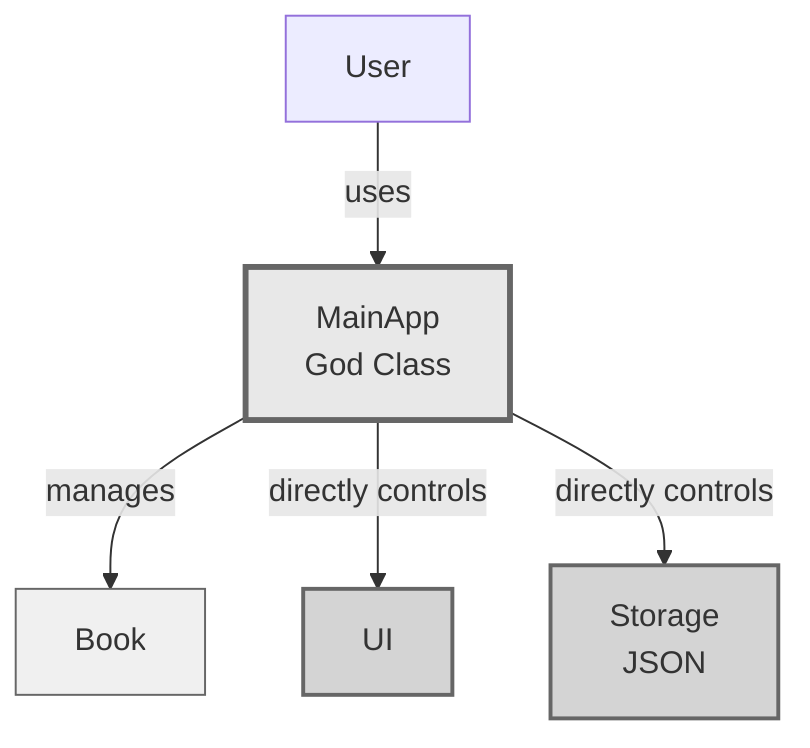
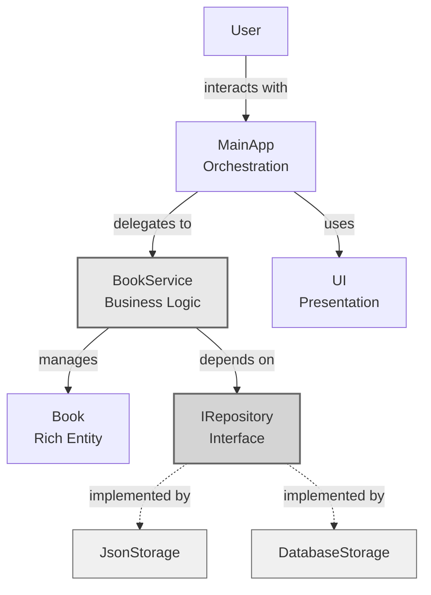
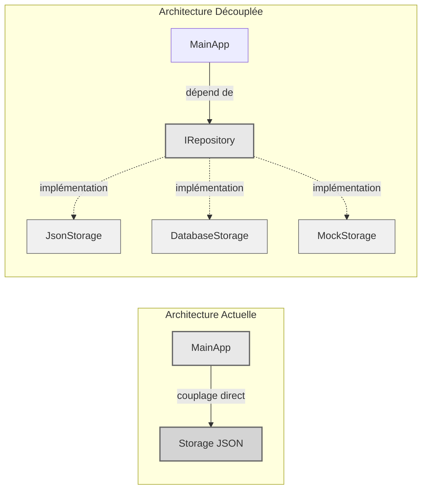
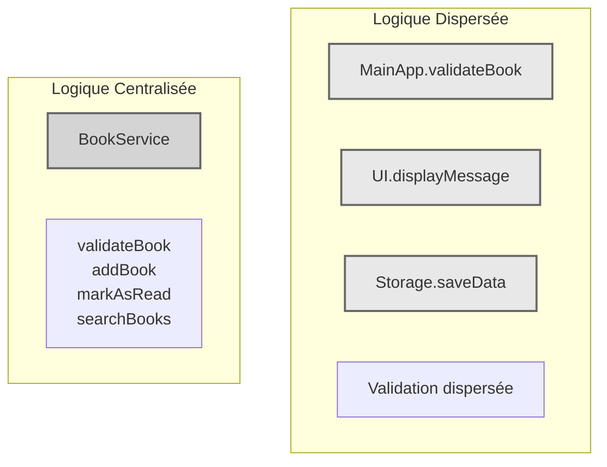
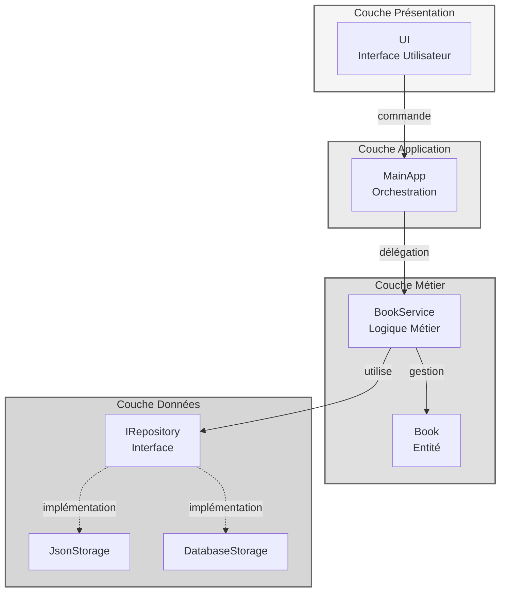

# Analyse de l'Architecture Logicielle

## Vue d'ensemble

Analyse critique d'une architecture mal conçue : identification des défauts architecturaux, impact sur la maintenabilité et l'évolutivité, et propositions de refonte basée sur les principes SOLID et Clean Architecture.

---

## 1. Identification des Défauts Majeurs

### 1.1 Violation du Principe de Responsabilité Unique (SRP)

**Problème identifié**

La classe `MainApp` centralise trop de responsabilités :
- Gestion de l'interface utilisateur
- Implémentation de la logique métier
- Contrôle du stockage des données
- Orchestration générale de l'application

**Impact sur la maintenabilité**

Toute modification, quelle que soit sa nature, nécessite d'intervenir sur MainApp. Les corrections de bugs, l'ajout de fonctionnalités et les changements technologiques créent une charge maintenant toutes les responsabilités en même temps.

**Impact sur la testabilité**

Impossible d'isoler et de tester indépendamment chaque responsabilité. Les tests unitaires deviennent des tests d'intégration obligatoires, augmentant leur complexité et leur coût.

**Impact sur la complexité**

La classe devient monolithique et difficile à comprendre. Chaque développeur nouveau sur le projet doit comprendre tous les aspects de l'application.

---

### 1.2 Couplage Fort Entre Composants

**Problème identifié**

L'architecture présente des dépendances directes vers des implémentations concrètes :
- MainApp dépend directement de Storage et UI
- Absence de séparation par couches architecturales
- Pas d'utilisation d'interfaces ou d'abstractions

**Impact sur l'évolutivité**

Impossible de remplacer le système de stockage JSON sans réécrire MainApp. Chaque changement technologique entraîne une cascade de modifications en cascade à travers le codebase.

**Impact sur la rigidité**

Chaque dépendance supplémentaire augmente le couplage. Une modification d'UI impacte directement MainApp, qui impacte Storage. Le système devient fragile et sujet aux régressions.

**Impact sur la réutilisabilité**

Les composants ne peuvent pas être réutilisés dans d'autres contextes. Une logique métier utile est verrouillée dans MainApp et inaccessible ailleurs.

---

### 1.3 Logique Métier Dispersée

**Problème identifié**

Les règles métier ne sont pas centralisées :
- Validation potentiellement présente dans MainApp, UI et Storage
- L'entité Book ne contient aucune logique métier
- Risque de duplication et d'incohérence

**Impact sur la consistance**

Validation différente selon le point d'entrée. Un livre peut être valide lors de l'ajout par UI mais rejeté lors du chargement depuis Storage.

**Impact sur la testabilité**

Impossible de tester les règles métier de manière isolée. Chaque test doit traverser plusieurs couches.

**Impact sur la maintenabilité**

Difficile de localiser et modifier les règles métier. Une correction de logique métier nécessite de chercher dans plusieurs fichiers.

---

## 2. Diagrammes d'Architecture

### 2.1 Architecture Actuelle (Problématique)

**Analyse du diagramme**

- MainApp est un point central de dépendance auquel se connectent toutes les autres classes
- Couplage direct avec les implémentations concrètes (Storage, UI)
- Aucune abstraction ni séparation des préoccupations
- La classe Book est passive, sans logique métier

---

### 2.2 Architecture Recommandée (Clean Architecture)

**Bénéfices majeurs**

- Séparation claire des responsabilités : chaque classe a un rôle défini
- Dépendance sur des abstractions (IRepository) plutôt que des implémentations
- Facilité de substitution : ajouter DatabaseStorage sans toucher le reste
- Chaque couche peut être testée indépendamment

---

## 3. Diagrammes d'Analyse Détaillés

### 3.1 Problème du Couplage Fort

**Explication détaillée**

À gauche : modification du stockage implique modification de MainApp. Le système est rigide et fragile.

À droite : ajout d'une nouvelle implémentation (DatabaseStorage, MockStorage) sans toucher MainApp. Le système respecte le principe Open/Closed.

---

### 3.2 Centralisation de la Logique Métier

**Principe d'application**

Avant : la logique métier est éparpillée dans plusieurs classes, créant de la redondance et des incohérences.

Après : une seule classe dédiée (BookService) contient toute la logique métier, facilitant la compréhension et la maintenance.

---

### 3.3 Architecture en Couches

**Flux de dépendances**

- Chaque couche ne dépend que de la couche inférieure
- La couche Métier ne connaît pas les détails d'implémentation du stockage
- Inversion de dépendance via l'interface IRepository
- Chaque couche peut être modifiée indépendamment

---

## 4. Matrice Comparative

| Critère | Architecture Actuelle | Architecture Recommandée |
|---------|----------------------|--------------------------|
| **Responsabilités** | Tout dans MainApp | Distribuées par couche |
| **Couplage** | Fort et direct | Faible via interfaces |
| **Logique métier** | Dispersée | Centralisée dans BookService |
| **Changement de Storage** | Réécriture complète | Nouvelle implémentation de IRepository |
| **Testabilité** | Tests end-to-end uniquement | Tests unitaires possibles |
| **Évolutivité** | Rigide | Flexible et extensible |
| **Maintenabilité** | Complexe | Claire et modulaire |
| **Temps d'onboarding** | Élevé | Réduit |
| **Coût de modification** | Exponentiel | Linéaire |

---

## 5. Analyse des Risques

### 5.1 Risques pour l'Ajout de Fonctionnalités

| Nouvelle Fonctionnalité | Impact Actuel | Impact Recommandé |
|------------------------|---------------|------------------|
| Système de notation | Modification : Book, MainApp, UI, Storage | Nouveau : BookRatingService |
| Recherche avancée | Logique dans MainApp surchargée | Nouveau : SearchService |
| Multi-utilisateurs | Refonte complète architecture | Extension couche métier |
| Export PDF | Impossible sans accès MainApp | Adapter sur IRepository |
| API REST | MainApp couplé à UI | Nouveau contrôleur indépendant |

**Conclusion**

Chaque nouvelle fonctionnalité dans l'architecture actuelle nécessite de toucher à MainApp, augmentant exponentiellement la complexité et les risques de régression. L'architecture recommandée permet d'ajouter des fonctionnalités sans impacter le code existant.

---

### 5.2 Difficulté de Remplacement du Stockage

**Processus avec l'architecture actuelle (problématique)**

1. Créer DatabaseStorage avec la même interface que Storage
2. Modifier MainApp pour utiliser DatabaseStorage
3. Réécrire toutes les méthodes de persistance
4. Adapter la logique métier stockée dans Storage
5. Tester l'intégralité de l'application
6. Corriger les régressions
7. Former l'équipe aux changements

**Temps estimé** : 2-4 semaines pour une petite application

---

**Processus avec architecture recommandée**

1. Créer DatabaseStorage implémentant IRepository
2. Configurer l'injection de dépendances pour utiliser DatabaseStorage
3. Exécuter les tests existants (sans modification)
4. Déployer en production

**Temps estimé** : 1-2 jours

---

**Raisons techniques de la difficulté**

- Dépendance directe : MainApp appelle directement les méthodes de Storage
- Absence d'abstraction : Pas d'interface définissant le contrat de stockage
- Couplage au format : Références spécifiques à JSON dispersées dans le code
- Logique métier mélangée : Si la validation est dans Storage, elle doit être réécrite pour chaque nouvelle implémentation
- Pas de tests existants : Risque élevé lors de la migration

---

## 6. Principes Architecturaux Recommandés

### 6.1 Principes SOLID

**Single Responsibility (SRP)**
- Une classe doit avoir une seule raison de changer
- BookService gère la logique métier, Storage gère la persistance

**Open/Closed (OCP)**
- Classes ouvertes à l'extension, fermées à la modification
- Ajouter DatabaseStorage sans modifier BookService

**Liskov Substitution (LSP)**
- Les implémentations sont interchangeables
- DatabaseStorage peut remplacer JsonStorage sans casser le code

**Interface Segregation (ISP)**
- Interfaces spécifiques plutôt que générales
- IRepository définie par les besoins, pas par l'implémentation

**Dependency Inversion (DIP)**
- Dépendre d'abstractions, pas d'implémentations
- BookService dépend de IRepository, pas de JsonStorage

---

### 6.2 Architecture en Couches

**Couche Présentation**
- Gestion de l'interface utilisateur
- Communication avec l'utilisateur
- Validation de saisie simple

**Couche Application**
- Orchestration entre couches
- Coordination des workflows
- Point d'entrée pour les cas d'usage

**Couche Métier**
- Logique et règles métier
- Entités avec comportements
- Validation métier complexe

**Couche Données**
- Accès et persistance des données
- Abstraction via repository pattern
- Implémentations interchangeables

---

### 6.3 Design Patterns Applicables

**Repository Pattern**
- Abstraction de l'accès aux données
- Interface IRepository, implémentations multiples
- Facilite les tests et le changement de technologie

**Dependency Injection**
- Inversion de contrôle pour le découplage
- Injection de dépendances via constructeur
- Facilite les tests unitaires

**Service Layer**
- Encapsulation de la logique métier
- BookService centralise toutes les opérations
- Réutilisable par plusieurs interfaces

**Rich Domain Model**
- Entités avec comportements métier
- Book.markAsRead() au lieu de MainApp.markBookAsRead()
- Logique métier dans le modèle

---

## 7. Plan de Refactorisation

### Phase 1 : Mise en Place de l'Infrastructure (1-2 semaines)

- Créer l'interface IRepository
- Implémenter JsonStorage en tant qu'implémentation de IRepository
- Configurer l'injection de dépendances

### Phase 2 : Extraction de la Logique Métier (2-3 semaines)

- Créer BookService
- Déplacer la logique métier de MainApp vers BookService
- Ajouter des tests unitaires pour BookService

### Phase 3 : Enrichissement des Entités (1-2 semaines)

- Ajouter des comportements métier à Book
- Encapsuler les données
- Valider au niveau de l'entité

### Phase 4 : Séparation des Couches (1-2 semaines)

- Clarifier les responsabilités de MainApp (orchestration uniquement)
- Isoler la couche présentation
- Documenter les flux

### Phase 5 : Tests et Validation (1-2 semaines)

- Écrire tests unitaires complets
- Effectuer tests d'intégration
- Valider avec les utilisateurs

---

## 8. Conclusion

L'architecture actuelle souffre de trois défauts majeurs critiques :

1. **Violation du SRP** : MainApp fait trop de choses, rendant la maintenabilité impossible
2. **Couplage fort** : Impossible d'évoluer sans réécrire l'application
3. **Logique métier dispersée** : Validation incohérente et code non testable

L'adoption d'une architecture en couches avec des interfaces claires permettrait de :

- Tester indépendamment chaque composant
- Ajouter des fonctionnalités sans modifier le code existant
- Remplacer des technologies (JSON → Database) en quelques heures
- Former rapidement les nouveaux développeurs

L'investissement dans une refactorisation architecturale se rentabilise rapidement face aux coûts de maintenance et d'évolution d'une architecture rigide.

---

**Date de création** : 6 novembre 2025  
**Auteur** : Analyse architecturale assistée

