# 🏠 Exercice : Maison Connectée - Quand Tout S'Emballe

## 📌 Contexte & Objectif

Vous êtes architecte logiciel pour une startup de domotique. Vous devez concevoir une **maison connectée avec plusieurs capteurs IoT** qui envoient des données vers un serveur central. Le problème : **dès que plusieurs capteurs émettent simultanément, le système devient lent et certaines alertes se perdent**.

### 🎯 Compétences Visées

- Comprendre les **flux d'événements asynchrones**
- Maîtriser le pattern **Producteur/Consommateur**
- Identifier les **goulots d'étranglement architecturaux**
- Concevoir une architecture **découplée et résiliente**
- Gérer les **pics de charge** et la **tolérance aux défaillances**

---

## 🔴 Partie 1 : Diagnostic - Analyse des Problèmes Architecturaux

### 1.1 Architecture Actuelle (Problématique)

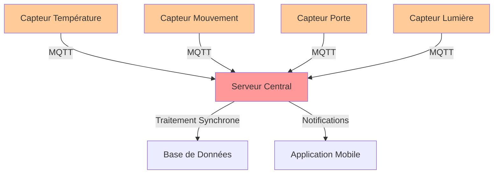

**Description** : Les capteurs envoient directement leurs données au serveur central via MQTT. Le serveur traite chaque message **de manière synchrone** et répond immédiatement.

### 1.2 Identification des Problèmes

#### 🔴 **Problème 1 : Goulot d'Étranglement (Bottleneck)**

| Aspect | Problème |
|--------|---------|
| **Serveur Central** | Point unique de traitement pour TOUS les événements |
| **Capacité** | Limité par la puissance d'une seule machine |
| **Pic de Charge** | 4 capteurs + autres appareils = saturation rapide |
| **Symptôme** | Latence croissante, timeouts, perte de messages |

**Exemple Concret** : 
- À 15h, tous les capteurs envoient un message (pic quotidien)
- Le serveur reçoit 100 événements/seconde
- Mais il ne peut traiter que 50 événements/seconde
- Les 50 autres événements sont perdus ou retardés ❌

#### 🔴 **Problème 2 : Couplage Fort**

Les capteurs sont **fortement couplés** au serveur :
- Ils dépendent directement de sa disponibilité
- Si le serveur tombe, les capteurs n'ont nulle part où envoyer les données
- Impossible de modifier le traitement sans toucher aux capteurs

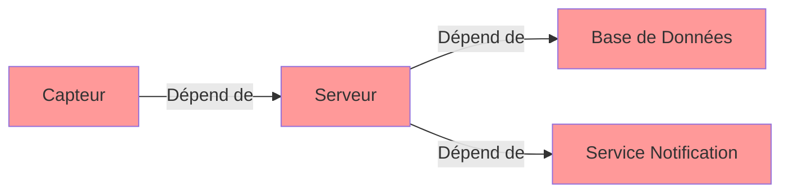

#### 🔴 **Problème 3 : Absence de File de Messages (Buffer)**

Sans buffer, les messages sont traités **immédiatement ou perdus** :

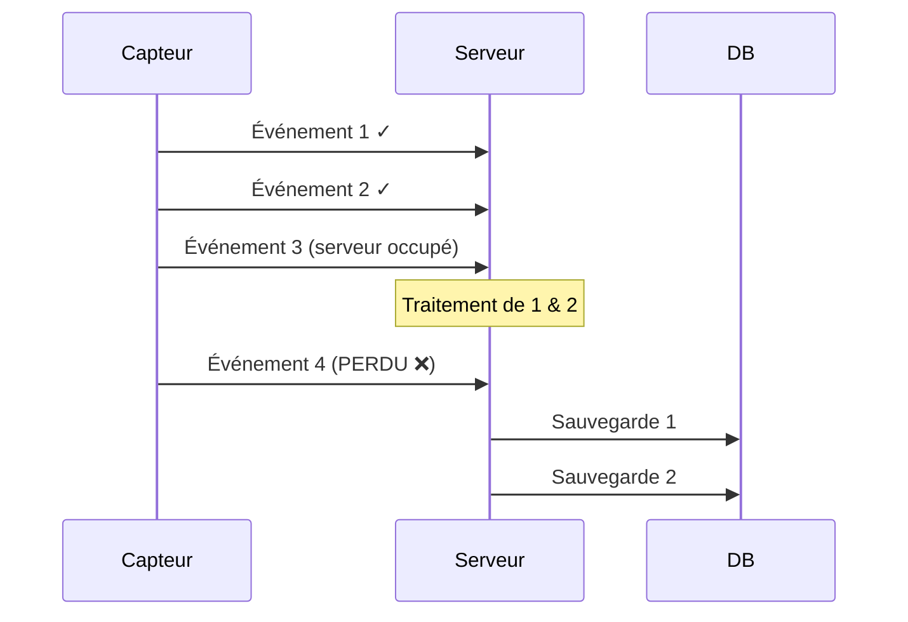

#### 🔴 **Problème 4 : Absence de Garantie de Livraison**

- **Best effort** : Le message est envoyé une fois, sans garantie
- Si le serveur est occupé ou défaillant, le message est perdu
- Impossible de savoir si une alerte critique (détecteur de fumée) a été reçue

#### 🔴 **Problème 5 : Pas de Priorité entre les Événements**

Tous les événements sont traités avec la même priorité :
- Température normale = alerte détecteur de fumée (CRITIQUE)
- Le système traite d'abord ce qu'il reçoit en premier

---

## 🟢 Partie 2 : Concepts Fondamentaux

### 2.1 Flux d'Événements Asynchrones

Un **événement** est une notification qu'*quelque chose s'est produit* dans le système.

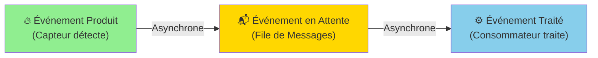

**Avantages** :
- Le producteur n'attend pas le résultat du consommateur
- Les deux peuvent travailler à des vitesses différentes
- Système plus résilient aux pics

### 2.2 Pattern Producteur/Consommateur

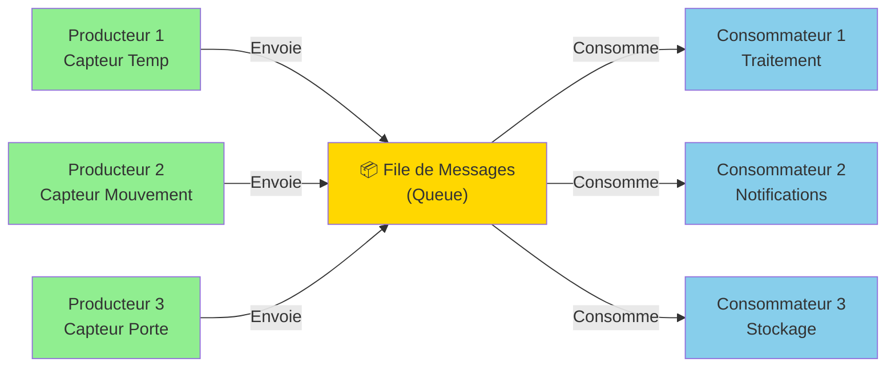

### 2.3 Découplage par Message Broker

Le **Message Broker** est l'intermédiaire qui :
- Reçoit les messages des producteurs
- Les stocke temporairement
- Les distribue aux consommateurs

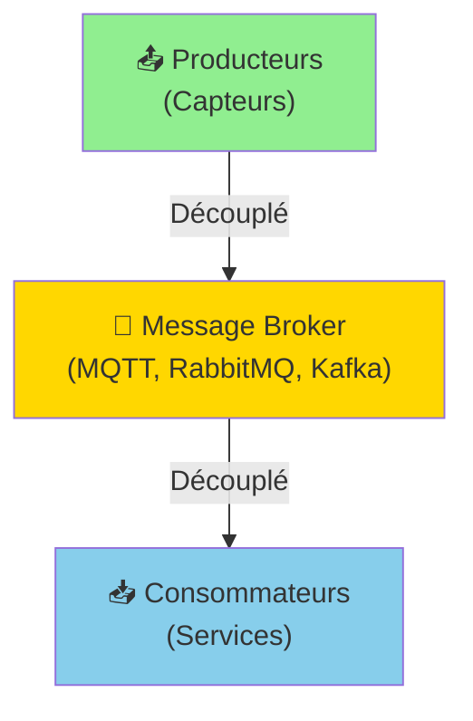

---

## 🟡 Partie 3 : Modèle Événementiel Robuste (Solution Proposée)

### 3.1 Architecture Cible

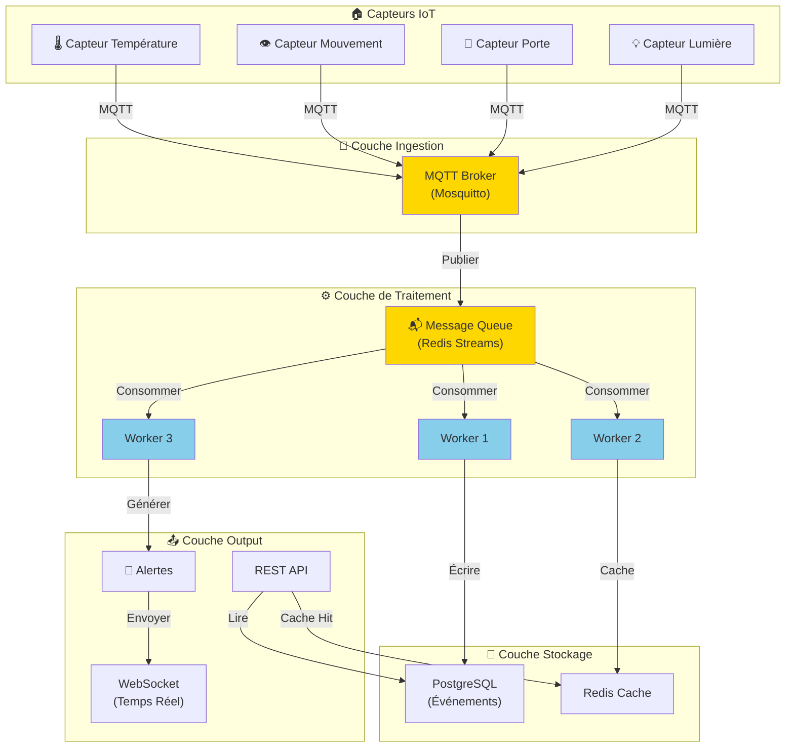

### 3.2 Flux Complet d'un Événement

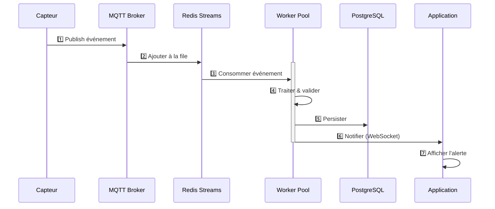

### 3.3 Résilience & Garanties de Livraison

#### ✅ Acknowledgment (Ack)

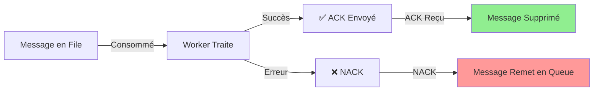

#### ⏱️ Timeout & Retry

```
Tentative 1 : TIMEOUT → Retry
Tentative 2 : SUCCÈS ✓
```

---

## 🏗️ Partie 4 : Pile Technologique Concrète

### 4.1 Architecture Détaillée

```
┌────────────────────────────────────────────────────────┐
│                 📱 APPLICATION CLIENT                  │
│              (Web - Flutter - React Native)            │
└─────────────────────┬──────────────────────────────────┘
                      │
        ┌─────────────┼─────────────┐
        ▼             ▼             ▼
┌──────────────┬──────────────┬──────────────┐
│ REST API    │  WebSocket  │  gRPC        │
│ (Node.js)   │  Server     │  Service     │
└──────────────┴──────────────┴──────────────┘
        │             │             │
        └─────────────┼─────────────┘
                      ▼
        ┌─────────────────────────┐
        │  Redis Streams (Queue) │
        │  (Persistance + FIFO)  │
        └─────────────────────────┘
                      │
        ┌─────────────┼─────────────┬─────────────┐
        ▼             ▼             ▼             ▼
    ┌────────┐  ┌────────┐  ┌────────┐  ┌────────┐
    │Worker 1│  │Worker 2│  │Worker 3│  │Worker N│
    │(Node)  │  │(Node)  │  │(Node)  │  │(Node)  │
    └────────┘  └────────┘  └────────┘  └────────┘
        │             │             │             │
        └─────────────┼─────────────┼─────────────┘
                      ▼
        ┌─────────────────────────┐
        │    PostgreSQL DB        │
        │  (Événements + Logs)    │
        └─────────────────────────┘
```

### 4.2 Composants Technologiques

| Couche | Technologie | Rôle | Avantages |
|--------|-------------|------|----------|
| **Capteurs** | MQTT (Mosquitto) | Collecte des données | Léger, fiable, protocole standard IoT |
| **File Messages** | Redis Streams | Buffering + FIFO | Persistance, ordre garanti, performance |
| **Traitement** | Node.js + Workers | Consommation asynchrone | JavaScript partout, scalabilité |
| **Stockage** | PostgreSQL | Persistance des événements | ACID, requêtes complexes |
| **Cache** | Redis | Données chaudes | Très rapide, réduit charge DB |
| **Temps Réel** | WebSocket | Notifications client | Bidirectionnel, instant |

### 4.3 Exemple : Configuration MQTT

```bash
# Installer Mosquitto (broker MQTT)
docker run -d -p 1883:1883 eclipse-mosquitto

# Un capteur se connecte et envoie des données :
mosquitto_pub -h localhost -t "maison/capteurs/temperature" -m '{"temp": 22.5}'
```

### 4.4 Exemple : Redis Streams Configuration

```javascript
// Producteur : Ajouter un événement à la file
const redis = require('redis');
const client = redis.createClient();

client.xAdd('capteurs:events', '*', 
  'type', 'temperature',
  'value', 22.5,
  'timestamp', Date.now(),
  (err, id) => {
    console.log('Événement ajouté:', id);
  }
);
```

```javascript
// Consommateur : Lire depuis la file
const { createClient } = require('redis');
const client = createClient();

async function consume() {
  const events = await client.xRead(
    { key: 'capteurs:events', id: '$' },
    { COUNT: 10, BLOCK: 0 }
  );
  
  for (const event of events) {
    console.log('Événement reçu:', event);
    // Traiter l'événement
    await processEvent(event);
  }
}
```

### 4.5 Exemple : Worker Pattern (Node.js)

```javascript
const { Worker } = require('bullmq');
const Queue = require('bullmq').Queue;

// Créer une queue
const queue = new Queue('capteurs');

// Créer un worker qui traite les événements
const worker = new Worker('capteurs', async (job) => {
  const { type, value, timestamp } = job.data;
  
  console.log(`⚙️ Traitement: ${type} = ${value}`);
  
  // Valider l'événement
  if (value < -20 || value > 60) {
    throw new Error('Valeur hors limites');
  }
  
  // Persister en base de données
  await db.query(
    'INSERT INTO events (type, value, timestamp) VALUES ($1, $2, $3)',
    [type, value, new Date(timestamp)]
  );
  
  // Envoyer notification WebSocket
  io.emit('event', { type, value });
  
  console.log(`✅ Événement traité`);
});
```

---

## 🧪 Partie 5 : Stratégie de Test - Résilience

### 5.1 Test de Charge (Load Testing)

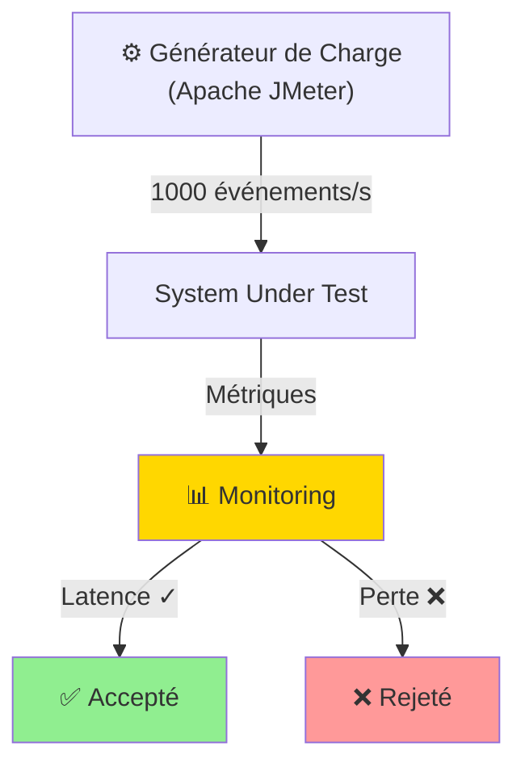

**Objectif** : Générer des pics de charge et mesurer la résilience

**Exemple avec k6** :
```javascript
import http from 'k6/http';
import { check } from 'k6';

export let options = {
  stages: [
    { duration: '1m', target: 100 },   // 0→100 utilisateurs en 1min
    { duration: '5m', target: 1000 },  // 100→1000 en 5min
    { duration: '1m', target: 0 },     // 1000→0 en 1min
  ],
};

export default function() {
  let response = http.post('http://localhost:3000/event', {
    type: 'temperature',
    value: Math.random() * 30
  });

  check(response, {
    'status est 200': (r) => r.status === 200,
    'temps réponse < 200ms': (r) => r.timings.duration < 200,
  });
}
```

### 5.2 Chaos Engineering (Injection de Défauts)

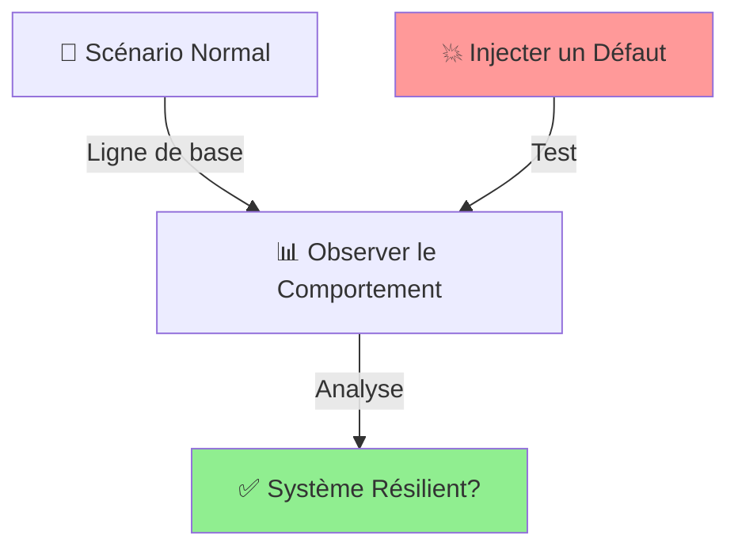

**Défauts à Tester** :

| Défaut | Commande | Résultat Attendu |
|--------|----------|------------------|
| **Worker crash** | `kill -9 worker_pid` | Les autres workers prennent le relais ✓ |
| **DB lente** | Ajouter latence réseau | Queue fait buffer, événements pas perdus ✓ |
| **Redis down** | `docker stop redis` | Alerter + retry ultérieurement ✓ |
| **Saturation** | 10 000 événements/s | Dégradation gracieuse (mais pas de perte) ✓ |

### 5.3 Test d'Ordre des Événements

```javascript
// ✅ Les événements doivent arriver dans l'ordre
async function testEventOrdering() {
  const order = [];
  
  // Produire 1000 événements
  for (let i = 0; i < 1000; i++) {
    await queue.add('event', { id: i, timestamp: Date.now() });
  }
  
  // Consommer et vérifier l'ordre
  worker.on('completed', (job) => {
    order.push(job.data.id);
  });
  
  await new Promise(resolve => setTimeout(resolve, 5000));
  
  // Vérifier FIFO
  for (let i = 0; i < 1000; i++) {
    assert(order[i] === i, `Événement ${i} pas au bon ordre`);
  }
  
  console.log('✅ Ordre des événements: OK');
}
```

### 5.4 Test de Livraison Garantie

```javascript
// ✅ Garantir qu'aucun événement n'est perdu
async function testNoLoss() {
  const sent = 10000;
  let received = 0;
  
  // Envoyer 10 000 événements
  for (let i = 0; i < sent; i++) {
    await producer.send({
      topic: 'capteurs',
      messages: [{ value: JSON.stringify({ id: i }) }]
    });
  }
  
  // Consommer tous les événements
  await consumer.run({
    eachMessage: async () => {
      received++;
    }
  });
  
  assert(received === sent, `Perte de ${sent - received} événements`);
  console.log(`✅ Livraison: ${received}/${sent} événements reçus`);
}
```

### 5.5 Métriques de Monitoring

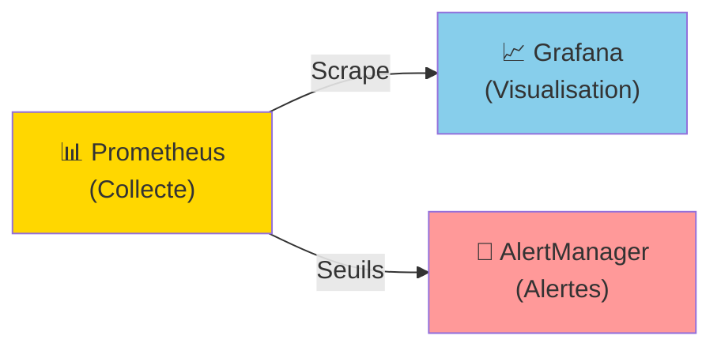

**Métriques Clés** :

| Métrique | Seuil d'Alerte | Signification |
|----------|---|---|
| **Latence P99** | > 500ms | 1% des requêtes trop lentes |
| **Taux d'Erreur** | > 1% | Plus d'1% d'événements en erreur |
| **Queue Depth** | > 100k | Trop d'événements en attente |
| **Worker Memory** | > 500MB | Fuite mémoire potentielle |

---

## 📋 Comparaison : Avant / Après

### Avant (Synchrone, Centralisé)

```
Capacité: 50 événements/s
Pic supporté: 60 événements/s → PERTE ❌
SPOF: Serveur central
Découpling: Faible
```

### Après (Asynchrone, Distribué)

```
Capacité: 1000+ événements/s (3 workers)
Pic supporté: 5000 événements/s → Buffer puis traite ✓
SPOF: Aucun (chaque composant peut être remplacé)
Découpling: Fort (producteurs ≠ consommateurs)
```

---

## 🎓 Résumé des Concepts Clés

### Les 5 Principes de Base

1. **Asynchronisme** : Les producteurs n'attendent pas les consommateurs
2. **Découplage** : Les composants ne se connaissent pas directement
3. **Buffering** : Une file de messages absorbe les pics
4. **Scalabilité Horizontale** : Ajouter plus de workers = plus de capacité
5. **Résilience** : Les défaillances n'affectent pas le système complet

### Patterns Utilisés

| Pattern | Usage |
|---------|-------|
| **Producteur/Consommateur** | Découplage entre capteurs et traitement |
| **Message Broker** | MQTT pour la collection, Redis pour le buffering |
| **Worker Pool** | Paralléliser le traitement |
| **Circuit Breaker** | Protéger contre les défaillances |
| **Retry + Backoff** | Réessayer après une erreur transitoire |

---

## 🚀 Conclusion

Cette architecture résout tous les problèmes identifiés au départ :

✅ **Pas de goulot** : Distributeur de charge (scale horizontalement)
✅ **Pas de couplage** : Producteurs et consommateurs découplés
✅ **Pas de perte** : File de messages + ACK
✅ **Priorité** : Possibility d'ajouter des queues prioritaires
✅ **Résilience** : Défaillances d'un composant = pas d'impact global

La maison connectée peut maintenant supporter **des milliers d'événements par seconde** tout en garantissant la livraison de chaque alerte critique. 🏠✨
