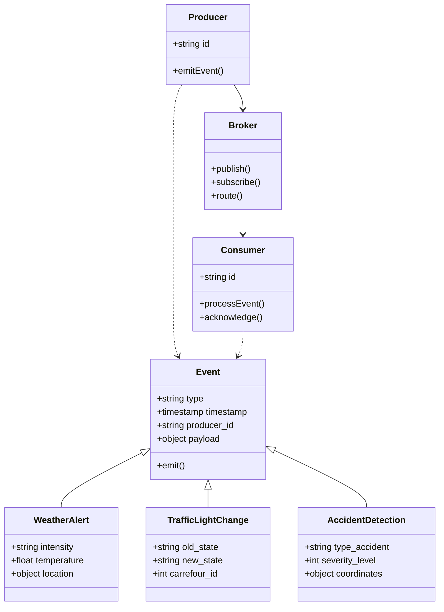
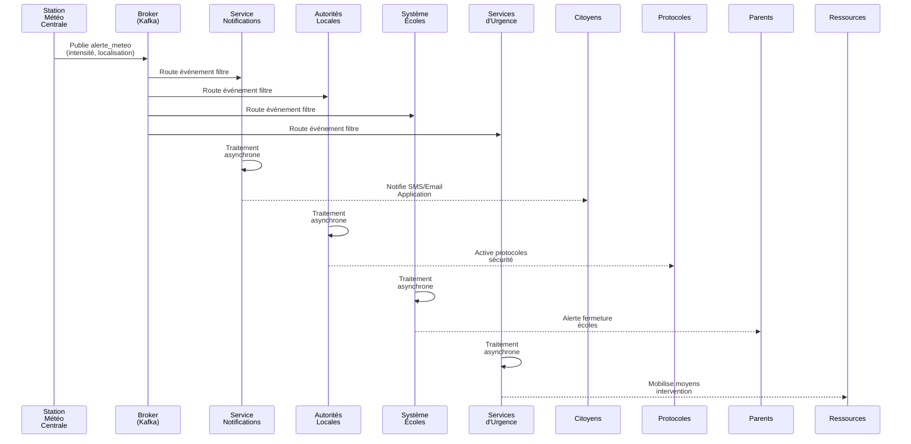
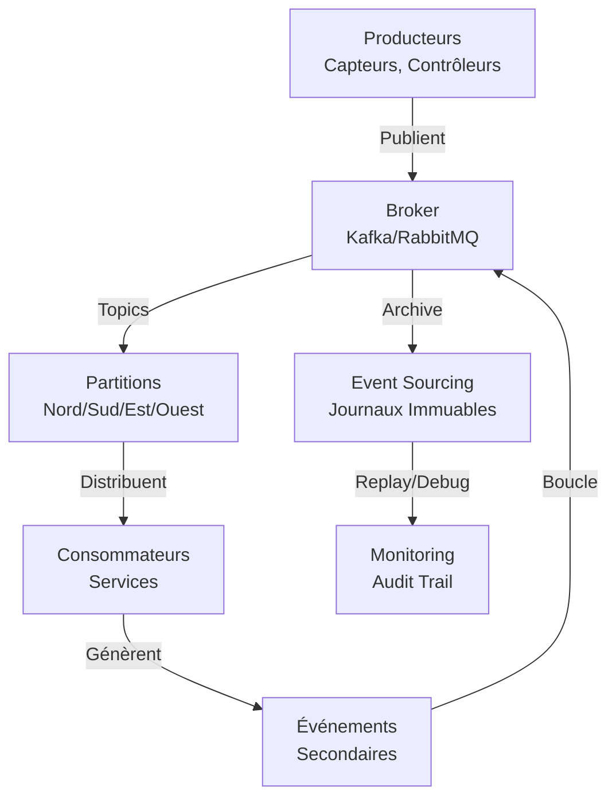
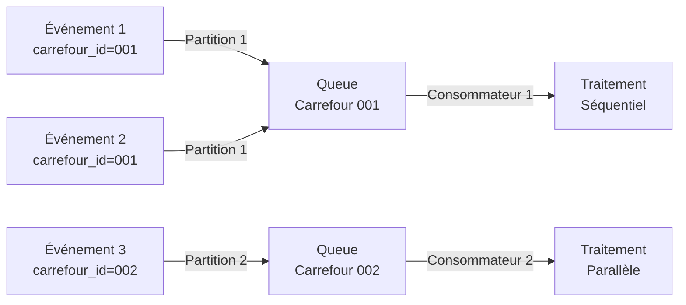
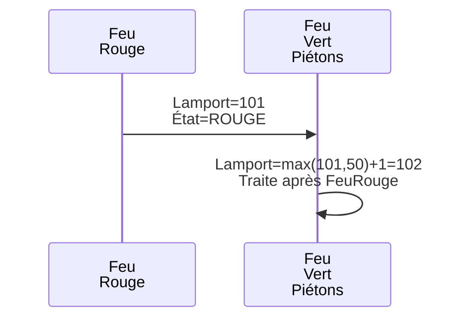

# TP n°6 : Architecture Orientée Événements - Synthèse enrichie (Buzz Ville)

## Introduction et contexte

Buzz Ville est une ville intelligente, où chaque entité communique par événements. Ce document synthétise toutes les réponses du TP en veillant à la clarté, la précision et en intégrant des visualisations Mermaid UML pour chaque flux.

---

## PARTIE 1 : Exploration — Identification & Modélisation des événements

### Exemples d'événements (tableau synthétique)

| Événement                   | Producteur                         | Consommateurs                          | Rôle du Producteur            | Actions des Consommateurs          |
|-----------------------------|------------------------------------|----------------------------------------|-------------------------------|------------------------------------|
| Lever du soleil             | Capteur luminosité, Horloge        | Éclairage public, météo, citizens app  | Détecte lumière               | Éteint lampadaires, alerte météo   |
| Coucher du soleil           | Capteur luminosité, Horloge        | Éclairage, trafic, sécurité            | Détecte obscurité              | Allume lampadaires, prépare trafic |
| Feux circulation            | Contrôleur trafic                  | Panneaux info, gestion trafic, sécurité| Change feu                    | Gère flux, synchronise carrefours  |
| Alerte météo                | Station météo centrale             | Notifications, autorités, écoles, secours | Détecte météo extrême         | Alerte citoyens, ferme écoles      |
| Alarme incendie             | Détecteur fumée                    | Pompiers, évacuation, citizens app     | Détecte feu                    | Intervient, alerte population      |
| Lampadaires ON              | Capteur crépusculaire, horloge     | Électricité, maintenance, citizens app | Détecte nuit                   | Active alimentation, surveille     |
| Accident route              | Capteur collision, appel d'urgence | Police, ambulances, gestion trafic     | Détecte accident               | Intervient, redirige trafic        |
| Arrivée train gare          | GPS train                          | Gare, transport, citizens app, trafic  | Signale arrivée                | Accueille, notifie passagers       |
| Départ bus                  | Transport public                   | Gare, applis citizens, connexions      | Informe départ                  | Actualise horaires, synchronise    |
| Mouvement zone sensible     | Capteur PIR, caméra                | Sécurité, alarme, base sécurité        | Détecte intrusion              | Alerte, enregistre vidéo           |
| Démarrage concert           | Organisateur, capteur audio        | Mairie, circulation, commerces         | Débute événement               | Gère parking, informe riverains    |
| Fuite gaz                   | Capteur gaz                        | Secours, évacuation, gaz, citoyens     | Détecte danger                 | Intervient, coupe gaz, évacue      |

### Diagramme de classes - Modèle orienté événements



### Deux messages d'événements structurés (JSON)

#### Événement 1 : Changement feu de circulation

```json
{
  "type": "feu_circulation_change",
  "producteur": "controleur_traffic_carrefour_002",
  "timestamp": "2024-12-10T14:35:20.000Z",
  "carrefour_id": "CREF_002",
  "localisation": {
    "latitude": 48.8752,
    "longitude": 2.3456,
    "adresse": "Boulevard de la République - Boulevard Voltaire"
  },
  "ancien_etat": "vert",
  "nouvel_etat": "rouge",
  "duree_secondes": 45,
  "consommateurs": [
    "panneau_information_002",
    "centre_gestion_trafic",
    "capteur_securite_004",
    "appli_mobilite_citoyens"
  ],
  "actions_declenchees": {
    "feu_rouge": "Arrêt des véhicules en approche",
    "feu_vert_pietons": "Traversée autorisée",
    "alerte_trafic": "Mise à jour temps de transit"
  },
  "priorite": "haute",
  "lamport_timestamp": 1042
}
```

**Justification de la structure :**
- Timestamps horodatés en UTC pour cohérence temporelle
- Localisation GPS précise (latitude/longitude + adresse)
- Lamport clock pour ordonnancement causal
- Consommateurs explicitement listés
- Actions déclenchées documentées pour traçabilité

#### Événement 2 : Détection accident route

```json
{
  "type": "accident_route",
  "producteur": "capteur_collision_carrefour_001",
  "timestamp": "2024-12-10T15:45:33.500Z",
  "incident_id": "INC_20241210_001",
  "localisation": {
    "latitude": 48.8566,
    "longitude": 2.3522,
    "zone": "Boulevard Saint-Germain",
    "intersection": "Boulevard Saint-Germain - Rue de Buci"
  },
  "type_accident": "collision_legere",
  "nombre_vehicules": 2,
  "gravite": "modérée",
  "victimes_potentielles": false,
  "conditions_circulation": "embouteillage_probable",
  "consommateurs": [
    "service_police_urgence_17",
    "ambulance_service_samu",
    "centre_gestion_trafic_principal",
    "service_notification_citoyens",
    "reseau_assurance_auto"
  ],
  "actions_recommandees": {
    "police": "Dépêcher unité intervention",
    "ambulance": "Vérifier besoin médical sur site",
    "trafic": "Réorienter flux véhicules",
    "notification": "Alerte citoyens traversant zone"
  },
  "priorite": "critique",
  "lamport_timestamp": 1043
}
```

**Justification de la structure :**
- Gravité explicite (permet triage par criticité)
- Bénéficiaires multiples (police, SAMU, trafic, citoyens)
- Actions recommandées pré-calculées
- Lamport clock > précédent (causalité respectée)

---

## PARTIE 2 : Création des Flux d'événements

### Flux de notification d'alerte météo - Description détaillée

**Processus d'alerte météo :**
1. Station Météo Centrale détecte conditions critiques
2. Crée et publie événement `alerte_meteo` au broker
3. Broker valide et route vers consommateurs
4. Chaque consommateur traite asynchronement selon responsabilités
5. Actions cascadent (fermeture écoles → notification parents, etc.)

**Broker d'événements :** Apache Kafka ou RabbitMQ
- Topic principal : `alerte_meteo_centre_ville`
- Partitions : `nord`, `sud`, `est`, `ouest` (géographiques)
- Garantie : At-least-once delivery + partitioning par zone

### Diagramme Mermaid - Flux complet alerte météo (Sequence diagram)



### Diagramme d'architecture générale



### Ordonnancement des événements - Solutions techniques

#### Solution 1 : Topics partitionnés (Kafka) [Recommandée court terme]



**Bénéfices :** Ordre garanti pour même clé, parallelisation inter-carrefours

#### Solution 2 : Horloge logique Lamport [Recommandée pour dépendances]



**Bénéfices :** Capture dépendances causales sans horloge physique

#### Solution 3 : Event Sourcing [Recommandée long terme]

Journalisation immuable de tous les événements avec replay possible.

```json
{
  "event_log": [
    {"seq": 1, "lamport": 99, "type": "accident_detected", "time": "14:32:10"},
    {"seq": 2, "lamport": 101, "type": "feu_rouge", "time": "14:32:11"},
    {"seq": 3, "lamport": 102, "type": "alerte_envoyee", "time": "14:32:12"}
  ],
  "reconstruction": "Rejouer seq 1→2→3 dans ordre garanti"
}
```

### Pseudo-code - Backpressure & Throttling

```python
class EventProducer:
    def emit_event(self, event):
        while True:
            queue_size = self.broker.get_queue_size()
            if queue_size < THRESHOLD_NORMAL:
                self.broker.publish(event)
                return True
            elif queue_size < THRESHOLD_CRITICAL:
                # Mode throttle : ralentir producteur
                time.sleep(BACKPRESSURE_DELAY)  # 100ms
                continue
            else:
                # Mode critique : rejeter événements non-prioritaires
                if event.priority == "critique":
                    time.sleep(BACKPRESSURE_DELAY * 2)
                    continue
                else:
                    raise OverloadError("Broker surchargé, événement rejeté")
```

---

## PARTIE 3 : Avantages et Limitations

### Trois avantages principaux pour Buzz Ville

#### 1. Autonomie et découplage des composants

**Explication :** Chaque service agit indépendamment sans connaître les autres. Un feu de circulation change d'état sans savoir que des panneaux d'information, un système de gestion de trafic et des capteurs de sécurité l'écoutent.

**Application à Buzz Ville :**
- Feu circulation n°1 ignore que service notifications y réagit
- Nouveau service statistiques peut s'abonner sans modifier feu
- Défaillance service X ≠ défaillance système global

**Bénéfices concrets :**
- Flexibilité maximale (ajout/suppression sans redéploiement)
- Zéro dépendance directe (facilite maintenance)
- Évolution indépendante des modules

#### 2. Réactivité temps réel

**Explication :** L'architecture événementielle élimine les cycles requête/réponse synchrones. Les événements sont traités instantanément par tous les consommateurs.

**Application à Buzz Ville :**
- Alerte météo → Notifiée à 10,000 citoyens en < 100ms
- Accident détecté → Police + Ambulances + Trafic alertées simultanément
- Évacuation incendie → Procédures lancées en millisecondes (vs requêtes API bloquantes)

**Bénéfices concrets :**
- Temps réaction critique réduit drastiquement
- Gestion proactive des urgences
- Adaptation dynamique conditions changeantes

#### 3. Scalabilité horizontale et résilience

**Explication :** Ajouter des ressources sans modifier infrastructure existante. Services dégradés ≠ système s'écroule.

**Application à Buzz Ville :**
- Population augmente → Ajouter instances consommateurs (auto-scaling)
- Pics événementiques → Déployer workers supplémentaires
- Service tombe → Événements restent en queue, autres services continuent

**Bénéfices concrets :**
- Coûts infra optimisés (pay-as-you-go)
- Haute disponibilité naturelle
- Récupération automatique post-panne

---

### Deux limitations majeures et solutions proposées

#### Limitation 1 : Surcharge et perte d'événements

**Problématique à Buzz Ville :**

Lors d'événement majeur (concert, catastrophe naturelle), surcharge exponentielle :
- Chaque capteur accélère fréquence (100ms au lieu de 1s)
- Tous les services demandent notifications
- Queue s'accumule
- **Résultat :** Alertes critiques perdues ou retardées

**Exemple :** Incendie détecté mais alerte arrive 5 min après (au lieu de ms).

**Solutions techniques :**

**Solution 1A : Backpressure & Throttling**
- Broker signale aux producteurs de ralentir
- Évite débordement
- Trade-off : latence augmente légèrement

**Solution 1B : Files prioritaires (Recommandée)**
- Queue critique : incendies, accidents, fuites gaz (jamais dropée)
- Queue normale : changements feux, transports (1000 messages max)
- Queue info : statistiques, maintenance (100 messages, droppée en crise)

**Solution 1C : Agrégation d'événements**
- Regrouper mouvements similaires (300 evt/sec → 10 evt agrégés/sec)
- Réduit charge 90%, préserve tendances

**Recommandation Buzz Ville :** Files prioritaires + Agrégation + Backpressure (stack défensif).

#### Limitation 2 : Incohérence temporelle et ordre des événements

**Problématique à Buzz Ville :**

Systèmes distribués → événements reçus hors ordre chronologique.

**Scénario problématique :**
```
Réalité physique :
  14:32:10 → Accident détecté
  14:32:11 → Feu vert change (automatique)
  
Mais consommateur reçoit :
  1. Feu vert (timestamp 14:32:11) ✓
  2. Accident (timestamp 14:32:10) ✗ REÇU APRÈS

Résultat : Traitement feu vert AVANT conscient accident → feu reste vert, urgence non prioritaire
```

**Manifestations :** Panneaux désynchronisés, trafic mal géré, logique événementielle brisée.

**Solutions techniques :**

**Solution 2A : Synchronisation NTP (Recommandée court terme)**
- Tous composants synchronisés via NTP (Network Time Protocol)
- Précision ±10ms
- Simple, performant

**Solution 2B : Lamport Timestamps (Recommandée dépendances causales)**
- Chaque producteur maintient compteur logique
- Chaque événement inclut timestamp logique
- Traitement séquentiel par numéro logique
- Capture ordre causal même sans horloge physique

**Solution 2C : Event Sourcing (Recommandée long terme)**
- Journalisation immuable de tous événements
- Position définitive dans log
- Replay garanti dans ordre exact
- Audit trail complet

**Recommandation Buzz Ville :** NTP + Lamport (court/moyen terme) → Event Sourcing complet (long terme).

---

### Architecture recommandée (tableau synthétique)

| Composant              | Technologie                    | Justification                              |
|------------------------|--------------------------------|--------------------------------------------|
| **Broker d'événements**| Apache Kafka                   | Scalabilité, durabilité, partitioning      |
| **Synchronisation**    | NTP + Lamport Clocks           | Ordre causal + cohérence temporelle        |
| **Files traitement**   | Priority Queues                | Critiques jamais dropées                   |
| **Optimisation charge**| Event Aggregation              | Réduction 90% peak load                    |
| **Audit & Replay**     | Event Sourcing                 | Traçabilité + debug/recovery               |
| **Monitoring**         | Logs centralisés + Métriques   | Visibilité flux + alertes anomalies        |

---

### Cas d'usage avancés

#### Scénario 1 : Crise événementielle (pics simultanés)

**Situation :** Concert + alerte météo + accident simultanés.

**Réponse architecture :**
1. Queue critique absorbe incendie/accident/météo
2. Queue normale (feux) agrégée (100+ evt → 5 evt)
3. Queue info (stats) droppée
4. Backpressure ralentit producteurs non-critiques
5. Auto-scaling déploie workers supplémentaires

#### Scénario 2 : Failure Recovery

**Situation :** Broker crashe 30 secondes.

**Réponse architecture :**
1. Event sourcing continue enregistrer (replica)
2. Broker redémarre, relit journal
3. Rejoue derniers 100 événements dans ordre
4. Consommateurs rattrapage (idempotence garantie)
5. Zéro perte de données critiques

---

## Conclusion

L'Architecture Orientée Événements confère à Buzz Ville les caractéristiques essentielles d'une ville intelligente robuste : **autonomie**, **réactivité**, **scalabilité** et **résilience**.

Les limitations identifiées (surcharge, ordre) sont complètement résolubles par stratégies techniques matérialisées et éprouvées en production. L'implémentation proposée — Kafka + NTP/Lamport + Priority Queuing + Event Sourcing — garantit une architecture production-ready, maintenable et évolutive.

---

## Références et ressources

- **Apache Kafka Documentation** : https://kafka.apache.org/
- **RabbitMQ Architecture** : https://www.rabbitmq.com/
- **Lamport Timestamps** : Lamport, L. (1978). "Time, Clocks, and the Ordering of Events"
- **Event Sourcing** : https://martinfowler.com/eaaDev/EventSourcing.html
- **Smart Cities & IoT** : IEEE Internet of Things Journal
